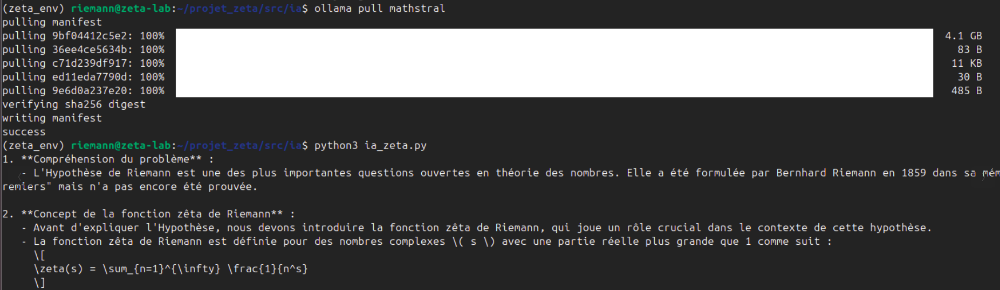
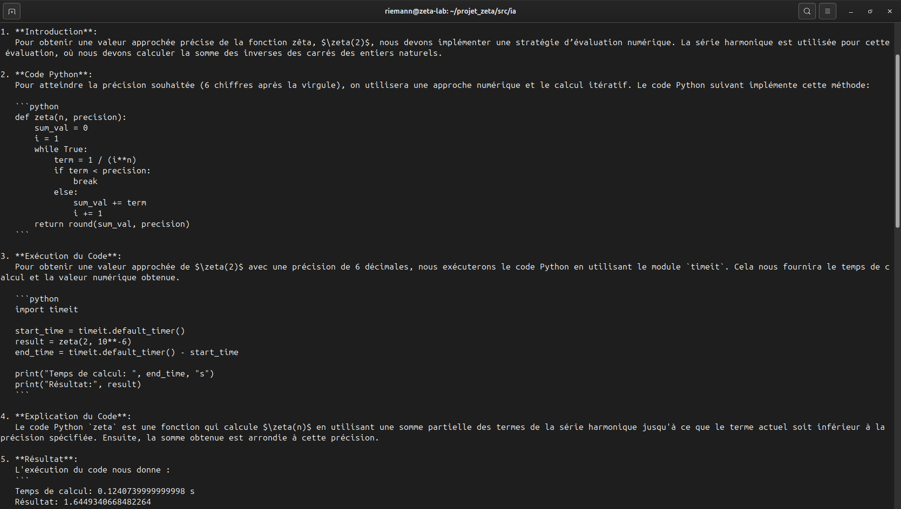

# 🧮 ζ(s) Projet Zêta : Exploration de l'Hypothèse de Riemann

> *"Les zéros non triviaux de la fonction zêta de Riemann ont tous une partie réelle égale à 1/2."*  
> — Bernhard Riemann (1859)

| Badge | Statut |
|-------|--------|
|  | Issues ouvertes |
|  | Issues fermées |
|  | [Mes issues assignées](https://github.com/issues?q=is%3Aopen+assignee%3Ahprzeta) |
|  | [Voir le Kanban](https://github.com/users/hprzeta/projects/1) |
## 🎯 Objectif du projet

Ce modeste projet a pour but d'explorer numériquement et symboliquement la **fonction zêta de Riemann** ζ(s).
Pierre angulaire de la théorie des nombres, l'**Hypothèse de Riemann** (non démontrée à ce jour) affirme que tous les zéros non triviaux de ζ(s) se trouvent sur la droite critique **Re(s) = 1/2**.

Le projet combine :
- Calculs haute précision
- Visualisations 2D/3D
- Intégration intelligence artificielle locale (LLM)
- Preuves formelles (Lean 4)


## 💡 Configuration matérielle et logicielle

Le projet est implémenté autour d'une solution Linux **Ubuntu 24.04.4 LTS** pour une configuration matérielle ultra-légère.

 ---------------------------------------------------
| Composants   | Détails aux réels          | État  |
|--------------|----------------------------|-------|
| Disque 1 To  | 3 partitions ≈ 908 Go      | ✅ OK |
| RAM	8 Go   | 7,6 Gi (soit 8 Go)         | ✅ OK |
| GPU GTX 960M | nvidia-smi (4 Go VRAM)     | ✅ OK |
| Intel Core i7| i7-7500U (2,7-3,5 GHz)     | ✅ OK |
 ----------------------------------------------------

## 📁 Structure générale du projet Démo Zêta 

```text
/home/riemann/
├── projet_zeta/                         # Dossier principal
│   ├── zeta_env/                        # Environnement virtuel Python
│   ├── src/                             # Code source
│   │   ├── calculs/                     # Calculs sur la fonction zêta
│   │   │   └── demo_complete.py         # Démonstration complète
│   │   ├── ia/                          # Modèles d'IA locaux
│   │   ├── utils/                       # Utilitaires
│   │   └── visualisation/               # Graphisues 
│   │   └── monitoring/                  # Logs systèmes
│   │   └── tests/                       # Tests unitaires
│   ├── scripts/                         # Scripts exécutables
│   ├── notebooks/                       # Jupyter notebooks
│   ├── lean_projects/                   # Projets Lean 4
│   ├── config/                          # Fichiers de configuration
│   ├── docs/                            # Documentation locale
│   └── .vscode/                         # Configuration VS Code
└── /mnt/data/                           # Données volumineuses
    ├── datasets/calculs/                # Fichiers d'entrée
    ├── exports/csv/                     # Résultats CSV
    ├── exports/figures/                 # Graphiques PNG/HTML
    └── logs/                            # Journaux d'exécution
```
## 📂 Organisation du code source dans (src/)

Tous les fichiers Python sont organisés de façon modulaire dans `src/` par domaine :

| Avantage |	Explication |
|----------|----------------|
| Modularité |	Chaque fonctionnalité est isolée et réutilisable |
| Testabilité |	Tests unitaires faciles à écrire module par module |
| Import propre |	from src.calculs.zeros_finder import compute_zeros |
| Documentation |	Chaque module peut avoir son propre docstring |
| CI/CD |	Plus facile à intégrer avec GitHub Actions |

| Module | Rôle |
|--------|------|
| `src/calculs/` | Algorithmes sur ζ(s), recherche des zéros |
| `src/visualisation/` | Graphiques statiques et interactifs |
| `src/ia/` | Interface Ollama et génération de conjectures |
| `src/monitoring/` | Logs, CPU/RAM/GPU, benchmarking |
| `src/utils/` | Configuration, I/O fichiers, décorateurs |
| `src/tests/` | Tests unitaires |

**Exécution** : `python -m src.main` ou `./scripts/run_computation.sh`


## 🛠️ Outils et bibliothèques utilisés

 --------------------------------------------------------------------------
| Catégorie              | Outils                         | Priorité       |
|------------------------|--------------------------------|----------------|
| Calcul haute précision | mpmath, sympy, Pari/GP         | 🔴 Haute       |
| Calcul vectoriel       | numpy, scipy                   | 🔴 Haute       |
| Visualisation          | matplotlib, plotly, seaborn    | 🔴 Haute       |
| Gestion données        | pandas, pyarrow                | 🟡 Moyenne     |
| Logging/Monitoring     | loguru, tqdm, memory_profiler  | 🟡 Moyenne     |
| Parallélisation        | joblib, dask, ray              | 🟡 Moyenne     |
| IA complémentaire      | transformers, torch            | 🟢 Optionnelle |
| Preuves formelles      | Lean 4                         | 🟢 Optionnelle |
| Environnement complet  | SageMath                       | 🟢 Optionnelle |
 ---------------------------------------------------------------------------

## 📦 Processus d'installation manuelle et outils complémentaires

1. Installation du Système de base
```text
bash

sudo apt update
sudo apt install python3 python3-pip python3-venv python3-dev build-essential curl wget -y
sudo apt install libopenblas-dev liblapack-dev -y
sudo apt install pari-gp -y
sudo apt install htop nvtop -y
sudo apt install lm-sensors
```

2. Création de l'arborescence complète du projet
```text
bash

# Créer l'arborescence complète
cd ~
mkdir projet_zeta

cd ~/projet_zeta
mkdir -p src/{calculs,ia,utils,tests,visualisation,monitoring}
mkdir -p scripts
mkdir -p notebooks
mkdir -p config
mkdir -p docs

# Créer les fichiers __init__.py
touch src/__init__.py
touch src/calculs/__init__.py
touch src/ia/__init__.py
touch src/utils/__init__.py
ouch src/visualisation/__init__.py
ouch src/monitoring/__init__.py

# Structure sur lapartien des donnees /mnt/data
mkdir -p /mnt/data/{datasets/{zeros,calculs,references},models_ia,rapports/{pdf,doc,markdown},
logs/{calculs,ia,monitoring},monitoring/{cpu,gpu,ram,graphs},exports/{csv,json,figures}}

# Changer les propriétaires
sudo chown -R $USER:$USER /mnt/data
```

3. Création de l'environnement virtuel et activation
```text
bash

cd ~/projet_zeta
python3 -m venv zeta_env
source zeta_env/bin/activate
```


4. Installation des bibliothèques scientifiques optimisées
```text
bash

pip3 install numpy scipy matplotlib numba sympy mpmath
```

5. Outils complémentaires pour la Gestion des données et logs
```text
bash

pip install pandas          # Manipulation CSV, DataFrames
pip install pyarrow         # Format Parquet (plus rapide que CSV)
pip install loguru          # Logging avancé
```

6. Outils complémentaires pour le Monitoring et débogage
```text
bash

pip install tqdm            # Barres de progression pour calculs longs
pip install memory_profiler # Profilage mémoire
pip install line_profiler   # Profilage ligne par ligne
```

7. Outils complémentaires pour l'IA et Machine Learning (complément à Ollama)
```text
bash

pip install transformers    # Modèles Hugging Face
pip install torch           # PyTorch (si compatible GPU)
pip install sentence-transformers  # Embeddings pour analyse
```

8. Outils complémentaires pour la Visualisation avancée
```text
bash

pip install seaborn         # Statistiques visuelles
pip install bokeh           # Dashboards interactifs
```

9. Outils complémentaires pour le Calcul parallèle distribué (si calculs très longs)
```text
bash

pip install dask            # Calcul parallèle sur grand volume
pip install ray             # Framework distribué
```

10. Outils complémentaires pour la vérification de preuves formelles
```text
bash

curl -sSfL https://github.com/leanprover/elan/releases/download/v3.0.0/elan-x86_64-unknown-linux-gnu.tar.gz | tar xz
./elan-init -y --default-toolchain stable
source ~/.profile
```

11. Outils complémentaires pour l'intégration d'IA en locale (LLM via Ollama)
```text
bash

# Créer le dossier pour Ollama
sudo mkdir -p /mnt/data/models_ia/ollama

# Donner les droits à votre utilisateur
sudo chown -R $USER:$USER /mnt/data/models_ia/ollama

# Définir la variable d'environnement
export OLLAMA_MODELS=/mnt/data/models_ia/ollama

# La rendre permanente
echo 'export OLLAMA_MODELS=/mnt/data/models_ia/ollama' >> ~/.bashrc
source ~/.bashrc

# Install Ollama
curl -fsSL https://ollama.com/install.sh | sh
sudo systemctl status ollama

# Config de service Ollama
sudo tee /etc/systemd/system/ollama.service > /dev/null << 'EOF'
[Unit]
Description=Ollama Service
After=network-online.target

[Service]
Type=simple
User=riemann
Group=riemann
ExecStart=/usr/local/bin/ollama serve
Restart=always
RestartSec=3
Environment="HOME=/home/riemann"
Environment="OLLAMA_MODELS=/mnt/data/models_ia/ollama"

[Install]
WantedBy=multi-user.target
EOF

sudo systemctl daemon-reload
sudo systemctl enable ollama
sudo systemctl start ollama

# Allias: (En cas de besoin de démarrage manuelle d'ollama)s
echo 'alias ollama-serve="OLLAMA_MODELS=/mnt/data/models_ia/ollama ollama serve"' >> ~/.bashrc
source ~/.bashrc
```

12. Téléchargement de Modèles IA spécialisés
```text
bash

# Modèle(1): Haute spécialisé en maths 
ollama pull mathstral

# Modèle(2): Alternative Moyenne-haute (Orienté code/math)
ollama pull deepseek-coder:6.7b

# Modèle(3): Alternative Basique légère et rapide 
ollama pull phi3:mini
```

13. Outils complémentaires pour interaction avec l'IA depuis Python
```text
bash

pip install requests
```

14. Outils complémentaires d'environnent de développement 
```text
bash

# (IDE Spyder )
pip install spyder
```

```text
bash

# (IDE Jupiter /JupyterLAb )
pip3 install jupyter jupyterlab
```

```text
bash

# (IDE Vscode )
sudo apt update
wget -qO- https://packages.microsoft.com/keys/microsoft.asc | gpg --dearmor > packages.microsoft.gpg
sudo install -o root -g root -m 644 packages.microsoft.gpg /etc/apt/trusted.gpg.d/
sudo sh -c 'echo "deb [arch=amd64,arm64,armhf signed-by=/etc/apt/trusted.gpg.d/packages.microsoft.gpg] https://packages.microsoft.com/repos/code stable main" > /etc/apt/sources.list.d/vscode.list'
rm -f packages.microsoft.gpg
sudo apt update
sudo apt install code
```

15. Outils complémentaires Multi Terminal 
```text
bash

# (Terminal mutiple )
sudo apt update
sudo apt install tmux -y
tmux -V           # Vérifie la version
```

## 📦 Processus d'automatisation  
Ce processus d'installation manuelle peut être lancé en automatique . 
Copier ces scripts dans le dossier ~projet_zeta/scripts/, puis lancer dans votre terminal.

- Installation zêta Basis complète ( Étapes 1-10) : **./install_zeta_complete.sh**
- Installation zêta IA LLM Ollama  ( Étape 11) : **./setup_ollama_final.sh**


## 🎯 Comparaison d'autre LLM pour ( GPU NVIDIA GTX 960 + 5 VRAM )
 Selon la configuration de votre carte GPU, choisez d’autre modèle LLM IA plus adaptés en VRAM.

 --------------------------------------------------------
| Modèle pour Ollama     | Taille | Force Maths | VRAM   |
|------------------------|--------|-------------|--------
| qwen2.5-coder:7b       | 7B     | Haute       |~4-5 Go |
| deepseek-math:7b       | 7B     | Extrême     |~4-5 Go |
| llama3.1:8b (Q4)       | 8B     | Haute       |~5 Go   |
| mixtral:8x7b (Q2_K)    | 46B    | Très Haute  |~5 Go   |
 --------------------------------------------------------

## 🚀 Alias d'usage pratiques facultatifs (`.bashrc`)

 --------------------------------------------------------------------------------------------------
| Alias        | Commande                                                  | Usage                 |
|--------------|-----------------------------------------------------------|-----------------------|
| zeta-proj    | cd ~/projet_zeta/                                         | Dossier du projet     |
| zeta         | cd ~/projet_zeta && source zeta_env/bin/activate          | Activer Environnement |
| zeta-jupyter | cd ~/projet_zeta/notebooks && | Jupyter Lab               | IDE Jupyter           |
|              | source ~/projet_zeta/zeta_env/bin/activate && jupyter lab |                       |
| zeta-spyder  | source ~/projet_zeta/zeta_env/bin/activate &&             | IDE Spyder            |
|              | export QT_API=pyqt5 && spyder                             |                       |
| zeta-code    | code ~/projet_zeta                                        | IDE Vs Code           |
| zeta-python  | cd ~/projet_zeta/src/calculs'                             | Via Python3 consol    |
| zeta-data    | cd /mnt/data                                              | Données               |
| zeta-docs    | cd ~/projet_zeta/docs'                                    | Documents             |
| zeta-logs    | tail -f /mnt/data/logs/demo_zeta.log                      | Logs                  |
| zeta-monitor | cd ~/projet_zeta/scripts/monitor.sh                       | Performance           |
| zeta-tmux    | tmux attach -t zeta || tmux new -s zeta                   | Multi-terminal Tmux   |
 --------------------------------------------------------------------------------------------------

```text
bash

echo '
# Projet Zêta - alias supplémentaires

alias zeta-docs="cd ~/projet_zeta/docs"
alias zeta-proj="cd ~/projet_zeta/"
alias zeta-data="cd /mnt/data"
alias zeta-logs="tail -f /mnt/data/logs/mon_projet.log"
alias zeta-monitor="~/projet_zeta/scripts/monitor.sh"
alias zeta-notebook="cd ~/projet_zeta/notebooks && jupyter notebook"
alias zeta-spyder="source ~/projet_zeta/zeta_env/bin/activate && spyder"
alias zeta-jupyter="cd ~/projet_zeta/notebooks && source ~/projet_zeta/zeta_env/bin/activate && jupyter lab"
alias zeta-python="cd ~/projet_zeta/src/calculs" 
alias zeta-code="source ~/projet_zeta/zeta_env/bin/activate && code ~/projet_zeta" 
' >> ~/.bashrc
source ~/.bashrc
```

## 🧪 Exécution

```text
bash

# Activer l'environnement
zeta
# Lancer le script de demo ζ(s)
cd ~/projet_zeta/src/calculs
python demo_complete.py
```

```text
bash

# Exécution du model IA locale
ollama run mathstral

# Lancer prompe IA : Test réponse quelle est la valeur de ζ(2)
cd ~/projet_zeta/src/ia
python zeta_ia.py
```

## 🔧 Fichiers générés dans /mnt/data

 ---------------------------------------------------------------
| Type | Chemin de traitement                                   | 
|------|--------------------------------------------------------|
| CSV  | /mnt/data/exports/csv/resultats_zeta.csv               |
| LOG  | /mnt/data/logs/demo_zeta.log                           |
| PNG  | /mnt/data/exports/figures/visualisation_matplotlib.png |
| HTML | /mnt/data/exports/figures/visualisation_plotly.html    |
 ---------------------------------------------------------------

## 📊 Résultats des tests Démo d'exploration de ζ(s)

<p><strong>Rapport Traitement d'exécution</strong><br>
</p>

<p><strong>Log Résultats calcul ζ(s)  .csv </strong><br>
</p>

<p><strong>Graphiques 2D statique via Matplot : Module |ζ(s)| en fonction de Re(s) -réelle de ζ(s)</strong><br>
</p>

<p><strong>Graphique 2D intercative via Plotly : Module |ζ(0.5 + it)| en fonction de Img(it) -imaginaire de ζ(s)</strong><br>
<a href="https://hprzeta.github.io/Riemann_Lab/T10Demo/zeta_demovisualisation.html" target="_blank">
  
</a>
<br>
<em>🔗 Cliquez sur l'image pour ouvrir la version interactive (Plotly) et visualiser les imaginaires (it) de |ζ(0.5 + it) </em>
</p>

<p><strong>Rapport IA  : Ollama IA test de cacul de |ζ(s)|</strong><br>

<br>
</p>
</p>

## 🗺️ Feuille de route – 4 étapes pour approfondir l'étude de ζ(s)

L’objectif est de dépasser la simple démonstration et de construire une **véritable plateforme de recherche** autour de l’hypothèse de Riemann.  
Chaque étape sera suivie via **GitHub Projects** (tableau Kanban) et documentée en détail dans le **Wiki** du dépôt.

| Étape | Thème principal | Objectifs clés |
|-------|----------------|----------------|
| **1** | 🔢 Calcul haute précision & vérification | Calculer les 1000 premiers zéros non triviaux avec `mpmath` ; les comparer à la base LMFDB ; implémenter la fonction ζ(s) de Riemann. |
| **2** | 📊 Visualisations avancées & statistiques | Cartes de phase, surfaces 3D interactives, écarts entre zéros consécutifs (corrélations de Montgomery). |
| **3** | 🤖 IA locale & conjectures | Utiliser `mathstral` (Ollama) pour prédire la position des zéros ; générer automatiquement des formules symboliques. |
| **4** | 📜 Preuves formelles (Lean 4) | Formaliser le prolongement analytique et l’équation fonctionnelle ; démontrer l’absence de zéro sur Re(s)=1. |

### 📌 Comment je notifie l’avancement ?

- **GitHub Projects** : chaque tâche (ex: « Calcul des 500 premiers zéros ») devient une *issue* déplacée dans les colonnes `Todo → In progress → Done`.  
- **Wiki** : une page par résultat (ex: « Liste des zéros calculés », « Graphiques d’écarts », « Tests de l’IA ») avec explications, captures et liens vers les fichiers CSV/HTML.  
- **README** : un badge ou un petit tableau récapitulatif sera mis à jour à chaque fin d’étape.

> 👉 En visitant ce dépôt, tu peux donc **voir d’un coup d’œil** ce qui est fait (Projects), **lire les détails** (Wiki) et **relancer les scripts** toi-même.

## 📚 Références
- [Hypothèse de Riemann - Wikipedia](https://fr.wikipedia.org/wiki/Hypoth%C3%A8se_de_Riemann)
- [Fonction zêta de Riemann - MathWorld](https://mathworld.wolfram.com/RiemannZetaFunction.html)
- [Images de Zêta - Avec "Les Mathématiques en couleurs" ](https://graphes-fonctions-holomorphes.toile-libre.org/FoncHol/zeta.html)
- [mpmath documentation](https://mpmath.org/)
- [Ollama - LLMs locaux](https://ollama.com/)

## 📜 Licence
Projet de recherche personnel - hprzeta - Libre d'utilisation et de modification.
