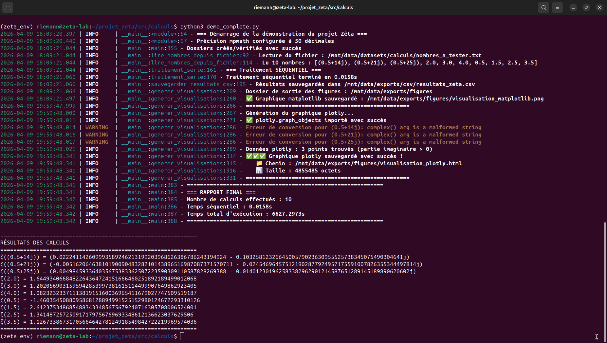
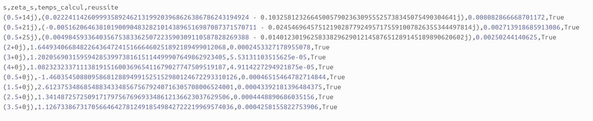
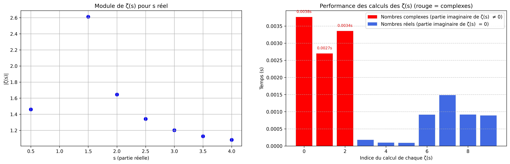
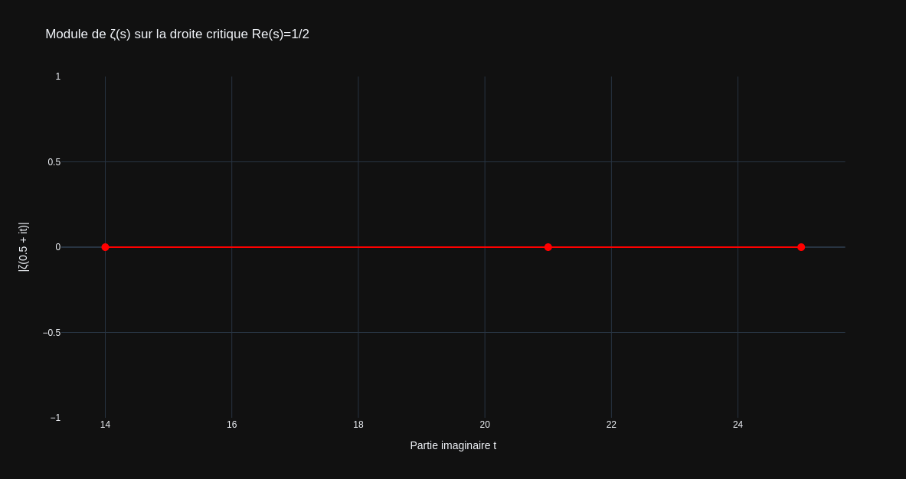

# 🧮 ζ(s) Projet Zêta : Exploration de l'Hypothèse de Riemann

> *"Les zéros non triviaux de la fonction zêta de Riemann ont tous une partie réelle égale à 1/2."*  
> — Bernhard Riemann (1859)

## 🎯 Objectif du projet

Ce modeste projet a pour but d'explorer numériquement et symboliquement la **fonction zêta de Riemann** ζ(s), 
pierre angulaire de la théorie des nombres. 
L'**Hypothèse de Riemann** (non démontrée à ce jour) affirme que tous les zéros non triviaux de ζ(s) se trouvent sur la droite critique **Re(s) = 1/2**.

Le projet combine :
- Calculs haute précision
- Visualisations 2D/3D
- Intégration intelligence artificielle locale (LLM)
- Preuves formelles (Lean 4)


## 💡 Récapitulatif de ma configuration matérielle

 ------------------------------------------------
| Composant    |Détail                   | État  |
|--------------|-------------------------|-------|
| Disque 1 To  | 73+183+1,1+651 ≈ 908 Go | ✅ OK |
| RAM	8 Go   | 7,6 Gi (soit 8 Go)      | ✅ OK |
| GPU GTX 960M | nvidia-smi (4 Go VRAM)  | ✅ OK |
| Intel Core i7| i7-7500U (2,7-3,5 GHz)  | ✅ OK |
 ------------------------------------------------

## 📁 Structure du projet Démo Zêta 

```text
/home/riemann/
├── projet_zeta/                         # Dossier principal
│   ├── zeta_env/                        # Environnement virtuel Python
│   ├── src/                             # Code source
│   │   ├── calculs/                     # Calculs sur la fonction zêta
│   │   │   └── demo_complete.py         # Démonstration complète
│   │   ├── ia/                          # Modèles d'IA locaux
│   │   ├── utils/                       # Utilitaires
│   │   └── tests/                       # Tests unitaires
│   ├── scripts/                         # Scripts exécutables
│   ├── notebooks/                       # Jupyter notebooks
│   ├── lean_projects/                   # Projets Lean 4
│   ├── config/                          # Fichiers de configuration
│   ├── docs/                            # Documentation locale
│   └── .vscode/                         # Configuration VS Code
└── /mnt/data/                           # Données volumineuses
    ├── datasets/calculs/                # Fichiers d'entrée
    ├── exports/csv/                     # Résultats CSV
    ├── exports/figures/                 # Graphiques PNG/HTML
    └── logs/                            # Journaux d'exécution
```

## 🛠️ Outils et bibliothèques utilisés

 --------------------------------------------------------------------------
| Catégorie              | Outils                         | Priorité       |
|------------------------|--------------------------------|----------------|
| Calcul haute précision | mpmath, sympy, Pari/GP         | 🔴 Haute       |
| Calcul vectoriel       | numpy, scipy                   | 🔴 Haute       |
| Visualisation          | matplotlib, plotly, seaborn    | 🔴 Haute       |
| Gestion données        | pandas, pyarrow                | 🟡 Moyenne     |
| Logging/Monitoring     | loguru, tqdm, memory_profiler  | 🟡 Moyenne     |
| Parallélisation        | joblib, dask, ray              | 🟡 Moyenne     |
| IA complémentaire      | transformers, torch            | 🟢 Optionnelle |
| Preuves formelles      | Lean 4                         | 🟢 Optionnelle |
| Environnement complet  |  SageMath                      | 🟢 Optionnelle |
 ---------------------------------------------------------------------------

## 📦 Processus d'installation et outils complémentaires

1. Création de l'environnement virtuel et activation
```text
cd ~
mkdir projet_zeta
cd projet_zeta
python3 -m venv zeta_env
source zeta_env/bin/activate
```
2. Création de l'arborescence complète du projet
```text
# Créer l'arborescence complète
cd ~/projet_zeta

mkdir -p src/{calculs,ia,utils,tests}
mkdir -p scripts
mkdir -p notebooks
mkdir -p config
mkdir -p docs

# Créer les fichiers __init__.py
touch src/__init__.py
touch src/calculs/__init__.py
touch src/ia/__init__.py
touch src/utils/__init__.py

# Structure sur lapartien des donnees /mnt/data
mkdir -p /mnt/data/{datasets/{zeros,calculs,references},models_ia,rapports/{pdf,doc,markdown},
logs/{calculs,ia,monitoring},monitoring/{cpu,gpu,ram,graphs},exports/{csv,json,figures}}

# Changer les propriétaires
sudo chown -R $USER:$USER /mnt/data
```

3. Installation du Système de base
```text
sudo apt update
sudo apt install python3 python3-pip python3-venv python3-dev build-essential curl wget -y
sudo apt install libopenblas-dev liblapack-dev -y
sudo apt install pari-gp -y
sudo apt install htop nvtop -y
sudo apt install lm-sensors
```

4. Installation des bibliothèques scientifiques optimisées
```text
bash

pip3 install numpy scipy matplotlib jupyter numba sympy mpmath
```

5. Outils complémentaires pour la Gestion des données et logs
```text
bash

pip install pandas          # Manipulation CSV, DataFrames
pip install pyarrow         # Format Parquet (plus rapide que CSV)
pip install loguru          # Logging avancé
```

6. Outils complémentaires pour le Monitoring et débogage
```text
bash

pip install tqdm            # Barres de progression pour calculs longs
pip install memory_profiler # Profilage mémoire
pip install line_profiler   # Profilage ligne par ligne
```

7. Outils complémentaires pour l'IA et Machine Learning (complément à Ollama)
```text
bash

pip install transformers    # Modèles Hugging Face
pip install torch           # PyTorch (si compatible GPU)
pip install sentence-transformers  # Embeddings pour analyse
```

8. Outils complémentaires pour la Visualisation avancée
```text
bash

pip install seaborn         # Statistiques visuelles
pip install bokeh           # Dashboards interactifs
```

9. Outils complémentaires pour le Calcul parallèle distribué (si calculs très longs)
```text
bash

pip install dask            # Calcul parallèle sur grand volume
pip install ray             # Framework distribué
```

10. Outils complémentaires pour la vérification de preuves formelles
```text
bash
curl -sSfL https://github.com/leanprover/elan/releases/download/v3.0.0/elan-x86_64-unknown-linux-gnu.tar.gz | tar xz
./elan-init -y --default-toolchain stable
source ~/.profile
```

11. Outils complémentaires pour l'intégration d'IA locale (LLM)
```text
bash
curl -fsSL https://ollama.com/install.sh | sh
sudo systemctl status ollama
```

12. Télecharger des Modèles IA spécialisés
```text
bash

# Modèle spécialisé en maths 
ollama pull mathstral

# Alternative plus légère et rapide
ollama pull phi3:mini
```

13. Outils complémentaires pour interaction avec l'IA depuis Python
```text
bash

pip install requests
```

14. Outils complémentaires Environnent de développement (IDE Spyder )
```text
bash

pip install spyder
```


## 🚀 Alias pratiques facultatifs (`.bashrc`)

 --------------------------------------------------------------------------------------------------
| Alias        | Commande                                                  | Usage                 |
|--------------|-----------------------------------------------------------|-----------------------|
| zeta-proj    | cd ~/projet_zeta/                                         | Dossier du projet     |
| zeta         | cd ~/projet_zeta && source zeta_env/bin/activate          | Activer Environnement |
| zeta-jupyter | cd ~/projet_zeta/notebooks && | Jupyter Lab               | IDE Jupyter           |
|              | source ~/projet_zeta/zeta_env/bin/activate && jupyter lab |                       |
| zeta-spyder  | source ~/projet_zeta/zeta_env/bin/activate &&             | IDE Spyder            |
|              | export QT_API=pyqt5 && spyder                             |                       |
| zeta-code    | code ~/projet_zeta                                        | IDE Vs Code           |
| zeta-python  | cd ~/projet_zeta/src/calculs'                             | Via Python3 consol    |
| zeta-data    | cd /mnt/data                                              | Données               |
| zeta-docs    | cd ~/projet_zeta/docs'                                    | Documents             |
| zeta-logs    | tail -f /mnt/data/logs/demo_zeta.log                      | Logs                  |
| zeta-monitor | cd ~/projet_zeta/scripts/monitor.sh"                      | Performance           |
 --------------------------------------------------------------------------------------------------

```text
bash

echo '
# Projet Zêta - alias supplémentaires

alias zeta-docs="cd ~/projet_zeta/docs"
alias zeta-proj="cd ~/projet_zeta/"
alias zeta-data="cd /mnt/data"
alias zeta-logs="tail -f /mnt/data/logs/mon_projet.log"
alias zeta-monitor="~/projet_zeta/scripts/monitor.sh"
alias zeta-notebook="cd ~/projet_zeta/notebooks && jupyter notebook"
alias zeta-spyder="source ~/projet_zeta/zeta_env/bin/activate && spyder"
alias zeta-jupyter="cd ~/projet_zeta/notebooks && source ~/projet_zeta/zeta_env/bin/activate && jupyter lab"
alias zeta-python="cd ~/projet_zeta/src/calculs" 
alias zeta-code="source ~/projet_zeta/zeta_env/bin/activate && code ~/projet_zeta" 
' >> ~/.bashrc

source ~/.bashrc
```

## 🧪 Exécution

```text
bash
# Activer l'environnement
zeta
# Lancer le script de demo ζ(s)
cd ~/projet_zeta/src/calculs
python demo_complete.py
```

```text
bash
# Exécution du model IA locale
ollama run mathstral

# Lancer prompe IA : Test réponse quelle est la valeur de ζ(2)
cd ~/projet_zeta/src/ia
python zeta_ia.py
```

## 🔧 Fichiers générés dans /mnt/data

 ---------------------------------------------------------------
| Type | Chemin                                                 | 
|------|--------------------------------------------------------|
| CSV  | /mnt/data/exports/csv/resultats_zeta.csv               |
| LOG  | /mnt/data/logs/demo_zeta.log                           |
| PNG  | /mnt/data/exports/figures/visualisation_matplotlib.png |
| HTML | /mnt/data/exports/figures/visualisation_plotly.html    |
 ---------------------------------------------------------------

## 📊 Résultats des tests Démo ζ(s)

<p><strong>Rapport Traitement d'exécution</strong><br>
</p>

<p><strong>Log Résultats calcul ζ(s)  .csv </strong><br>
</p>

<p><strong>Graphiques 2D statique via Matplot : Module |ζ(s)| en fonction de s (partie réelle)</strong><br>
</p>

<p><strong>Graphique 2D intercative via Plotly : Module |ζ(0.5 + it)| en fonction de t (partie imaginaire)</strong><br>
<a href="https://hprzeta.github.io/Riemann_Lab/images/visualisation_plotly.html" target="_blank">
  
</a>
<br>
<em>🔗 Cliquez sur l'image pour ouvrir la version interactive (Plotly) et  visualiser les imaginaires (it) de |ζ(0.5 + it) </em>
</p>

## 📚 Références
- [Hypothèse de Riemann - Wikipedia](https://fr.wikipedia.org/wiki/Hypoth%C3%A8se_de_Riemann)
- [Fonction zêta de Riemann - MathWorld](https://mathworld.wolfram.com/RiemannZetaFunction.html)
- [GitHub - Projet Zêta et IA](https://github.com/Deskuma/riemann-hypothesis-ai)
- [Images de Zêta - Mathématiques en couleurs ](https://graphes-fonctions-holomorphes.toile-libre.org/FoncHol/zeta.html)
- [mpmath documentation](https://mpmath.org/)
- [Ollama - LLMs locaux](https://ollama.com/)

## 📜 Licence
Projet de recherche personnel - Libre d'utilisation et de modification.
