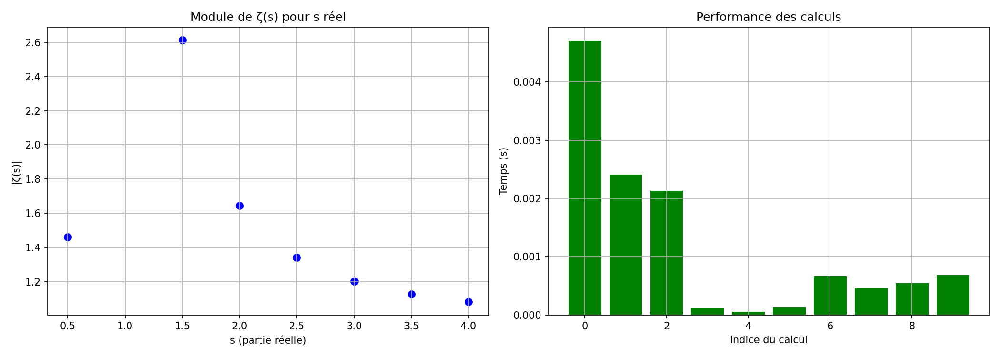

# 🧮 ζ(s) Projet Zêta : Exploration de l'Hypothèse de Riemann

> *"Les zéros non triviaux de la fonction zêta de Riemann ont tous une partie réelle égale à 1/2."*  
> — Bernhard Riemann (1859)

## 🎯 Objectif du projet

Ce projet a pour but d'explorer numériquement et symboliquement la **fonction zêta de Riemann** ζ(s), 
pierre angulaire de la théorie des nombres. 
L'**Hypothèse de Riemann** (non démontrée à ce jour) affirme que tous les zéros non triviaux de ζ(s) se trouvent sur la droite critique **Re(s) = 1/2**.

Ce projet combine :
- Calculs haute précision
- Visualisations 2D/3D
- Intelligence artificielle locale (LLM)
- Preuves formelles (Lean 4)

## 📁 Structure du projet Démo

/home/riemann/
├── projet_zeta/                         # Dossier principal
│   ├── zeta_env/                        # Environnement virtuel Python
│   ├── src/                             # Code source
│   │   ├── calculs/                     # Calculs sur la fonction zêta
│   │   │   └── demo_complete.py         # Démonstration complète
│   │   ├── ia/                          # Modèles d'IA locaux
│   │   ├── utils/                       # Utilitaires
│   │   └── tests/                       # Tests unitaires
│   ├── scripts/                         # Scripts exécutables
│   ├── notebooks/                       # Jupyter notebooks
│   ├── lean_projects/                   # Projets Lean 4
│   ├── config/                          # Fichiers de configuration
│   ├── docs/                            # Documentation locale
│   └── .vscode/                         # Configuration VS Code
└── /mnt/data/                           # Données volumineuses
    ├── datasets/calculs/                # Fichiers d'entrée
    ├── exports/csv/                     # Résultats CSV
    ├── exports/figures/                 # Graphiques PNG/HTML
    └── logs/                            # Journaux d'exécution


## 🛠️ Outils et bibliothèques

 --------------------------------------------------------------------------
| Catégorie              | Outils                         | Priorité       |
|------------------------|--------------------------------|----------------|
| Calcul haute précision | mpmath, sympy, Pari/GP         | 🔴 Haute       |
| Calcul vectoriel       | numpy, scipy                   | 🔴 Haute       |
| Visualisation          | matplotlib, plotly, seaborn    | 🔴 Haute       |
| Gestion données        | pandas, pyarrow                | 🟡 Moyenne     |
| Logging/Monitoring     | loguru, tqdm, memory_profiler  | 🟡 Moyenne     |
| Parallélisation        | joblib, dask, ray              | 🟡 Moyenne     |
| IA complémentaire      | transformers, torch            | 🟢 Optionnelle |
| Preuves formelles      | Lean 4                         | 🟢 Optionnelle |
| Environnement complet  |  SageMath                      | 🟢 Optionnelle |
 ---------------------------------------------------------------------------

## 🚀 Alias de configuration facultatif (`.bashrc`)

 --------------------------------------------------------------------------------------------------
| Alias        | Commande                                                  | Usage                 |
|--------------|-----------------------------------------------------------|-----------------------|
| zeta         | cd ~/projet_zeta && source zeta_env/bin/activate          | Activer Environnement |
| zeta-jupyter | cd ~/projet_zeta/notebooks && | Jupyter Lab               |                       |
|              | source ~/projet_zeta/zeta_env/bin/activate && jupyter lab | Jupyter               |
| zeta-spyder  | source ~/projet_zeta/zeta_env/bin/activate &&             |                       |
|              | export QT_API=pyqt5 && spyder                             | Spyder                |
| zeta-code    | code ~/projet_zeta                                        | VS Code               |
| zeta-data    | cd /mnt/data                                              | Données               |
| `eta-logs    | tail -f /mnt/data/logs/demo_zea.log                       | Logs                  |
 --------------------------------------------------------------------------------------------------
 
## 🧪 Exécution

```text
bash
# Activer l'environnement
zeta
# Lancer le script
cd ~/projet_zeta/src/calculs
python demo_complete.py
```

## 🔧 Fichiers générés

 ---------------------------------------------------------------
| Type | Chemin                                                 | 
|------|--------------------------------------------------------|
| CSV  | /mnt/data/exports/csv/resultats_zeta.csv               |
| LOG  | /mnt/data/logs/demo_zeta.log                           |
| PNG  | /mnt/data/exports/figures/visualisation_matplotlib.png |
| HTML | /mnt/data/exports/figures/visualisation_plotly.html    |
 ---------------------------------------------------------------

## 📊 Résultats des tests Démo

============================================================
SORTIE LOG DE TRAITEMENT
============================================================


============================================================
RÉSULTATS DES CALCULS
============================================================


============================================================
GRAPHIQUE 2 D
============================================================
 
 
 
 
## 📚 Références

- [Hypothèse de Riemann - Wikipedia](https://fr.wikipedia.org/wiki/Hypoth%C3%A8se_de_Riemann)
- [Fonction zêta de Riemann - MathWorld](https://mathworld.wolfram.com/RiemannZetaFunction.html)
- [mpmath documentation](https://mpmath.org/)
- [Ollama - LLMs locaux](https://ollama.com/)
- [GitHub - Projet Zêta](https://github.com/hprzeta/Riemann_Lab)

## 📜 Licence

Projet de recherche personnel - Libre d'utilisation et de modification.
