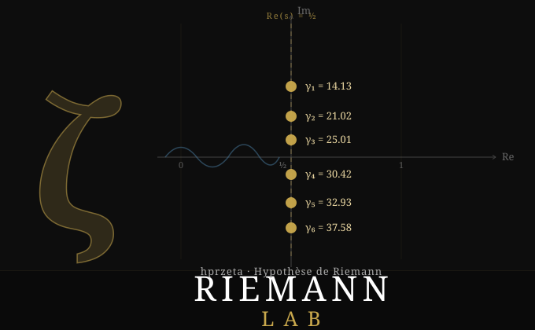
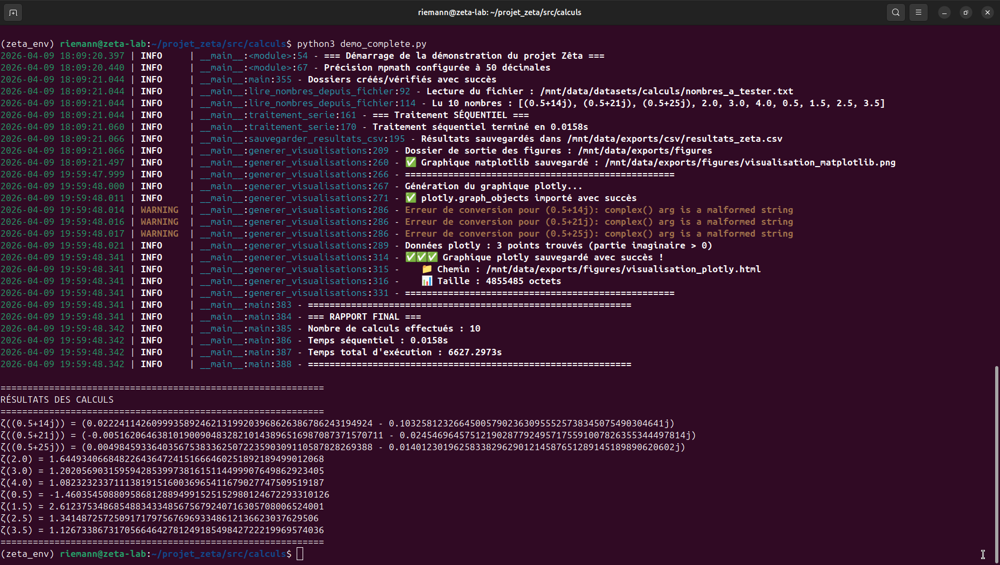
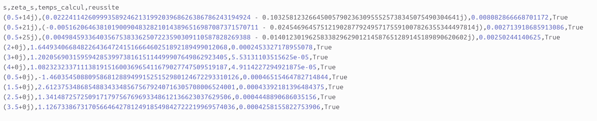
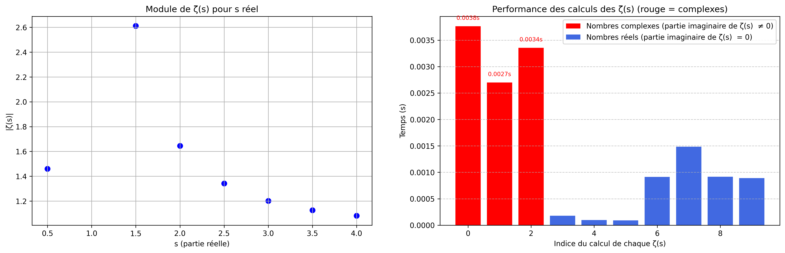
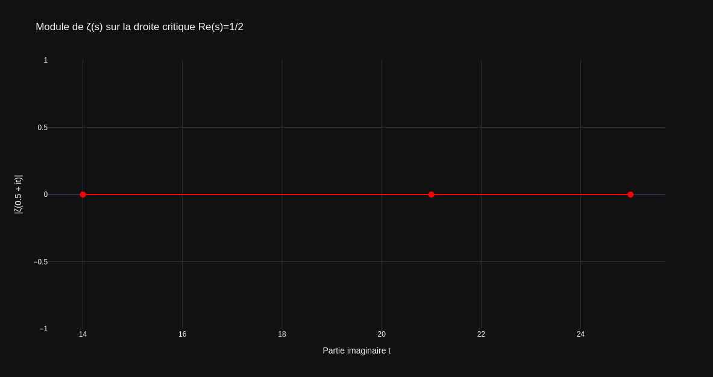
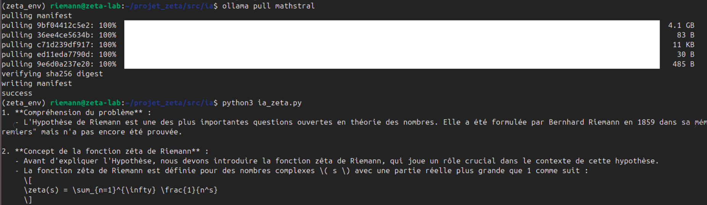
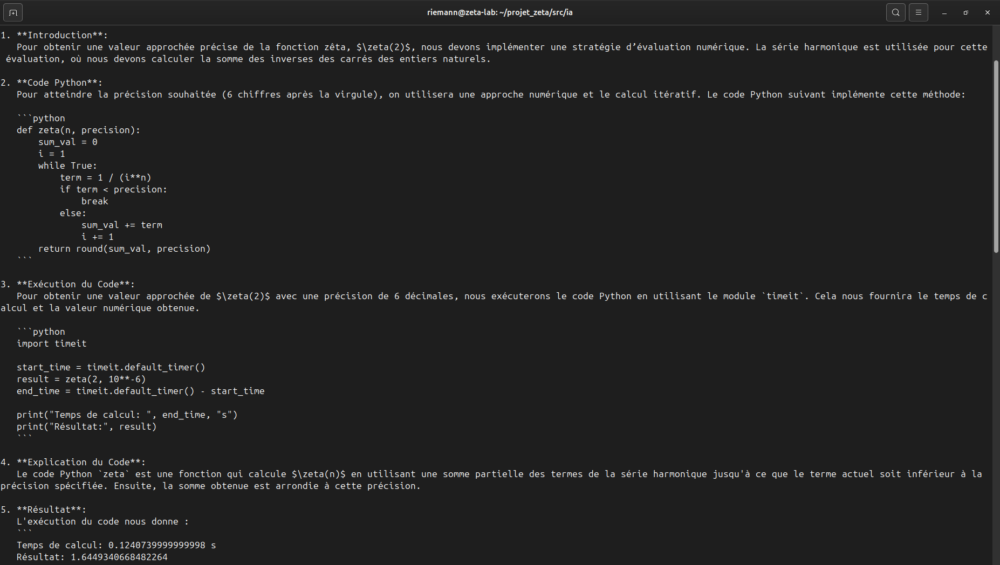

# 🧮 ζ(s) Projet Zêta : Exploration de l'Hypothèse de Riemann

> *"Les zéros non triviaux de la fonction zêta de Riemann ont tous une partie réelle égale à 1/2."*  
> — Bernhard Riemann (1859)

| Badge | Statut |
|-------|--------|
|  | Issues ouvertes |
|  | Issues fermées |
|  | [Mes issues assignées](https://github.com/issues?q=is%3Aopen+assignee%3Ahprzeta) |
|  | [Voir le Kanban](https://github.com/users/hprzeta/projects/1) |

## 🚀 État actuel — juin 2026

| Métrique | Valeur |
|---|---|
| Zéros calculés | **10 142** validés Turing-Backlund |
| Pipeline | **v4.1** · Illinois_C (170 bits) + Newton · ~41 z/s · GPU CuPy |
| 🌐 Site | [https://hprzeta.github.io/Riemann_Lab/](https://hprzeta.github.io/Riemann_Lab/) |
| 📚 Wiki | [https://github.com/hprzeta/Riemann_Lab/wiki](https://github.com/hprzeta/Riemann_Lab/wiki) |
| 💡 Config matérielle | [Wiki — Configuration-Materielle-Logicielle](https://github.com/hprzeta/Riemann_Lab/wiki/Configuration-Materielle-Logicielle) |

## 🎯 Objectif du projet

Le projet hprzeta a pour but d'explorer numériquement et symboliquement la **fonction zêta de Riemann** ζ(s).
Pierre angulaire de la théorie des nombres, l'**Hypothèse de Riemann** (non démontrée à ce jour) affirme que tous les zéros non triviaux de ζ(s) se trouvent sur la droite critique **Re(s) = 1/2**.

Le projet combine :
- Calculs haute précision
- Visualisations 2D/3D
- Intégration intelligence artificielle locale (LLM)
- Preuves formelles (Lean 4)

## 💡 Configuration matérielle et logicielle

> 📄 Cette section est documentée en détail sur le Wiki :
> **[Wiki — Configuration Matérielle & Logicielle](https://github.com/hprzeta/Riemann_Lab/wiki/Configuration-Materielle-Logicielle)**
>
> Contenu : matériel (i7-7500U, GTX 960M, RAM 8Go), structure projet, organisation `src/`,
> bibliothèques, fichiers générés dans `/mnt/data`, scripts d'installation.

## 📊 Résultats des tests Démo d'exploration de ζ(s)

<strong>Rapport Traitement d'exécution</strong> 

<strong>Log Résultats calcul ζ(s)  .csv </strong> 

<strong>Graphiques 2D statique via Matplot : Module |ζ(s)| en fonction de Re(s) -réelle de ζ(s)</strong> 

<strong>Graphique 2D intercative via Plotly : Module |ζ(0.5 + it)| en fonction de Img(it) -imaginaire de ζ(s)</strong> 

 
<em>🔗 Cliquez sur l'image pour ouvrir la version interactive (Plotly) et visualiser les imaginaires (it) de |ζ(0.5 + it) </em>

<strong>Rapport IA  : Ollama IA test de cacul de |ζ(s)|</strong> 

 

## 🗺️ Feuille de route – 4 étapes pour approfondir l'étude de ζ(s)

L’objectif est de dépasser la simple démonstration et de construire une **véritable plateforme de recherche** autour de l’hypothèse de Riemann.  
Chaque étape sera suivie via **GitHub Projects** (tableau Kanban) et documentée en détail dans le **Wiki** du dépôt.

| Étape | Thème principal | Objectifs clés |
|-------|----------------|----------------|
| **1** | 🔢 Calcul haute précision & vérification | Calculer les 1000 premiers zéros non triviaux avec `mpmath` ; les comparer à la base LMFDB ; implémenter la fonction ζ(s) de Riemann. |
| **2** | 📊 Visualisations avancées & statistiques | Cartes de phase, surfaces 3D interactives, écarts entre zéros consécutifs (corrélations de Montgomery). |
| **3** | 🤖 IA locale & conjectures | Utiliser `mathstral` (Ollama) pour prédire la position des zéros ; générer automatiquement des formules symboliques. |
| **4** | 📜 Preuves formelles (Lean 4) | Formaliser le prolongement analytique et l’équation fonctionnelle ; démontrer l’absence de zéro sur Re(s)=1. |

### 📌 Comment je notifie l’avancement ?

- **GitHub Projects** : chaque tâche (ex: « Calcul des 500 premiers zéros ») devient une *issue* déplacée dans les colonnes `Todo → In progress → Done`.  
- **Wiki** : une page par résultat (ex: « Liste des zéros calculés », « Graphiques d’écarts », « Tests de l’IA ») avec explications, captures et liens vers les fichiers CSV/HTML.  
- **README** : un badge ou un petit tableau récapitulatif sera mis à jour à chaque fin d’étape.

> 👉 En visitant ce dépôt, tu peux donc **voir d’un coup d’œil** ce qui est fait (Projects), **lire les détails** (Wiki) et **relancer les scripts** toi-même.

## 📚 Références
- [Hypothèse de Riemann - Wikipedia](https://fr.wikipedia.org/wiki/Hypoth%C3%A8se_de_Riemann)
- [Fonction zêta de Riemann - MathWorld](https://mathworld.wolfram.com/RiemannZetaFunction.html)
- [Images de Zêta - Avec "Les Mathématiques en couleurs" ](https://graphes-fonctions-holomorphes.toile-libre.org/FoncHol/zeta.html)
- [mpmath documentation](https://mpmath.org/)
- [Ollama - LLMs locaux](https://ollama.com/)

## 📜 Licence
Projet de recherche personnel - hprzeta - Libre d'utilisation et de modification.
