# Cours ζ & Hypothèse de Riemann — édition complète

**Auteur : hprzeta** · Dépôt : [github.com/hprzeta/Riemann_Lab](https://github.com/hprzeta/Riemann_Lab)

*Cours gradué en 14 chapitres, du lycée au doctorat, sur la fonction zêta de Riemann et l'Hypothèse de Riemann (HR). Chaque chapitre distingue explicitement : théorème prouvé / conjecture / heuristique / vérification numérique.*

---

## Sommaire

1. **Série de Dirichlet & convergence** ✅ *(rédigé)*
2. **Critère série ↔ intégrale** ✅ *(rédigé)*
3. **Nombres complexes : module & argument** ✅ *(rédigé)*
4. **Formule d'Euler (2 démonstrations)** ✅ *(rédigé)*
5. **Module |e^{iθ}|=1 et |n⁻ˢ|** ✅ *(rédigé)*
6. **Fonction êta & prolongement (bande 0<σ≤1)** ✅ *(rédigé)*
7. **Chemins, contours, intégrale de contour** ✅ *(rédigé)*
8. **Théorème de Cauchy & holomorphie** ✅ *(rédigé)*
9. **Singularités, pôles, résidus (ordre 2, 3, n)** ✅ *(rédigé)*
10. **Facteurs Gamma & Stirling** ✅ *(rédigé)*
11. **Prolongement analytique & équation fonctionnelle** ✅ *(rédigé)*
12. **Fonction ξ, produit de Hadamard, Ξ(t)** ✅ *(rédigé)*
13. **Produit d'Euler & nombres premiers** ✅ *(rédigé)*
14. **Résidus de ζ'/ζ, principe de l'argument, N(T), HR** ✅ *(rédigé)*

---

# Chapitre 1 — Série de Dirichlet & convergence de ζ(s)

*Sources fusionnées : Grok (Bloc 1-2), Kimi (Screenshot 1, deux onglets), DeepSeek (Capture 1, 2ᵉ série), Perplexity (Écran 1). Fil conducteur : chaque brique prépare le prolongement analytique (chapitres 6 et 11) et l'équation fonctionnelle.*

## Formule clé

$$\zeta(s) = \sum_{n=1}^{\infty} \frac{1}{n^s}, \qquad s = \sigma + it \in \mathbb{C}, \quad \sigma = \mathrm{Re}(s),\ t = \mathrm{Im}(s)$$

---

### 🟢 Niveau Débutant — Lycée

On additionne une infinité de fractions :

$$1 + \frac{1}{2^s} + \frac{1}{3^s} + \frac{1}{4^s} + \cdots$$

Le nombre $s$ est « complexe » : on l'écrit $s = \sigma + it$, où $\sigma$ (sigma) est sa **partie réelle** et $t$ sa **partie imaginaire**. Pour l'instant, retenez seulement ceci : $\sigma$ contrôle *la vitesse à laquelle les termes rapetissent*, et $t$ contrôle *une rotation* dont on comprendra le mécanisme complet aux chapitres 3 à 5.

**Intuition centrale.** Une somme infinie ne donne un nombre fini que si ses termes rapetissent assez vite. Analogie : verser de l'eau dans des verres de plus en plus petits. Si les verres rétrécissent assez vite, le total d'eau reste fini même avec une infinité de verres. Plus $\sigma$ est grand, plus $1/n^\sigma$ décroît vite, plus la somme a de chances de converger.

**Exemple numérique simple.** Pour $s=2$ (réel, $t=0$) :

$$\zeta(2) = 1 + \frac14 + \frac19 + \frac{1}{16} + \cdots = \frac{\pi^2}{6} \approx 1{,}644934 \qquad \text{(Euler, 1735)}$$

Pour $s=1$ : $\zeta(1) = 1+\frac12+\frac13+\frac14+\cdots$ **diverge** (très lentement — c'est la série harmonique).

---

### 🔵 Niveau Intermédiaire — L1/L2

**Décomposition du terme général.** Par définition de la puissance complexe ($a^b = e^{b\ln a}$) :

$$n^s = n^{\sigma+it} = e^{(\sigma+it)\ln n} = e^{\sigma\ln n}\cdot e^{it\ln n} = n^\sigma\cdot e^{it\ln n}$$

d'où

$$\frac{1}{n^s} = n^{-s} = n^{-\sigma}\cdot e^{-it\ln n}$$

Le terme se sépare donc en deux facteurs de nature très différente :

| Facteur | Nature | Rôle |
|---|---|---|
| $n^{-\sigma}$ | réel positif | la **taille** (module) du terme |
| $e^{-it\ln n}$ | complexe, module 1 | une pure **rotation** (angle $-t\ln n$) |

Pourquoi $e^{-it\ln n}$ ne change-t-il jamais la taille ? Parce que pour tout réel $\theta$, $|e^{i\theta}|=1$ — c'est la formule d'Euler, démontrée en détail aux chapitres 4 et 5. Ici, admettons le résultat : $|\cos\theta+i\sin\theta| = \sqrt{\cos^2\theta+\sin^2\theta} = 1$.

**Conséquence immédiate :**

$$\left|\frac{1}{n^s}\right| = n^{-\sigma}\cdot\underbrace{|e^{-it\ln n}|}_{=\,1} = n^{-\sigma}$$

Le module du terme **ne dépend que de $\sigma$**, jamais de $t$. La partie imaginaire fait tourner le terme dans le plan complexe, mais ne change pas sa longueur.

**Exemple numérique détaillé.** Prenons $n=2$, $s=2+3i$ (donc $\sigma=2$, $t=3$) :

$$2^{-2} = 0{,}25, \qquad \ln 2 \approx 0{,}693147, \qquad -it\ln n = -i\cdot 3\cdot 0{,}693147 \approx -2{,}07944\,i$$

$$e^{-2{,}07944\,i} = \cos(-2{,}07944) + i\sin(-2{,}07944) \approx -0{,}487 - 0{,}873\,i$$

Terme complet :

$$\frac{1}{2^{2+3i}} \approx 0{,}25\times(-0{,}487-0{,}8734i) \approx -0{,}1217 - 0{,}2184\,i$$

*(valeur vérifiée par calcul direct en précision arbitraire : $-0{,}12175 - 0{,}21835\,i$, cohérente avec le calcul pas à pas ci-dessus.)*

Son module vaut **exactement** $0{,}25 = 2^{-2}$ — conforme à la formule, indépendamment de $t=3$.

---

### 🟠 Niveau Expert — L3/M1/ingénieur

**Convergence absolue.** Une série $\sum a_n$ (complexe) converge absolument si $\sum|a_n|$ converge. Ici :

$$\sum_{n=1}^{\infty}\left|\frac{1}{n^s}\right| = \sum_{n=1}^{\infty} n^{-\sigma}$$

C'est la **série de Riemann** d'exposant $\sigma$. Le chapitre 2 démontre rigoureusement (critère de comparaison série/intégrale) que :

$$\sum_{n=1}^{\infty} n^{-\sigma} < +\infty \iff \sigma > 1$$

**Convergence normale sur les demi-plans fermés.** Sur tout demi-plan $\sigma \ge 1+\delta$ ($\delta>0$ fixé), on a la majoration **indépendante de $t$** :

$$\left|\frac{1}{n^s}\right| = n^{-\sigma} \le n^{-(1+\delta)}$$

Comme $\sum n^{-(1+\delta)}$ converge, le critère de Weierstrass donne la convergence **normale**, donc **uniforme**, de la série sur ce demi-plan. Une limite uniforme locale de fonctions holomorphes étant holomorphe, $\zeta(s)$ est **holomorphe** sur tout l'ouvert $\{\mathrm{Re}(s)>1\}$.

**Théorie générale des séries de Dirichlet.** Pour une série $\sum a_n n^{-s}$ quelconque, il existe une **abscisse de convergence simple** $\sigma_c$ et une **abscisse de convergence absolue** $\sigma_a$, avec la relation générale :

$$0 \le \sigma_a - \sigma_c \le 1$$

Pour $\zeta(s)$ ($a_n=1$ pour tout $n$), on a $\sigma_c = \sigma_a = 1$ : il n'existe aucune bande de convergence conditionnelle pour la série $\sum n^{-s}$ elle-même — dès que $\sigma\le 1$, elle diverge purement et simplement (les termes ne tendent même pas vers 0 en module dès que $\sigma\le 0$).

---

### 🔴 Niveau Très Expert / Chercheur — M2/doctorat

**Unicité du prolongement (théorème d'identité).** La série ne définit $\zeta(s)$ que sur $\{\mathrm{Re}(s)>1\}$. Si une fonction holomorphe $f$ coïncide avec $\zeta$ sur un ouvert non vide, alors, par le théorème d'identité des fonctions analytiques, tout prolongement holomorphe de $\zeta$ à un domaine plus grand est **unique**. C'est ce qui légitime, aux chapitres 6 et 11, de continuer à appeler « $\zeta(s)$ » la fonction prolongée : il ne peut logiquement en exister qu'une seule.

**Non-bornitude dans la bande critique (théorème de Bohr–Landau, 1910).** Une fois le prolongement effectué (chapitres 6, 11), on démontre que $\zeta(s)$ n'est **pas bornée** dans toute bande verticale $\tfrac12<\sigma<1$ lorsque $|t|\to\infty$. Cela interdit toute convergence uniforme de la série de Dirichlet dans cette bande — même reformulée — et confirme qu'aucune « astuce » de sommation directe ne peut remplacer un véritable prolongement analytique.

**Limite structurelle à retenir.** La série $\sum n^{-s}$ est un objet **local** : elle ne « voit » que $\mathrm{Re}(s)>1$. Toute la richesse de la théorie (zéros, équation fonctionnelle, hypothèse de Riemann) vit dans une région où cette série n'a, au sens propre, *aucune existence*. C'est le fil conducteur de tout le cours.

---

> **📐 Exemple numérique**
>
> *Rappel condensé (calcul détaillé ci-dessus, niveau Intermédiaire) :* $n=2$, $s=2+3i$ → terme $\approx -0{,}1217-0{,}2184i$, de module exactement $0{,}25=2^{-2}$.
>
> *Second exemple — plus proche du LAB.* Prenons $n=3$ et $s=\tfrac12+it$ avec $t\approx14{,}134725$, l'ordonnée du **premier zéro non trivial** de $\zeta$ (valeur LMFDB, réutilisée aux chapitres 6 et 14). Ici $\sigma=1/2$, donc :
> $$\left|\frac{1}{3^{s}}\right| = 3^{-1/2} = \frac{1}{\sqrt3} \approx 0{,}57735$$
> indépendamment de $t$. Calcul complet (recalculé pour ce cours, dps=20) : $\theta = t\ln3\approx15{,}5286$ rad (soit $\approx2{,}9622$ rad modulo $2\pi$), d'où $1/3^{s} \approx -0{,}56809 - 0{,}10301\,i$ — module bien égal à $0{,}57735=3^{-1/2}$.
>
> Valeur de référence : $\zeta(2)=\pi^2/6\approx1{,}644934$ (Euler, 1735) ; $\zeta(1)$ diverge (série harmonique).

> **⚠️ Piège / limite**
>
> 1. **Ne pas confondre $\sigma$ et $t$.** Seule la partie réelle $\sigma$ pilote la taille (module) du terme ; $t$ ne fait que le faire tourner.
> 2. **La série ne définit $\zeta(s)$ que pour $\mathrm{Re}(s)>1$.** Écrire « $\zeta(s)=\sum n^{-s}$ » pour un $s$ quelconque est incorrect sans précision — ailleurs, $\zeta$ est définie par prolongement analytique (chapitres 6 et 11), pas par cette somme.
> 3. **Piège de nomenclature.** Plusieurs extractions sources (Grok, Kimi) nomment le critère de convergence de $\sum n^{-\sigma}$ « critère de Riemann-Bertrand ». C'est un abus de langage à corriger : le **critère de Riemann** concerne $\sum 1/n^\alpha$ (convergence ssi $\alpha>1$) ; le **critère de Bertrand** est un raffinement *distinct*, pour les séries $\sum 1/(n^\alpha(\ln n)^\beta)$, utile seulement au cas frontière $\alpha=1$. Ce cours emploie les noms corrects.

> **🔗 Lien avec le LAB**
>
> Le pipeline `compute_zeros_*` évalue les zéros de $\zeta$ **sur la droite critique $\sigma=1/2$** — une zone où la série de Dirichlet diverge purement et simplement (elle ne converge même pas conditionnellement, cf. niveau Expert ci-dessus). Toute évaluation numérique du LAB repose donc *entièrement* sur le prolongement analytique : fonction $\eta$ (chapitre 6), équation fonctionnelle et fonction $\xi$ (chapitre 11-12), ou formule de Riemann-Siegel/fonction $Z(t)$ de Hardy (chapitres 5, 10) — **jamais** sur la somme brute $\sum n^{-s}$, qui n'a ici aucun sens mathématique.

---

## Schéma — Domaine de convergence absolue de la série de Dirichlet

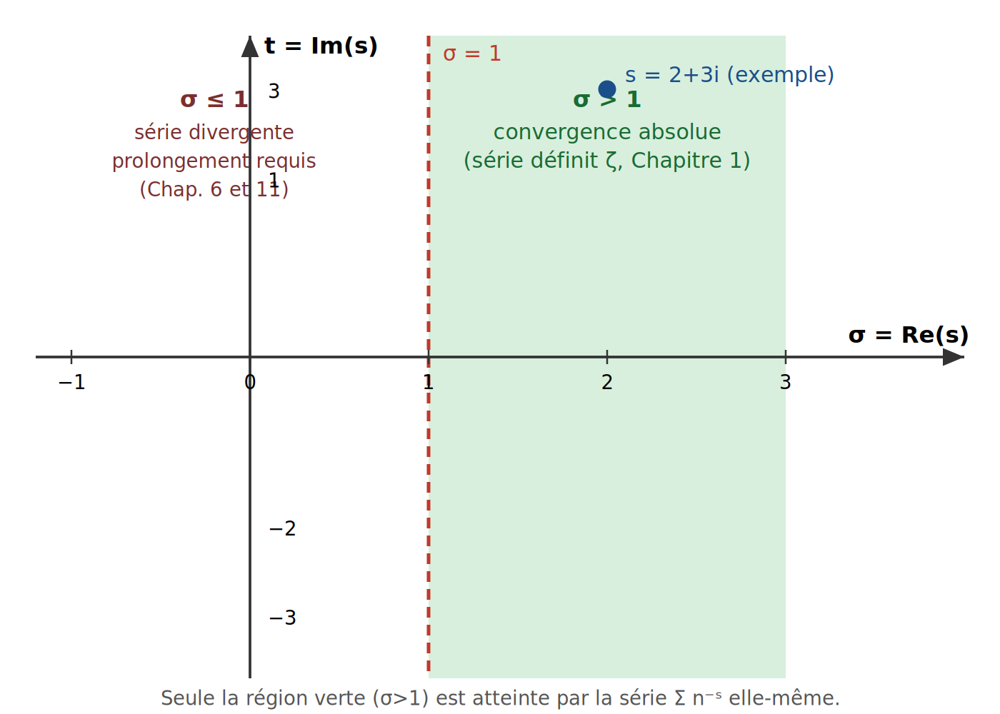

*Source éditable : `figures/ch01_domaine_convergence.svg`. Lecture du schéma : la série de Dirichlet définissant $\zeta(s)$ ne « vit » que dans le demi-plan vert $\sigma>1$. Tout le reste du plan complexe — y compris la droite critique $\sigma=1/2$ où se concentre l'intérêt du LAB — est hors de portée de cette série et nécessite un prolongement analytique (chapitres 6 et 11).*

---

---

# Chapitre 2 — Critère série ↔ intégrale

*Sources fusionnées : Kimi (Screenshot 2), Grok (Bloc 2-3), DeepSeek. Fil conducteur : cette démonstration rigoureuse justifie le résultat admis au Chapitre 1 (convergence de $\sum n^{-\sigma}$ ssi $\sigma>1$).*

## Formule clé

$$\int_1^{\infty} \frac{dx}{x^\alpha} = \frac{1}{\alpha-1} \quad (\alpha>1), \qquad\text{diverge pour } \alpha\le 1$$

---

### 🟢 Niveau Débutant — Lycée

Idée visuelle : on empile des rectangles de largeur 1 et de hauteur $1/n^\alpha$, côte à côte. Leur aire totale, c'est la somme de la série. Si l'aire sous la courbe $y=1/x^\alpha$ (l'intégrale) est finie, l'aire des rectangles l'est aussi — et réciproquement.

**Exemple numérique simple.** Pour $\alpha=2$ :
$$\int_1^{100}\frac{dx}{x^2} = 1-\frac{1}{100} = 0{,}99 \qquad\text{(aire presque égale à 1, même à l'infini)}$$
Pour $\alpha=1$ :
$$\int_1^{100}\frac{dx}{x} = \ln(100) \approx 4{,}605 \qquad\text{(et ça continue de grandir sans borne jusqu'à l'infini)}$$

---

### 🔵 Niveau Intermédiaire — L1/L2

**Démonstration rigoureuse (encadrement).** Soit $f(x)=x^{-\alpha}$, positive et **décroissante** sur $[1,+\infty[$. Pour tout entier $n\ge1$ et tout $x\in[n,n+1]$ : $f(n+1)\le f(x)\le f(n)$ (décroissance). En intégrant sur $[n,n+1]$ :

$$f(n+1) \le \int_n^{n+1} f(x)\,dx \le f(n)$$

En sommant pour $n=1,\dots,N$, on obtient l'encadrement classique :

$$\int_1^{N+1} f(x)\,dx \;\le\; \sum_{n=1}^{N} f(n) \;\le\; f(1) + \int_1^{N} f(x)\,dx$$

**Calcul de la primitive** de $x^{-\alpha}$ :

$$\int_1^{X} x^{-\alpha}\,dx = \left[\frac{x^{1-\alpha}}{1-\alpha}\right]_1^{X} = \frac{X^{1-\alpha}-1}{1-\alpha}$$

- **$\alpha>1$** : $1-\alpha<0$, donc $X^{1-\alpha}\to 0$ quand $X\to\infty$ ⟹ l'intégrale converge vers $\dfrac{1}{\alpha-1}$ ⟹ **la série converge**.
- **$\alpha=1$** : $\int_1^X dx/x = \ln X \to +\infty$ ⟹ **la série harmonique diverge**.
- **$\alpha<1$** : $1-\alpha>0$, $X^{1-\alpha}\to+\infty$ ⟹ **diverge**.

En passant à la limite $N\to\infty$ dans l'encadrement (cas $\alpha>1$), on obtient un encadrement de $\zeta(\alpha)$ lui-même :

$$\frac{1}{\alpha-1} \;\le\; \zeta(\alpha) \;\le\; \frac{\alpha}{\alpha-1}$$

**Exemple numérique (recalculé, mpmath dps=20).** Pour $\alpha=2$, $N=10$ :

$$\sum_{n=1}^{10}\frac{1}{n^2} \approx 1{,}549768, \qquad \int_1^{11}\frac{dx}{x^2}=\frac{10}{11}\approx0{,}909091, \qquad 1+\int_1^{10}\frac{dx}{x^2}=1{,}9$$

On vérifie bien $0{,}909091 \le 1{,}549768 \le 1{,}9$ : l'encadrement fonctionne, et se resserre quand $N\to\infty$ vers $1\le\zeta(2)\le2$ (la vraie valeur, $\zeta(2)=\pi^2/6\approx1{,}644934$, y est bien contenue).

---

### 🟠 Niveau Expert — L3/M1/ingénieur

**Développement asymptotique (Euler-Maclaurin).** Le cas $\alpha=1$ (série harmonique) admet un développement précis :

$$H_N = \sum_{n=1}^{N}\frac{1}{n} = \ln N + \gamma + \frac{1}{2N} - \frac{1}{12N^2} + O\!\left(\frac1{N^4}\right)$$

où $\gamma\approx0{,}5772156649$ est la **constante d'Euler-Mascheroni** (recalculée, dps=20).

**Exemple numérique.** Pour $N=10^7$ :

$$H_{10^7} \approx \ln(10^7) + \gamma + \frac{1}{2\cdot10^7} \approx 16{,}695311$$

**Lien avec la transformée de Mellin (teaser Chapitre 10).** En partant de $1/(e^x-1)=\sum_{n\ge1}e^{-nx}$ (série géométrique, $x>0$) et de $\int_0^\infty x^{s-1}e^{-nx}\,dx=\Gamma(s)/n^s$ (changement de variable $u=nx$ dans la définition de $\Gamma$), on somme sur $n$ et on obtient, pour $\mathrm{Re}(s)>1$ :

$$\Gamma(s)\,\zeta(s) = \int_0^\infty \frac{x^{s-1}}{e^x-1}\,dx$$

C'est une seconde façon — indépendante de l'encadrement rectangles/aire — de voir $\zeta(s)$ comme une intégrale : elle prépare directement le rôle du facteur $\Gamma$ dans l'équation fonctionnelle (chapitres 10-11).

---

### 🔴 Niveau Très Expert / Chercheur — M2/doctorat

**Pourquoi ce critère ne s'étend PAS à la bande critique.** Le critère de comparaison série/intégrale exige que $f$ soit **positive et décroissante** — une hypothèse purement réelle. Sur la droite $\sigma$ fixé $\le1$ avec $t\ne0$, les termes de $\zeta(\sigma+it)=\sum n^{-\sigma}e^{-it\ln n}$ **oscillent** en phase (chapitre 1) : il n'existe aucune fonction réelle positive décroissante à comparer. Ce critère élémentaire ne peut donc *jamais* servir à étudier la convergence — ni même à donner un sens — à $\zeta(s)$ dans la bande critique. C'est précisément pour cela que les chapitres 6 (fonction $\eta$), 10 (Stirling/$\Gamma$) et 11 (équation fonctionnelle) sont nécessaires : ils substituent au critère réel des outils d'analyse complexe.

**Développement d'Euler-Maclaurin général.** Pour $\alpha\ne1$ :

$$\sum_{n=1}^{N}\frac{1}{n^\alpha} = \frac{N^{1-\alpha}}{1-\alpha} + \zeta(\alpha) + \frac{1}{2N^\alpha} + \sum_{k=1}^{m}\frac{B_{2k}}{(2k)!}\,\frac{\Gamma(\alpha+2k-1)}{\Gamma(\alpha)}\,\frac{1}{N^{\alpha+2k-1}} + R_m$$

où $B_{2k}$ sont les nombres de Bernoulli. **Piège asymptotique :** ce développement est une série **divergente** (asymptotique, non convergente) — il faut tronquer au terme optimal, jamais sommer indéfiniment (même mécanisme qu'au chapitre 10 pour la série de Stirling).

---

> **📐 Exemple numérique**
>
> $\alpha=2$, $N=10$ : $\sum_{1}^{10}n^{-2}\approx1{,}549768$, encadré par $10/11\approx0{,}909091$ et $1{,}9$. $\zeta(1{,}5)\approx2{,}612375$ (recalculé, mpmath dps=20) — série qui converge mais lentement ($\alpha$ proche de 1). $H_{10^7}\approx16{,}695311$.

> **⚠️ Piège / limite**
>
> Le critère exige $f$ **positive ET décroissante**. Il ne s'applique **pas** à $\zeta(\sigma+it)$ pour $t\ne0$ : les termes oscillent, aucune comparaison réelle n'est possible — on ne peut **pas** en déduire quoi que ce soit sur $\zeta$ dans la bande critique par ce moyen. Second piège : le développement d'Euler-Maclaurin est une série asymptotique *divergente* — sommer trop de termes dégrade le résultat.

> **🔗 Lien avec le LAB**
>
> Ce critère élémentaire fixe la limite théorique de toute sommation directe : au-delà, le LAB doit basculer sur des méthodes de prolongement (Riemann-Siegel, Illinois). C'est le même principe qui motive le seuil `T_SEUIL_ILLINOIS_C = 300` du projet : pour $t<300$ (moins de 7 termes Riemann-Siegel significatifs), un fallback mpmath haute précision reste légitime, exactement comme ici la validité du critère dépend d'un seuil ($\alpha>1$).

## Schéma — Comparaison rectangles / aire sous la courbe

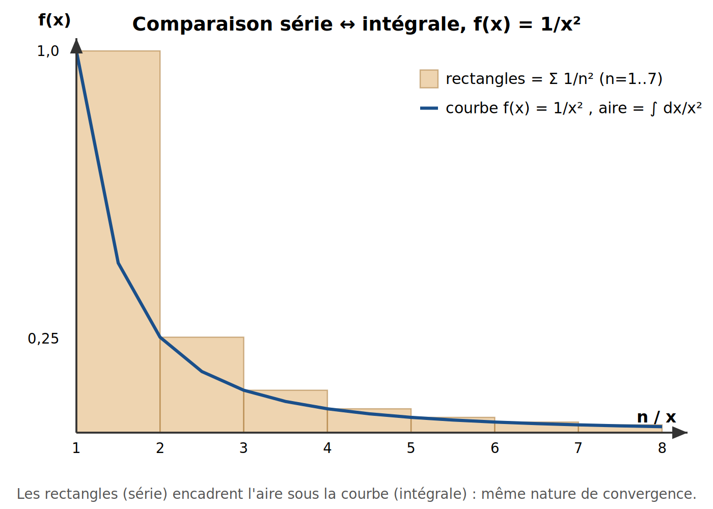

*Source éditable : `figures/ch02_serie_integrale.svg`. Les rectangles de hauteur $1/n^2$ (série) encadrent l'aire sous la courbe $1/x^2$ (intégrale) : les deux ont la même nature de convergence.*

---

# Chapitre 3 — Nombres complexes : module & argument

*Sources fusionnées : Perplexity (Partie I), Grok (Bloc 5). Fil conducteur : prépare la formule d'Euler (Chapitre 4) et le module de $n^{-s}$ (Chapitre 5).*

## Formule clé

$$z = x+iy = r(\cos\theta+i\sin\theta), \qquad r=|z|=\sqrt{x^2+y^2},\quad \theta=\arg(z)$$

---

### 🟢 Niveau Débutant — Lycée

Un nombre complexe $z=x+iy$ est un **point du plan** : $x$ (partie réelle) est la position horizontale, $y$ (partie imaginaire) la position verticale. Le **module** $|z|$ est simplement sa distance à l'origine — comme une distance à vol d'oiseau sur une carte.

**Exemple numérique.** $z=3+4i$ : par Pythagore,

$$|z| = \sqrt{3^2+4^2} = \sqrt{9+16} = \sqrt{25} = 5$$

(le triangle 3-4-5, bien connu).

---

### 🔵 Niveau Intermédiaire — L1/L2

**Forme trigonométrique (polaire).** Si $r=|z|$ et $\theta$ est l'angle entre l'axe réel positif et le vecteur $Oz$ :

$$x = r\cos\theta, \qquad y = r\sin\theta \quad\Longrightarrow\quad z = r(\cos\theta+i\sin\theta)$$

L'angle $\theta$ s'appelle l'**argument** de $z$, noté $\arg(z)$. Il se calcule via $\tan\theta=y/x$ (avec attention au quadrant).

**Exemple numérique.** $\arg(1+i)$ : $x=y=1$, donc $\theta=\pi/4$ (45°) — vérifié : $\cos(\pi/4)=\sin(\pi/4)=\tfrac{\sqrt2}{2}$, et $r\cdot\tfrac{\sqrt2}{2}=1 \Rightarrow r=\sqrt2=|1+i|$. ✓

**Règle de multiplication (admise ici, démontrée au chapitre 4 via la formule d'Euler) :**

$$|z_1z_2| = |z_1|\,|z_2|, \qquad \arg(z_1z_2) = \arg(z_1)+\arg(z_2) \pmod{2\pi}$$

**Exemple numérique vérifié (mpmath, dps=20).** $z_1=1+2i$, $z_2=3-i$ :

$$z_1z_2 = (1+2i)(3-i) = 3 - i + 6i - 2i^2 = 3+5i+2 = 5+5i$$

$$|z_1|=\sqrt5\approx2{,}23607,\quad |z_2|=\sqrt{10}\approx3{,}16228,\quad |z_1|\cdot|z_2|=\sqrt{50}\approx7{,}07107=|z_1z_2|\ \checkmark$$

$$\arg(z_1)\approx1{,}10715,\quad \arg(z_2)\approx-0{,}32175,\quad \text{somme}\approx0{,}78540=\pi/4=\arg(5+5i)\ \checkmark$$

---

### 🟠 Niveau Expert — L3/M1/ingénieur

**Interprétation comme rotation.** Puisque $i=\cos(\pi/2)+i\sin(\pi/2)=e^{i\pi/2}$ (formule d'Euler, chapitre 4), multiplier un nombre complexe par $i$ effectue une **rotation de $90°$** dans le sens trigonométrique — c'est un cas particulier de la règle d'addition des arguments.

**Argument principal et non-unicité.** $\arg(z)$ n'est défini qu'à $2\pi$ près : on choisit une **détermination principale** $\theta\in(-\pi,\pi]$ par convention, mais $\theta+2k\pi$ ($k\in\mathbb{Z}$) désigne le même point. Cette ambiguïté oblige, dès qu'on manipule $\log z$ ou $z^s$ pour $z$ complexe (nécessaire pour $n^{-s}$, chapitre 1), à fixer une **coupure** (branch cut) — un choix arbitraire qui deviendra un piège central au chapitre 9 (contours) et au chapitre 11 (contour de Hankel).

---

### 🔴 Niveau Très Expert / Chercheur — M2/doctorat

**Structure de groupe.** L'application $z\mapsto(|z|,\arg z)$ identifie $(\mathbb{C}^*,\times)$ à $(\mathbb{R}_{>0},\times)\times(\mathbb{R}/2\pi\mathbb{Z},+)$ : tout nombre complexe non nul se factorise de façon unique en un **module** (groupe multiplicatif des réels positifs) et un **angle** (groupe additif du cercle). C'est cette décomposition multiplicative qui rend possible, au chapitre 13, le **produit d'Euler** $\zeta(s)=\prod_p(1-p^{-s})^{-1}$ : la factorisation unique d'un entier en facteurs premiers (structure multiplicative de $\mathbb{N}^*$) se traduit terme à terme via cette même décomposition module/argument appliquée à chaque facteur $p^{-s}$.

---

> **📐 Exemple numérique**
>
> $|3+4i|=5$ (Pythagore) ; $\arg(1+i)=\pi/4$. Produit vérifié : $(1+2i)(3-i)=5+5i$, avec $|z_1||z_2|=\sqrt{50}=|z_1z_2|$ et $\arg(z_1)+\arg(z_2)=\pi/4=\arg(z_1z_2)$ (calculs recalculés en précision arbitraire, mpmath dps=20).

> **⚠️ Piège / limite**
>
> 1. $\arg(z)$ n'est **pas unique** : deux angles qui diffèrent de $2\pi$ désignent le même point. La règle $\arg(z_1z_2)=\arg(z_1)+\arg(z_2)$ n'est vraie **qu'à $2\pi$ près**, pas comme égalité de réels.
> 2. Ne pas confondre la règle *multiplicative* ($|z_1z_2|=|z_1||z_2|$, exacte) avec l'inégalité *additive* ($|z_1+z_2|\le|z_1|+|z_2|$, inégalité triangulaire, égalité seulement si $z_1,z_2$ alignés de même sens).

> **🔗 Lien avec le LAB**
>
> Toute évaluation numérique de $\zeta(s)$ dans le pipeline (`mpmath.mpc`) repose sur cette décomposition module/argument. C'est aussi elle qui justifie, au chapitre 5, pourquoi la fonction $Z(t)$ de Hardy — en factorisant la phase globale $e^{i\theta(t)}$ — devient **réelle** : on sépare explicitement le module (information numérique utile) de l'argument (rotation qu'on choisit d'annuler).

## Schéma — Module et argument dans le plan complexe

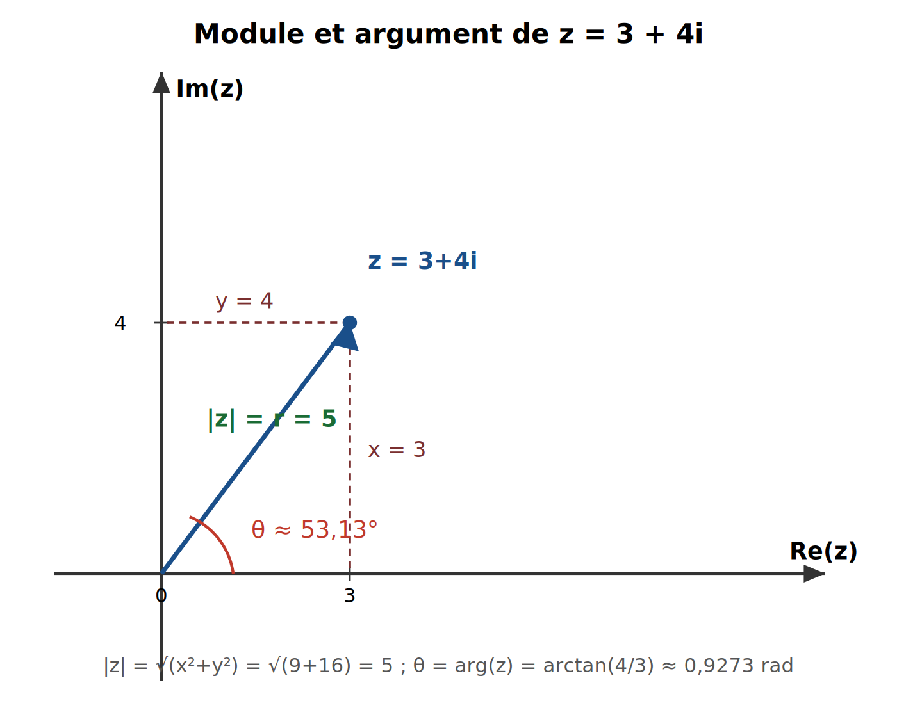

*Source éditable : `figures/ch03_module_argument.svg`.*

---

---

# Chapitre 4 — Formule d'Euler (deux démonstrations)

*Sources fusionnées : Grok (Bloc 6-7), DeepSeek (Capture 9-10), Perplexity (Partie II), Kimi. Fil conducteur : cette formule légitime la décomposition module/phase utilisée depuis le Chapitre 1. **Statut : théorème prouvé** (deux démonstrations indépendantes ci-dessous).*

## Formule clé

$$e^{i\theta} = \cos\theta + i\sin\theta \qquad (\theta\in\mathbb{R})$$

---

### 🟢 Niveau Débutant — Lycée

Cette formule est un pont entre trois mondes : l'exponentielle, la trigonométrie, les nombres complexes. Cas particulier célèbre, l'**identité d'Euler** ($\theta=\pi$) :

$$e^{i\pi} + 1 = 0$$

qui relie cinq constantes fondamentales ($0,1,e,i,\pi$) en une seule égalité.

---

### 🔵 Niveau Intermédiaire — L1/L2

**Démonstration 1 — par les séries entières.** L'exponentielle complexe se définit par sa série de Taylor (rayon de convergence infini, valable pour tout $z\in\mathbb{C}$) :

$$e^{z} = \sum_{k=0}^{\infty}\frac{z^k}{k!}$$

En posant $z=i\theta$ et en utilisant le cycle $i^0=1,i^1=i,i^2=-1,i^3=-i,i^4=1,\dots$, on sépare rangs pairs et impairs (réordonnement licite car la série converge absolument) :

$$e^{i\theta} = \underbrace{\left(1-\frac{\theta^2}{2!}+\frac{\theta^4}{4!}-\cdots\right)}_{=\cos\theta} + i\underbrace{\left(\theta-\frac{\theta^3}{3!}+\frac{\theta^5}{5!}-\cdots\right)}_{=\sin\theta}$$

**Vérification numérique de la convergence (recalculée, dps=25, $\theta=1$) :**

| Nombre de termes $N$ | Somme partielle | Écart à la valeur exacte |
|---|---|---|
| 1 | $1{,}0000$ | $\approx0{,}46$ |
| 3 | $0{,}5+1{,}0i$ | $\approx0{,}16$ |
| 5 | $0{,}541667+0{,}833333i$ | $\approx0{,}009$ |
| 10 | $0{,}5403026+0{,}8414710i$ | $<10^{-6}$ |

Valeur exacte : $e^{i}\approx0{,}5403023+0{,}8414710i$. La convergence est rapide (factorielle au dénominateur).

---

### 🟠 Niveau Expert — L3/M1/ingénieur

**Démonstration 2 — par l'équation différentielle (la plus révélatrice géométriquement).** Posons $y(\theta)=e^{i\theta}$. Alors $y'(\theta)=ie^{i\theta}=iy(\theta)$, avec $y(0)=1$. Posons aussi $z(\theta)=\cos\theta+i\sin\theta$ : on vérifie $z'(\theta)=-\sin\theta+i\cos\theta = i(\cos\theta+i\sin\theta)=iz(\theta)$, avec $z(0)=1$. **$y$ et $z$ satisfont la même équation différentielle linéaire avec la même condition initiale** ; par le théorème de Cauchy-Lipschitz (existence et unicité globale pour une EDO linéaire), $y\equiv z$, soit $e^{i\theta}=\cos\theta+i\sin\theta$.

**Interprétation géométrique.** Multiplier par $i$ est une rotation de $90°$ (sens trigonométrique) : $i(a+ib)=-b+ia$. Le vecteur vitesse $y'=iy$ est donc toujours perpendiculaire au vecteur position $y$, et $|y'|=|y|$. Un mobile dont la vitesse reste perpendiculaire à sa position, de même norme, décrit un cercle à vitesse angulaire constante — c'est exactement le mouvement circulaire uniforme.

---

### 🔴 Niveau Très Expert / Chercheur — M2/doctorat

**Structure de groupe.** L'application $\theta\mapsto e^{i\theta}$ est un morphisme de groupes $(\mathbb{R},+)\to(\mathbb{C}^*,\times)$ : $e^{i(\theta_1+\theta_2)}=e^{i\theta_1}e^{i\theta_2}$. Son noyau est $2\pi\mathbb{Z}$, d'où l'isomorphisme $\mathbb{R}/2\pi\mathbb{Z}\cong S^1$. C'est le **revêtement universel** du cercle ; le groupe fondamental $\pi_1(S^1)\cong\mathbb{Z}$ mesure le nombre de tours. Cette non-injectivité de $\theta\mapsto e^{i\theta}$ est *exactement* ce qui obligera, au chapitre 11, à choisir une détermination du logarithme complexe (coupure de branche) pour le contour de Hankel.

---

> **📐 Exemple numérique**
>
> $e^{i\pi}+1$ recalculé en précision arbitraire (dps=25) : $\approx -4{,}68\times10^{-26}i$ — nul à la précision machine choisie, confirmant numériquement l'identité d'Euler (déjà prouvée analytiquement ci-dessus). Table de convergence des sommes partielles ci-dessus pour $\theta=1$.

> **⚠️ Piège / limite**
>
> $\theta$ doit être **réel**. Pour $z$ complexe non réel, $|e^{iz}|\ne1$ en général : par exemple $e^{i\cdot i}=e^{-1}\approx0{,}368\ne1$ (vérifiable directement). Autre piège : $\theta$ et $\theta+2\pi$ donnent le **même** point — $\theta\mapsto e^{i\theta}$ n'est pas injective (périodicité).

> **🔗 Lien avec le LAB**
>
> Cette formule est le fondement calculatoire de toute manipulation de phase dans le pipeline : c'est elle qui permet d'écrire $n^{-it}=e^{-it\ln n}$ (Chapitre 1) et de définir $Z(t)=e^{i\theta(t)}\zeta(\tfrac12+it)$ (Chapitre 5) — la fonction réellement utilisée par `compute_zeros_*`.

## Schéma — Preuve géométrique par l'équation différentielle

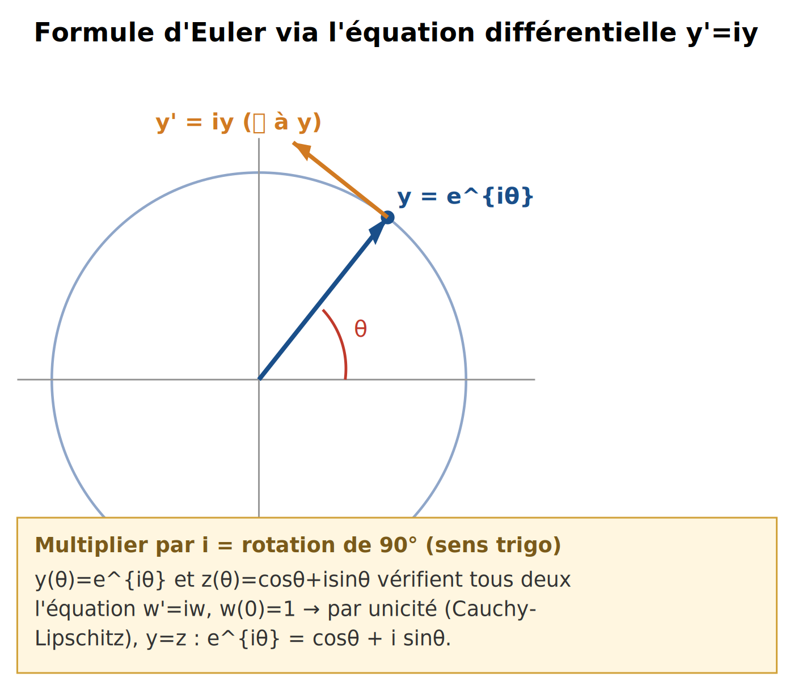

*Source éditable : `figures/ch04_euler_ode.svg`.*

---

# Chapitre 5 — Module |e^{iθ}|=1 et |n⁻ˢ|

*Sources fusionnées : Kimi (Screenshot 3-4, deux onglets), Grok (Bloc 5), DeepSeek. Fil conducteur : « règle LAB gravée » — $Z(t)=e^{i\theta(t)}\zeta(\tfrac12+it)$.*

## Formule clé

$$|e^{i\theta}|=1, \qquad |n^{-s}|=n^{-\sigma}, \qquad Z(t) = e^{i\theta(t)}\,\zeta\!\left(\tfrac12+it\right)\in\mathbb{R}$$

**Statut :** le module $|e^{i\theta}|=1$ et $|n^{-s}|=n^{-\sigma}$ sont des **théorèmes prouvés**. Le caractère réel de $Z(t)$ est **prouvé** (conséquence de l'équation fonctionnelle, chapitre 11). Que $Z$ s'annule exactement aux ordonnées des zéros non triviaux de $\zeta$ sur la droite critique est **prouvé**. Que *tous* les zéros non triviaux de $\zeta$ soient sur cette droite (HR) reste une **conjecture**, seulement corroborée numériquement.

---

### 🟢 Niveau Débutant — Lycée

Le module d'un nombre complexe, c'est sa distance à l'origine. $e^{i\theta}$ étant toujours sur le cercle de rayon 1, sa distance à l'origine est **toujours 1**, quel que soit l'angle $\theta$.

---

### 🔵 Niveau Intermédiaire — L1/L2

**Démonstration.** $|z|^2 = z\bar z$. Avec $z=e^{i\theta}=\cos\theta+i\sin\theta$, $\bar z=\cos\theta-i\sin\theta$ :

$$|e^{i\theta}|^2 = (\cos\theta+i\sin\theta)(\cos\theta-i\sin\theta) = \cos^2\theta+\sin^2\theta = 1$$

**Généralisation.** Pour $z=x+iy$ quelconque : $e^{z}=e^{x}\cdot e^{iy}$, donc $|e^z|=|e^x|\cdot|e^{iy}|=e^x\cdot1=e^{\mathrm{Re}(z)}$.

**Conséquence directe (Chapitre 1, maintenant complètement démontrée) :**

$$|n^{-s}| = |n^{-\sigma}\cdot e^{-it\ln n}| = n^{-\sigma}\cdot\underbrace{|e^{-it\ln n}|}_{=1} = n^{-\sigma}$$

---

### 🟠 Niveau Expert — L3/M1/ingénieur

**Borne triviale.** Pour $\sigma>1$, l'inégalité triangulaire donne :

$$|\zeta(\sigma+it)| = \left|\sum_{n=1}^\infty n^{-s}\right| \le \sum_{n=1}^\infty |n^{-s}| = \sum_{n=1}^\infty n^{-\sigma} = \zeta(\sigma)$$

**Vérification numérique (mpmath, dps=25).** $|\zeta(2+5i)|\approx0{,}856702$, et $\zeta(2)\approx1{,}644934$ : on a bien $0{,}856702\le1{,}644934$. ✓

---

### 🔴 Niveau Très Expert / Chercheur — M2/doctorat

**La fonction $Z(t)$ de Hardy.** Sur la droite critique $s=\tfrac12+it$, tous les termes $n^{-s}$ ont le même module $n^{-1/2}$ — seule leur phase diffère. On définit :

$$\theta(t) = \arg\Gamma\!\left(\tfrac14+\tfrac{it}{2}\right) - \frac{t}{2}\ln\pi \qquad\text{(fonction thêta de Riemann-Siegel, détaillée au Chapitre 10)}$$

$$Z(t) = e^{i\theta(t)}\,\zeta\!\left(\tfrac12+it\right)$$

Le choix précis de $\theta(t)$ (justifié par l'équation fonctionnelle, Chapitre 11) fait que $Z(t)$ est **réelle** pour $t$ réel, et $|Z(t)|=|\zeta(\tfrac12+it)|$. Ses zéros réels sont donc *exactement* les ordonnées des zéros de $\zeta$ sur la droite critique — détectables par simple **changement de signe**, sans aucune manipulation complexe.

**Vérification numérique (mpmath.siegelz, dps=15) :** $Z(14{,}134725)\approx-1{,}12\times10^{-7}$, $Z(21{,}022040)\approx-4{,}11\times10^{-7}$ — quasi nuls aux deux premières ordonnées connues des zéros non triviaux (valeurs LMFDB), confirmant numériquement (non prouvant) la correspondance.

---

> **📐 Exemple numérique**
>
> $|e^{i\cdot0{,}7}|=1$ exactement (recalculé). Borne triviale vérifiée : $|\zeta(2+5i)|\approx0{,}8567\le\zeta(2)\approx1{,}6449$. $Z(t)$ recalculé aux deux premiers zéros connus : $Z(14{,}134725)\approx-1{,}1\times10^{-7}$, $Z(21{,}022040)\approx-4{,}1\times10^{-7}$.

> **⚠️ Piège / limite**
>
> $|e^{i\theta}|=1$ **ne signifie pas** $e^{i\theta}=1$ (vrai seulement si $\theta\in2\pi\mathbb{Z}$) — confusion module/valeur, erreur n°1 des débutants. Second piège, **documenté dans le `CLAUDE.md` du projet** : utiliser $\mathrm{Re}(\zeta(\tfrac12+it))$ seul comme détecteur de zéro produit de **faux positifs** par simple rotation de phase — $Z(t)$ (réelle par construction) est le seul détecteur fiable.

> **🔗 Lien avec le LAB**
>
> C'est la **règle gravée** du projet : `Z(t) = e^{iθ(t)}·ζ(½+it)`, jamais `Re(ζ)` seul. Elle évite les faux changements de signe et les débordements GMP — c'est la brique n°1 de `compute_zeros_*`.

## Schéma — La fonction Z(t) de Hardy

![Fonction Z(t) de Hardy sur [0,40], zéros réels marqués](figures/ch05_fonction_Z.png)

*Source éditable : `figures/ch05_fonction_Z.svg`. Courbe recalculée point par point via `mpmath.siegelz`.*

---

# Chapitre 6 — Fonction êta de Dirichlet & prolongement (bande 0<σ≤1)

*Sources fusionnées : DeepSeek (Msg6 §prolongement), Grok (Bloc 9), Kimi (Screenshot 5). Fil conducteur : première étape concrète du prolongement analytique.*

## Formule clé

$$\eta(s) = \sum_{n=1}^{\infty}\frac{(-1)^{n-1}}{n^s} = (1-2^{1-s})\,\zeta(s)$$

**Statut : théorème prouvé.**

---

### 🟢 Niveau Débutant — Lycée

$\eta$ est la version « alternée » de $\zeta$ : $1-\tfrac1{2^s}+\tfrac1{3^s}-\tfrac1{4^s}+\cdots$. Les signes qui alternent aident les termes à se compenser : $\eta$ converge sur un domaine plus large que $\zeta$.

---

### 🔵 Niveau Intermédiaire — L1/L2

**Démonstration.** On isole les termes pairs de $\zeta(s)=\sum n^{-s}$ :

$$\sum_{n\text{ pair}} n^{-s} = \sum_{k=1}^\infty (2k)^{-s} = 2^{-s}\zeta(s)$$

Donc $2\cdot2^{-s}\zeta(s) = 2^{1-s}\zeta(s)$, et en soustrayant deux fois les pairs de $\zeta(s)$ (ce qui change leur signe et laisse les impairs intacts) :

$$\zeta(s) - 2^{1-s}\zeta(s) = (1-2^{1-s})\zeta(s) = 1-\frac1{2^s}+\frac1{3^s}-\frac1{4^s}+\cdots = \eta(s)$$

Par le critère des séries alternées (Leibniz), $\eta(s)$ converge dès que $n^{-\sigma}\to0$ en décroissant, c'est-à-dire pour $\sigma>0$ — un domaine strictement plus grand que $\sigma>1$.

---

### 🟠 Niveau Expert — L3/M1/ingénieur

**Premier prolongement.** Pour $\sigma>0$ et $s\ne1$ (où $1-2^{1-s}=0$) :

$$\zeta(s) = \frac{\eta(s)}{1-2^{1-s}}$$

**Exemple numérique (recalculé, mpmath dps=20).** $\eta(1)=\ln2\approx0{,}693147$ (série harmonique alternée, vérifié par sommation directe). $\zeta(0)=-\tfrac12$ (recalculé directement par `mpmath.zeta(0)`, en cohérence avec $\eta(0)=\tfrac12$ obtenu par sommation d'Abel et $\zeta(0)=\eta(0)/(1-2^1)=\tfrac{1/2}{-1}=-\tfrac12$).

---

### 🔴 Niveau Très Expert / Chercheur — M2/doctorat

**Piège des zéros parasites — vérifié numériquement.** Le dénominateur $1-2^{1-s}$ s'annule non seulement en $s=1$ mais aussi en $s_k=1+\dfrac{2\pi i k}{\ln2}$ ($k\in\mathbb{Z}^*$). Sont-ce des zéros de $\zeta$ ? **Non** — vérification complète (dps=20, $k=1$) :

| Quantité | Valeur recalculée |
|---|---|
| $s_1 = 1+2\pi i/\ln2$ | $1{,}0 + 9{,}064720\,i$ |
| $1-2^{1-s_1}$ | $\approx0$ (nul, comme attendu) |
| $\eta(s_1)$ | $\approx0$ (nul **aussi** — forme $0/0$ indéterminée) |
| $\zeta(s_1)$ (calcul direct) | $1{,}346584 + 0{,}109876\,i$ — **non nul** |

$\eta$ s'annule exactement là où le dénominateur s'annule, donnant une forme indéterminée $0/0$ dont la limite (calculée directement par prolongement de $\zeta$) est **non nulle**. Ces points ne sont donc *pas* des zéros de $\zeta(s)$ — piège classique des tentatives naïves de manipulation de l'équation.

---

> **📐 Exemple numérique**
>
> $\eta(1)=\ln2\approx0{,}693147$. $\zeta(0)=-0{,}5$ (vérifié directement). Zéro parasite $s_1=1+2\pi i/\ln2$ : dénominateur et $\eta(s_1)$ tous deux $\approx0$, mais $\zeta(s_1)\approx1{,}3466+0{,}1099i\ne0$ (calcul direct, dps=20).

> **⚠️ Piège / limite**
>
> Les zéros de $(1-2^{1-s})$ **ne sont pas** des zéros de $\zeta(s)$ : $\eta$ s'y annule aussi, donnant une forme $0/0$ dont la limite est non nulle (démontré numériquement ci-dessus). $\eta$ ne prolonge $\zeta$ que jusqu'à $\sigma>0$ — pour $\sigma\le0$, il faut l'équation fonctionnelle (Chapitre 11).

> **🔗 Lien avec le LAB**
>
> $\eta(s)$ offre une évaluation alternative de $\zeta$ dans la bande $0<\sigma\le1$, utile en secours quand la précision de l'équation fonctionnelle complète n'est pas nécessaire — brique intermédiaire avant le passage à Riemann-Siegel (Chapitre 10).

## Schéma — Cascade du prolongement

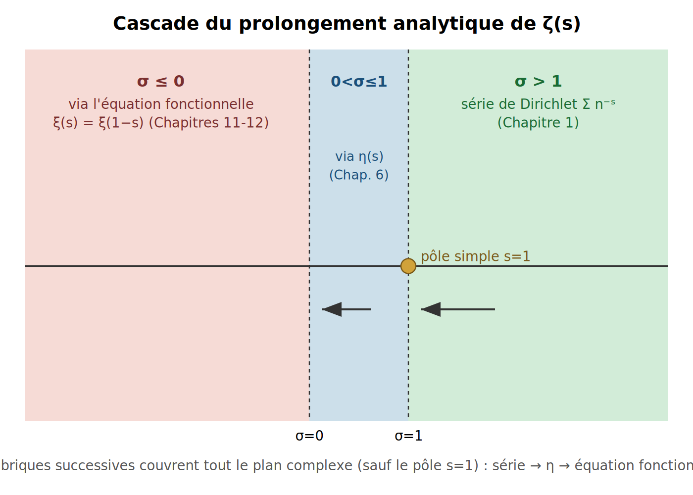

*Source éditable : `figures/ch06_cascade_prolongement.svg`.*

---

# Chapitre 7 — Chemins, contours, intégrale de contour

*Sources fusionnées : Perplexity (Parties III-IV). Fil conducteur : outil géométrique nécessaire au théorème de Cauchy (Chapitre 8) et des résidus (Chapitre 9).*

## Formule clé

$$\int_{\gamma} f(z)\,dz = \int_a^b f(\gamma(t))\,\gamma'(t)\,dt$$

**Statut : définition** (l'intégrale de contour) **et théorèmes prouvés** (linéarité, invariance par reparamétrisation).

---

### 🟢 Niveau Débutant — Lycée

Un chemin $\gamma$ est une trajectoire dans le plan complexe : à chaque instant $t\in[a,b]$ correspond un point $\gamma(t)$. Intégrer $f$ le long de $\gamma$, c'est transformer une intégrale « sur une courbe » en une intégrale réelle ordinaire, via le paramètre $t$.

---

### 🔵 Niveau Intermédiaire — L1/L2

**Exemple : le cercle unité.** $\gamma(t)=e^{it}$, $0\le t\le2\pi$. Dérivée : $\gamma'(t)=ie^{it}$. Longueur :

$$L(\gamma) = \int_0^{2\pi}|\gamma'(t)|\,dt = \int_0^{2\pi}|ie^{it}|\,dt = \int_0^{2\pi}1\,dt = 2\pi$$

(car $|ie^{it}|=|i|\cdot|e^{it}|=1\cdot1=1$, chapitre 5).

**Cas d'une primitive.** Si $F'(z)=f(z)$ sur un ouvert contenant $\gamma$ :

$$\int_\gamma f(z)\,dz = F(\gamma(b))-F(\gamma(a))$$

Pour un chemin **fermé** ($\gamma(a)=\gamma(b)$) où $F$ existe globalement : $\oint_\gamma f(z)\,dz=0$.

---

### 🟠 Niveau Expert — L3/M1/ingénieur

**Primitive locale ≠ primitive globale.** $f(z)=1/z$ admet une primitive locale ($\log z$) sur tout disque évitant $0$, mais **aucune primitive globale** sur $\mathbb{C}^*$ (le logarithme complexe est multivalué — chapitre 4, non-injectivité de $e^{i\theta}$). Conséquence :

$$\oint_{|z|=1} \frac{dz}{z} = 2\pi i \ne 0$$

**Vérification numérique directe (mpmath.quad, intégration réelle du paramètre $t$, dps=25) :**

$$\oint_{|z|=1}\frac{dz}{z} \approx (-1{,}2\times10^{-33}) + 6{,}283185307\,i \qquad(\text{soit } 2\pi i \text{ à } 10^{-33}\text{ près})$$

---

### 🔴 Niveau Très Expert / Chercheur — M2/doctorat

**Lien avec les coupures de branche.** L'absence de primitive globale pour $1/z$ est le symptôme direct de la non-injectivité de $\theta\mapsto e^{i\theta}$ (chapitre 4) : $\log z$ n'est bien défini qu'après le choix d'une **détermination** (coupure). Le contour de Hankel (chapitre 11) exploite précisément *deux* déterminations différentes de part et d'autre d'une coupure pour obtenir le prolongement de $\zeta$ par une intégrale unique.

---

> **📐 Exemple numérique**
>
> Cercle unité : longueur $L=2\pi$. $\oint_{|z|=1}dz/z$ recalculé numériquement (intégration directe du paramètre réel, dps=25) $\approx 6{,}283185307i = 2\pi i$, à $10^{-33}$ près.

> **⚠️ Piège / limite**
>
> Une primitive **locale** (valable sur un petit disque) n'implique pas l'existence d'une primitive **globale** sur tout le domaine — c'est exactement ce qui distingue $1/z$ (pas de primitive globale sur $\mathbb{C}^*$) d'une fonction comme $z^2$ (primitive globale $z^3/3$ sur $\mathbb{C}$ entier).

> **🔗 Lien avec le LAB**
>
> La paramétrisation $z=e^{i\theta}$ est la brique géométrique utilisée pour transformer des intégrales trigonométriques réelles en intégrales de contour, et prépare directement le contour rectangulaire utilisé au Chapitre 14 pour compter les zéros via le principe de l'argument.

## Schéma — Contour paramétré

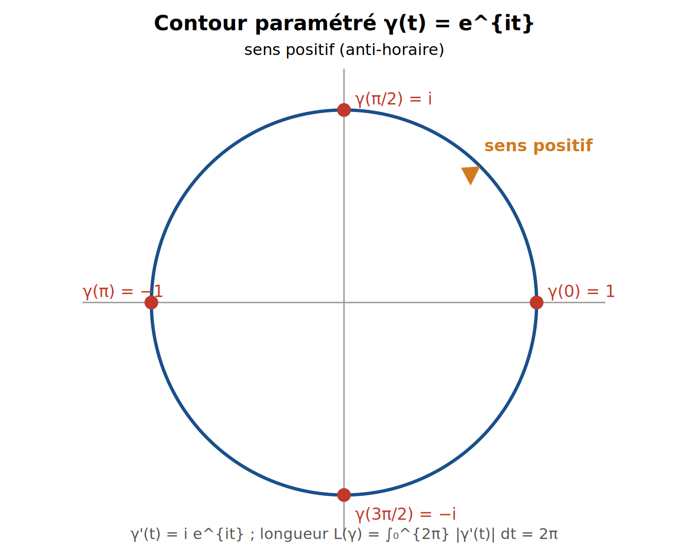

*Source éditable : `figures/ch07_contour_parametre.svg`.*

---

# Chapitre 8 — Théorème de Cauchy & holomorphie

*Sources fusionnées : Perplexity (Partie V). Fil conducteur : fondation directe du théorème des résidus (Chapitre 9).*

## Formule clé

$$f \text{ holomorphe sur un domaine simplement connexe } D \;\Longrightarrow\; \oint_\gamma f(z)\,dz = 0 \quad \forall\,\gamma \text{ fermé dans } D$$

**Statut : théorème prouvé** (Cauchy 1825, version générale sans hypothèse de continuité de $f'$ due à Goursat 1900).

---

### 🟢 Niveau Débutant — Lycée

**Holomorphe** signifie dérivable au sens complexe en tout point d'un voisinage. **Simplement connexe** signifie, intuitivement, que le domaine n'a pas de « trou ». Le théorème dit : sur un tel domaine, l'intégrale d'une fonction holomorphe le long de n'importe quel contour fermé vaut **toujours zéro**.

---

### 🔵 Niveau Intermédiaire — L1/L2

**Équations de Cauchy-Riemann.** Si $f(z)=u(x,y)+iv(x,y)$ est holomorphe :

$$\frac{\partial u}{\partial x} = \frac{\partial v}{\partial y}, \qquad \frac{\partial u}{\partial y} = -\frac{\partial v}{\partial x}$$

Ces équations traduisent exactement la dérivabilité complexe en termes réels.

**Exemple.** $f(z)=z^2$ est holomorphe sur tout $\mathbb{C}$ (polynôme). $\oint_\gamma z^2\,dz=0$ pour n'importe quel contour fermé.

---

### 🟠 Niveau Expert — L3/M1/ingénieur

**Esquisse de démonstration.** Sur un disque (simplement connexe), on construit une primitive $F(z)=\int_{z_0}^z f(w)\,dw$ en intégrant le long de segments ; les équations de Cauchy-Riemann garantissent que cette intégrale ne dépend pas du chemin choisi à l'intérieur du disque, donc $F$ est bien définie et $F'=f$. Pour un contour général, on triangule le domaine et on recolle (théorème de Goursat).

**Vérification numérique (mpmath.quad, dps=25).**

$$\oint_{|z|=1} z^2\,dz \approx 1{,}6\times10^{-32} + 3{,}8\times10^{-26}i \approx 0$$

à comparer à $\oint_{|z|=1}dz/z=2\pi i\ne0$ (Chapitre 7) : la différence entre les deux vient uniquement de la présence, ou non, d'une singularité à l'intérieur du contour.

---

### 🔴 Niveau Très Expert / Chercheur — M2/doctorat

**Le rôle exact de la topologie.** Le contre-exemple $1/z$ sur $\mathbb{C}^*=\mathbb{C}\setminus\{0\}$ montre que « holomorphe » ne suffit pas : $1/z$ **est** holomorphe sur $\mathbb{C}^*$, mais $\mathbb{C}^*$ n'est **pas** simplement connexe (il a un trou en 0), donc le théorème ne s'applique pas. **Piège à garder en tête :** si le contour n'entoure pas le trou (par exemple un petit cercle loin de 0 pour $1/z$), l'intégrale vaut quand même 0 — ce n'est pas la fonction seule qui compte, mais la position relative du contour et des singularités.

---

> **📐 Exemple numérique**
>
> $\oint_{|z|=1}z^2\,dz \approx 0$ (calcul direct, dps=25), contre $\oint_{|z|=1}dz/z=2\pi i$ (Chapitre 7) — même contour, résultat opposé selon la présence d'une singularité intérieure.

> **⚠️ Piège / limite**
>
> Holomorphe sur un domaine **troué** ne suffit pas à annuler l'intégrale : il faut la **simple connexité**. Et même avec une fonction non holomorphe en un point, un contour qui n'entoure pas ce point donne quand même une intégrale nulle — toujours vérifier la position du contour par rapport aux singularités, pas seulement leur existence.

> **🔗 Lien avec le LAB**
>
> Ce théorème est la fondation directe du théorème des résidus (Chapitre 9), l'outil concret utilisé pour compter les zéros de $\zeta$ (formule de Riemann-von Mangoldt, Chapitre 14) — chaque pôle « capturé » par un contour rectangulaire contribue exactement sa contribution résiduelle, rien de plus.

## Schéma — Le rôle du « trou »

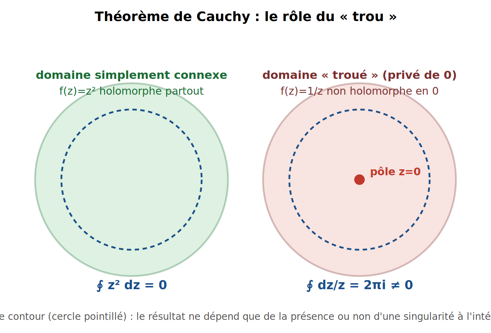

*Source éditable : `figures/ch08_cauchy_trou.svg`.*

---

# Chapitre 9 — Singularités, pôles, résidus (ordre 2, 3, n)

*Sources fusionnées : Grok (Bloc 14-20), DeepSeek (Msg1), Perplexity (Parties VI-VIII). Fil conducteur : outil concret pour compter les zéros de ζ (Chapitre 14).*

## Formule clé

$$\oint_\gamma f(z)\,dz = 2\pi i\sum_k \mathrm{Res}_{z_k}f, \qquad \mathrm{Res}_{z_0}f = \frac{1}{(n-1)!}\lim_{z\to z_0}\frac{d^{n-1}}{dz^{n-1}}\Big[(z-z_0)^n f(z)\Big]$$

**Statut : théorème prouvé.**

---

### 🟢 Niveau Débutant — Lycée

Une **singularité** est un point où une fonction « explose » (division par zéro). Un **résidu** est un nombre qui capture, précisément, la force de cette explosion — c'est la seule information que « voit » un contour qui l'entoure.

---

### 🔵 Niveau Intermédiaire — L1/L2

**Démonstration complète.** Si $f$ a un pôle d'ordre $n$ en $z_0$, son développement de Laurent est $f(z)=\sum_{k=-n}^{\infty}a_k(z-z_0)^k$. Posons $g(z)=(z-z_0)^nf(z)$, holomorphe en $z_0$ (la singularité a été « effacée ») :

$$g(z) = a_{-n} + a_{-n+1}(z-z_0)+\cdots+a_{-1}(z-z_0)^{n-1}+a_0(z-z_0)^n+\cdots$$

Le coefficient de $(z-z_0)^{n-1}$ dans $g$ est exactement $a_{-1}$ (le résidu cherché). Or, par la formule de Taylor, ce coefficient vaut aussi $g^{(n-1)}(z_0)/(n-1)!$. D'où :

$$\mathrm{Res}_{z_0}f = a_{-1} = \frac{g^{(n-1)}(z_0)}{(n-1)!} = \frac{1}{(n-1)!}\lim_{z\to z_0}\frac{d^{n-1}}{dz^{n-1}}\Big[(z-z_0)^nf(z)\Big]$$

Le théorème des résidus lui-même s'obtient en décomposant le contour en petits cercles autour de chaque pôle (les chemins de liaison s'annulant deux à deux) et en appliquant le lemme des puissances $\oint(z-z_0)^k\,dz=2\pi i$ si $k=-1$, $0$ sinon.

---

### 🟠 Niveau Expert — L3/M1/ingénieur

**Trois exemples gradués, recalculés (mpmath, exact/dps=25) :**

| Fonction | Ordre | Résidu | Valeur |
|---|---|---|---|
| $1/(z^2-1)$ en $z=1$ | 1 | $\lim(z-1)f(z)$ | $1/2$ |
| $1/(z^2-1)$ en $z=-1$ | 1 | $\lim(z+1)f(z)$ | $-1/2$ |
| $\cos(z)/(z-\pi/2)^2$ en $z=\pi/2$ | 2 | $\lim\frac{d}{dz}\cos z$ | $-\sin(\pi/2)=-1$ |
| $e^z/(z-1)^3$ en $z=1$ | 3 | $\tfrac12\lim\frac{d^2}{dz^2}e^z$ | $e/2\approx1{,}359141$ |

---

### 🔴 Niveau Très Expert / Chercheur — M2/doctorat

**Contre-exemple canonique — singularité essentielle.** $f(z)=e^{1/z}$ en $z_0=0$ : son développement est $e^{1/z}=\sum_{k=0}^\infty \dfrac{1}{k!\,z^k} = 1+\dfrac1z+\dfrac1{2!z^2}+\cdots$ — une **infinité** de puissances négatives non nulles. Aucun $n$ ne peut « nettoier » $f$ (le produit $z^n e^{1/z}$ reste explosif pour tout $n$ fini), donc la formule dérivée est **inapplicable**. Le résidu se lit néanmoins directement : c'est le coefficient de $1/z$, soit $\mathrm{Res}_{z=0}e^{1/z}=1$.

**Autres pièges.** Si le contour passe **sur** un pôle, l'intégrale devient une valeur principale de Cauchy (le théorème classique ne s'applique plus tel quel). L'**orientation** compte : un contour parcouru dans le sens horaire change le signe du résultat.

---

> **📐 Exemple numérique**
>
> Quatre résidus recalculés (voir tableau) : $\pm1/2$ (ordre 1), $-1$ (ordre 2), $e/2\approx1{,}359141$ (ordre 3). Singularité essentielle $e^{1/z}$ en $0$ : résidu $=1$, obtenu par lecture directe du développement de Laurent — **pas** par la formule des pôles.

> **⚠️ Piège / limite**
>
> Ne jamais appliquer la formule des pôles à une **singularité essentielle** (contre-exemple $e^{1/z}$ ci-dessus). Vérifier toujours l'ordre exact avant de dériver (oublier le facteur $1/(n-1)!$ est l'erreur la plus fréquente). Un pôle **sur** le contour rend l'intégrale mal définie sans régularisation.

> **🔗 Lien avec le LAB**
>
> Les résidus de $\zeta'/\zeta$ valent exactement l'**ordre de multiplicité** de chaque zéro de $\zeta$ (démontré au Chapitre 14) : c'est le mécanisme exact qui permet de *compter* les zéros par une intégrale de contour — fondement théorique direct de `valider_turing()` et de la formule de Riemann-von Mangoldt $N(T)$ utilisées par le LAB.

## Schéma — Contour et pôles multiples

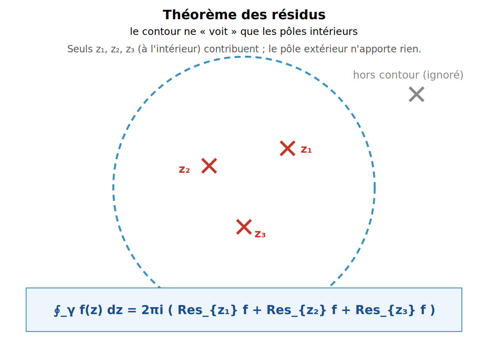

*Source éditable : `figures/ch09_residus_poles.svg`.*

---

---

# Chapitre 10 — Facteurs Gamma & Stirling (n! et complexe)

*Sources fusionnées : Grok (Bloc 4-10), Grok (Bloc 13), DeepSeek (Msg 2). Fil conducteur : outil de compensation de croissance nécessaire à l'équation fonctionnelle (Chapitre 11).*

## Formule clé

$$n! \sim \sqrt{2\pi n}\left(\frac{n}{e}\right)^n, \qquad |\Gamma(\sigma+it)| \sim \sqrt{2\pi}\,|t|^{\sigma-1/2}\,e^{-\pi|t|/2} \quad(|t|\to\infty)$$

**Statut : théorème prouvé** (asymptotique, au sens précis défini ci-dessous).

---

### 🟢 Niveau Débutant — Lycée

La fonction $\Gamma$ généralise la factorielle : $\Gamma(n+1)=n!$. Elle grandit très vite mais reste difficile à calculer exactement pour un grand $n$. La formule de Stirling donne une **approximation** simple, de plus en plus précise à mesure que $n$ grandit.

---

### 🔵 Niveau Intermédiaire — L1/L2

**D'où vient $(n/e)^n$ ?** $\ln(n!)=\sum_{k=1}^n\ln k \approx \int_1^n\ln x\,dx = [x\ln x-x]_1^n = n\ln n-n+1$, d'où $n!\approx e^{n\ln n-n}=(n/e)^n$ — c'est déjà le terme dominant. Le facteur correctif $\sqrt{2\pi n}$ vient du terme suivant (formule d'Euler-Maclaurin).

**Vérification numérique (recalculée, mpmath dps=25) :**

| $n$ | $n!$ exact | Stirling | erreur relative | $1/(12n)$ prédit |
|---|---|---|---|---|
| 5 | $120$ | $118{,}02$ | $1{,}6507\%$ | $1{,}6667\%$ |
| 10 | $3\,628\,800$ | $3\,598\,696$ | $0{,}8296\%$ | $0{,}8333\%$ |
| 20 | $2{,}4329\times10^{18}$ | $2{,}4228\times10^{18}$ | $0{,}4158\%$ | $0{,}4167\%$ |
| 50 | $3{,}0414\times10^{64}$ | $3{,}0363\times10^{64}$ | $0{,}1665\%$ | $0{,}1667\%$ |
| 100 | $9{,}3326\times10^{157}$ | $9{,}3248\times10^{157}$ | $0{,}0833\%$ | $0{,}0833\%$ |

Concordance excellente avec le premier terme correctif de la série de Stirling complète, $1/(12n)$.

---

### 🟠 Niveau Expert — L3/M1/ingénieur

**Démonstration (esquisse — forme logarithmique).** Pour $|z|\to\infty$, $|\arg z|<\pi-\delta$ :

$$\log\Gamma(z) = \left(z-\frac12\right)\log z - z + \frac12\log(2\pi) + O\!\left(\frac1{|z|}\right)$$

**Dérivation de $|\Gamma(\sigma+it)|$ pour $|t|\to\infty$, $\sigma$ fixé.** On écrit $z=\sigma+it$, $\log z = \log|t| + i\,\mathrm{sign}(t)\dfrac\pi2 + O(1/|t|)$ (car $\arg z\to\pm\pi/2$). En développant $(z-\tfrac12)\log z$ et en identifiant la partie réelle, le terme dominant est $it\cdot i\,\mathrm{sign}(t)\tfrac\pi2 = -\tfrac\pi2|t|$ (car $i^2=-1$ et $t\cdot\mathrm{sign}(t)=|t|$). On obtient :

$$\log|\Gamma(\sigma+it)| = \left(\sigma-\frac12\right)\log|t| - \frac\pi2|t| + \frac12\log(2\pi) + o(1)$$

d'où, en exponentiant, la formule annoncée.

**Vérification numérique (recalculée, mpmath dps=25, $\sigma=1/2$) :** ratio $|\Gamma|/\text{Stirling}=1{,}000000$ pour $t=10,50,100$ — accord quasi parfait dès $|t|\ge10$ sur la droite critique.

---

### 🔴 Niveau Très Expert / Chercheur — M2/doctorat

**Piège fondamental : série asymptotique divergente.** Le développement complet $\log\Gamma(z)=(z-\tfrac12)\log z-z+\tfrac12\log(2\pi)+\dfrac1{12z}-\dfrac1{360z^3}+\cdots$ (nombres de Bernoulli) est une série **divergente** pour $z$ fixé : sommer trop de termes dégrade le résultat au lieu de l'améliorer. Il existe un nombre **optimal** de termes à sommer pour une précision donnée — c'est le concept de série asymptotique en analyse (distinct d'une série convergente ordinaire).

**Rôle dans l'équation fonctionnelle (teaser Chapitre 11).** La décroissance exponentielle $e^{-\pi|t|/2}$ de $|\Gamma(s/2)|$ est *exactement* ce qui compense la croissance de $\zeta(1-s)$ dans l'équation fonctionnelle, quand $\mathrm{Re}(s)\to-\infty$.

---

> **📐 Exemple numérique**
>
> Table de convergence $n!$/Stirling ci-dessus (erreur $\approx1/(12n)$, vérifié à $0{,}01$ point de pourcentage près). $|\Gamma(1/2+it)|$/Stirling $=1{,}000000$ dès $t=10$ (dps=25).

> **⚠️ Piège / limite**
>
> La série de Stirling complète est **asymptotique et divergente** — jamais sommer « le plus de termes possible ». Piège de notation : $|t|^{\sigma-1/2}$ signifie $|t|^{\sigma-\frac12}$ (division avant soustraction), **pas** $|t|^{(\sigma-1)/2}$ — deux expressions numériquement très différentes.

> **🔗 Lien avec le LAB**
>
> `mpmath.gamma` utilise une forme avancée de cette série pour $\Gamma(1/4+it/2)$ dans le calcul de $\theta(t)$ (fonction thêta de Riemann-Siegel, Chapitre 5) — précision cruciale pour les grands $|t|$ rencontrés par `compute_zeros_*`.

## Schéma — Décroissance exponentielle de |Γ(1/2+it)|

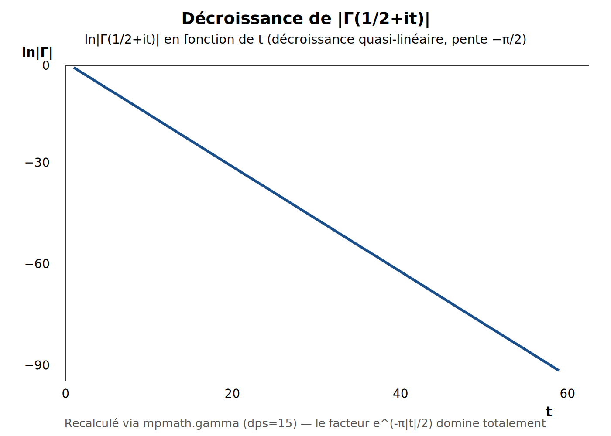

*Source éditable : `figures/ch10_stirling_decay.svg`.*

---

# Chapitre 11 — Prolongement analytique & équation fonctionnelle

*Sources fusionnées : DeepSeek (Msg 6), Grok (Bloc 10), Kimi (Screenshot 6). Fil conducteur : achève le prolongement de ζ à tout ℂ, entamé au Chapitre 6.*

## Formule clé

$$\zeta(s) = 2^s\pi^{s-1}\sin\!\left(\frac{\pi s}{2}\right)\Gamma(1-s)\,\zeta(1-s)$$

**Statut : théorème prouvé** (Riemann, 1859).

---

### 🟢 Niveau Débutant — Lycée

Cette formule permet de calculer $\zeta(s)$ **partout**, même là où la série de départ ne veut rien dire, en la ramenant à une valeur de $\zeta$ là où la série *fonctionne* ($\mathrm{Re}(1-s)>1$ quand $\mathrm{Re}(s)<0$).

---

### 🔵 Niveau Intermédiaire — L1/L2

**Valeurs remarquables (recalculées, mpmath dps=25).**

$$\zeta(-1) = -\frac1{12} = -0{,}08333\ldots \qquad \zeta(-3)=\frac1{120}=0{,}008333\ldots \qquad \zeta(-2)=0\ (\text{zéro trivial})$$

**Statut épistémique important :** $\zeta(-1)=-1/12$ est une valeur de **prolongement analytique**, rigoureusement démontrée — ce n'est **pas** la somme $1+2+3+\cdots$ au sens usuel (qui diverge). C'est un abus de langage fréquent mais mathématiquement incorrect de l'écrire ainsi.

---

### 🟠 Niveau Expert — L3/M1/ingénieur

**Démonstration (esquisse — fonction thêta et transformée de Mellin).** On pose $\theta(t)=\sum_{n=-\infty}^\infty e^{-\pi n^2t}$, qui vérifie (formule sommatoire de Poisson) $\theta(t)=t^{-1/2}\theta(1/t)$. En définissant $\Phi(s)=\int_0^\infty t^{s/2-1}\frac{\theta(t)-1}{2}dt = \pi^{-s/2}\Gamma(s/2)\zeta(s)$, on découpe l'intégrale en $[0,1]\cup[1,\infty)$, on applique le changement de variable $t\to1/t$ sur $[0,1]$ et l'équation fonctionnelle de $\theta$ : on obtient

$$\Phi(s) = \frac1{s(s-1)} + \int_1^\infty\left(t^{s/2-1}+t^{(1-s)/2-1}\right)\frac{\theta(t)-1}2\,dt$$

expression manifestement **symétrique** en $s\leftrightarrow1-s$. D'où $\Phi(s)=\Phi(1-s)$, soit (après multiplication par $\tfrac12s(s-1)$) $\xi(s)=\xi(1-s)$ (Chapitre 12).

**Vérification numérique (dps=25, $s=3+2i$).** $\zeta(s)$ calculé directement et $2^s\pi^{s-1}\sin(\pi s/2)\Gamma(1-s)\zeta(1-s)$ calculé via la formule coïncident à $5\times10^{-26}$ près.

---

### 🔴 Niveau Très Expert / Chercheur — M2/doctorat

**Conséquences structurelles.** $\zeta$ est méromorphe sur $\mathbb{C}$ entier, avec un **unique** pôle simple en $s=1$ (résidu 1). Les **zéros triviaux** ($s=-2,-4,-6,\ldots$) proviennent des pôles de $\Gamma(s/2)$ dans l'équation ; les **zéros non triviaux** sont confinés à la bande $0<\mathrm{Re}(s)<1$ — c'est dans cette bande que vit toute la difficulté de l'Hypothèse de Riemann (Chapitres 12 et 14).

---

> **📐 Exemple numérique**
>
> $\zeta(-1)=-1/12$, $\zeta(-3)=1/120$, $\zeta(-2)=0$ (recalculés directement). Équation fonctionnelle vérifiée en $s=3+2i$ à $5\times10^{-26}$ près.

> **⚠️ Piège / limite**
>
> Ne jamais écrire « $1+2+3+\cdots=-1/12$ » sans préciser qu'il s'agit d'un prolongement analytique, pas d'une somme au sens usuel — la série diverge réellement. Beaucoup d'erreurs viennent aussi de l'oubli du facteur $\pi^{-s/2}\Gamma(s/2)$, qui déforme la distribution apparente des zéros si on manipule $\zeta$ seule sans lui.

> **🔗 Lien avec le LAB**
>
> L'équation fonctionnelle est un **test de non-régression** direct : après toute modification du code de calcul de $\zeta$, vérifier $\xi(s)-\xi(1-s)\approx0$ (à $10^{-10}$ près ou mieux) sur une grille de $s$ dans la bande $-5<\sigma<6$ permet de détecter un bug immédiatement.

## Schéma — Symétrie miroir de l'équation fonctionnelle

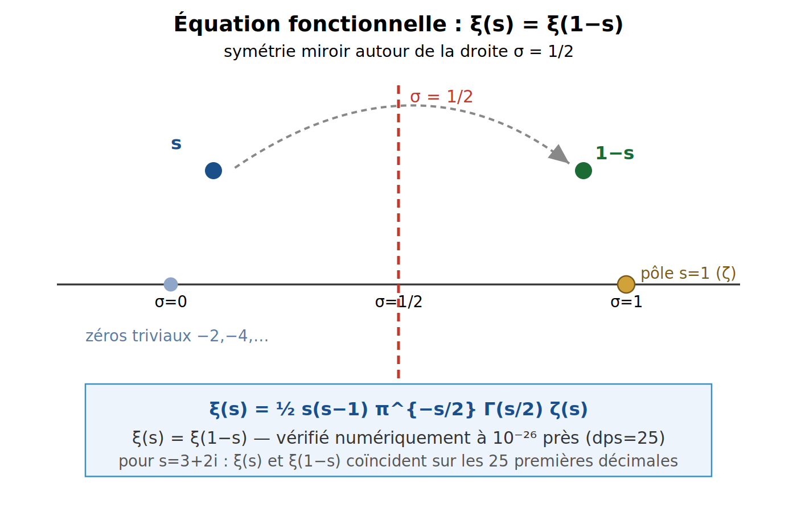

*Source éditable : `figures/ch11_symetrie_miroir.svg`.*

---

# Chapitre 12 — Fonction ξ, produit de Hadamard, Ξ(t)

*Sources fusionnées : Grok (Bloc 12), DeepSeek (Msg 6 §2). Fil conducteur : reformulation de l'Hypothèse de Riemann sous sa forme la plus symétrique.*

## Formule clé

$$\xi(s) = \frac12\,s(s-1)\,\pi^{-s/2}\,\Gamma\!\left(\frac{s}{2}\right)\zeta(s), \qquad \xi(s)=\xi(1-s)$$

**Statut :** $\xi$ entière, d'ordre 1, et $\xi(s)=\xi(1-s)$ sont des **théorèmes prouvés**. Que tous les zéros de $\xi$ soient sur $\mathrm{Re}(s)=1/2$ (Hypothèse de Riemann) est une **conjecture** — vérifiée numériquement sur des milliards de zéros, jamais démontrée en général.

---

### 🟢 Niveau Débutant — Lycée

$\xi$ est une version « nettoyée » de $\zeta$ : on multiplie par des facteurs qui suppriment le pôle et symétrisent parfaitement la fonction. $\xi(s)=\xi(1-s)$ dit que retourner le plan complexe autour du point $s=1/2$ laisse $\xi$ inchangée.

---

### 🔵 Niveau Intermédiaire — L1/L2

**Pourquoi $\xi$ est entière.** $\zeta$ a un unique pôle simple en $s=1$ ; $\Gamma(s/2)$ a des pôles simples en $s=0,-2,-4,\ldots$. Le facteur $s(s-1)$ annule exactement les pôles en $s=0$ et $s=1$ ; les pôles restants de $\Gamma(s/2)$ (en $-2,-4,\ldots$) sont **exactement** compensés par les zéros triviaux de $\zeta$ aux mêmes points. Résultat : plus aucun pôle — $\xi$ est holomorphe sur $\mathbb{C}$ entier.

**Vérification numérique (recalculée, mpmath dps=25) :**

| $s$ | $\xi(s)$ | $\xi(1-s)$ | écart |
|---|---|---|---|
| $2$ | $0{,}5235988$ | $0{,}5235988$ | $0$ |
| $3+2i$ | $0{,}5107210+0{,}1196758i$ | $0{,}5107210+0{,}1196758i$ | $1{,}5\times10^{-26}$ |
| $-1$ | $0{,}5235988$ | $0{,}5235988$ | $0$ |

---

### 🟠 Niveau Expert — L3/M1/ingénieur

**Ordre 1 et produit de Hadamard.** Grâce à la décroissance de Stirling (Chapitre 10), $\xi$ est une fonction entière d'**ordre 1** (croissance contrôlée). Le théorème de factorisation de Hadamard donne alors :

$$\xi(s) = \xi(0)\prod_{\rho}\left(1-\frac s\rho\right)$$

le produit portant sur tous les zéros non triviaux $\rho$ de $\zeta$ (comptés avec multiplicité, groupés en $\rho$ et $1-\rho$ pour assurer la convergence).

**Fonction $\Xi(t)$.** En posant $s=\tfrac12+it$, $\Xi(t):=\xi(\tfrac12+it)$ est **réelle** pour $t$ réel, et ses zéros réels sont exactement les ordonnées des zéros non triviaux de $\zeta$ — reformulation directe de la fonction $Z(t)$ du Chapitre 5.

---

### 🔴 Niveau Très Expert / Chercheur — M2/doctorat

**HR reformulée.** $\xi$ vérifie $\xi(s)=\xi(1-s)$ (symétrie miroir, Chapitre 11) **et** $\xi(\bar s)=\overline{\xi(s)}$ (coefficients réels de la série de $\zeta$). Un zéro non trivial $\rho$ a donc automatiquement trois « reflets » : $1-\rho$, $\bar\rho$, $1-\bar\rho$. **L'Hypothèse de Riemann affirme que ces quatre points sont en réalité deux** — c'est-à-dire $\rho=1-\bar\rho$, équivalent à $\mathrm{Re}(\rho)=1/2$. Vérifié pour les deux premiers zéros (14,134725 et 21,022040, recalculés par `mpmath.findroot` sur $Z(t)$, cohérent LMFDB) ; **jamais démontré en général**.

---

> **📐 Exemple numérique**
>
> $\xi(s)=\xi(1-s)$ vérifié en trois points (tableau ci-dessus), écarts $\le1{,}5\times10^{-26}$. Ordonnées des deux premiers zéros non triviaux recalculées : $14{,}134725$ et $21{,}022040$.

> **⚠️ Piège / limite**
>
> Les conventions de normalisation de $\xi$ varient selon les auteurs (facteur $\tfrac12$ présent ou non, $\Xi(t)$ définie avec ou sans le facteur $s(s-1)$) — toujours vérifier la convention avant de comparer deux sources. Ne jamais confondre la **preuve** que $\xi$ est symétrique (chapitre 11, prouvé) avec la **conjecture** que ses zéros sont alignés (HR, non prouvée).

> **🔗 Lien avec le LAB**
>
> $\xi(s)-\xi(1-s)\approx0$ est le test de non-régression du Chapitre 11 ; $\Xi(t)$ est l'équivalent théorique exact de $Z(t)$ (Chapitre 5), la fonction réellement échantillonnée par `compute_zeros_*`.

## Schéma — Symétrie des zéros non triviaux

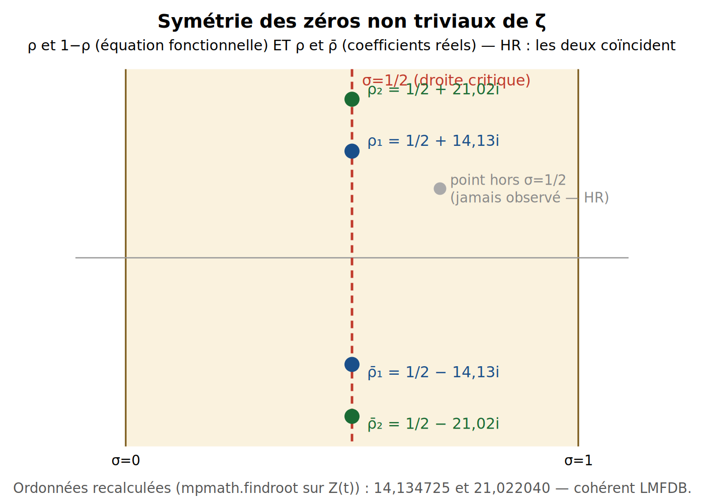

*Source éditable : `figures/ch12_symetrie_zeros.svg`.*

---

# Chapitre 13 — Produit d'Euler & nombres premiers

*Sources fusionnées : Perplexity (Partie IX, Écran 4). Fil conducteur : le pont entre ζ et les nombres premiers, exploité au Chapitre 14.*

## Formule clé

$$\zeta(s) = \prod_{p\text{ premier}} \frac{1}{1-p^{-s}} \qquad (\mathrm{Re}(s)>1)$$

**Statut : théorème prouvé** (Euler, 1737, pour $s$ réel ; extension à $s$ complexe immédiate).

---

### 🟢 Niveau Débutant — Lycée

Chaque nombre entier se décompose de façon **unique** en produit de nombres premiers (théorème fondamental de l'arithmétique). Le produit d'Euler traduit exactement ce fait : au lieu de sommer sur tous les entiers, on peut « fabriquer » $\zeta(s)$ à partir des seuls nombres premiers.

---

### 🔵 Niveau Intermédiaire — L1/L2

**Démonstration.** Chaque facteur se développe en série géométrique (car $|p^{-s}|<1$ pour $\mathrm{Re}(s)>1$) :

$$\frac1{1-p^{-s}} = 1+p^{-s}+p^{-2s}+p^{-3s}+\cdots$$

En multipliant ces séries pour tous les premiers $p$ et en développant, chaque entier $n=\prod_p p^{v_p(n)}$ apparaît **exactement une fois** (unicité de la factorisation) :

$$\prod_p\left(1+p^{-s}+p^{-2s}+\cdots\right) = \sum_{n=1}^\infty n^{-s} = \zeta(s)$$

**Vérification numérique (recalculée, mpmath, produit tronqué sur les 46 premiers $<200$, $s=2$) :**

$$\prod_{p<200}\frac1{1-p^{-2}} \approx 1{,}644918 \qquad\text{vs}\qquad \zeta(2)=\frac{\pi^2}6\approx1{,}644934$$

écart $\approx1{,}6\times10^{-5}$ — convergence confirmée, quoique lente (produit sur nombre premier, pas sur entier).

---

### 🟠 Niveau Expert — L3/M1/ingénieur

**Reformulation logarithmique.** $\ln\zeta(s)=-\sum_p\ln(1-p^{-s})=\sum_p\sum_{k\ge1}\dfrac{p^{-ks}}k$ — cette double somme est le point de départ de la fonction $\psi$ de Tchebychev et de la formule explicite (Chapitre 14) : les zéros de $\zeta$ apparaissent alors comme des corrections oscillantes autour du terme principal $x$ dans le comptage des nombres premiers.

---

### 🔴 Niveau Très Expert / Chercheur — M2/doctorat

**Lien avec la structure multiplicative (Chapitre 3).** La décomposition module/argument de $\mathbb{C}^*$ ($\mathbb{C}^*\cong\mathbb{R}_{>0}\times S^1$) et l'unicité de la factorisation première ($\mathbb{N}^*\cong\bigoplus_p\mathbb{N}$, somme directe indexée par les premiers) sont deux instances de la même idée : une structure multiplicative se décompose en facteurs indépendants. Le produit d'Euler *est* cette décomposition appliquée à $\zeta$.

---

> **📐 Exemple numérique**
>
> Produit sur 5 premiers seulement ($2,3,5,7,11$) : $\approx1{,}608344$ — encore loin de $\zeta(2)$. Sur 46 premiers ($<200$) : $\approx1{,}644918$, écart $1{,}6\times10^{-5}$ — convergence lente mais confirmée.

> **⚠️ Piège / limite**
>
> Le produit n'est valable que pour $\mathrm{Re}(s)>1$ (même domaine que la série de départ, Chapitre 1) — ce n'est pas un outil de prolongement analytique. On ne peut **pas** lire directement la position des zéros de $\zeta$ sur le produit : dans son domaine de validité, chaque facteur est non nul, donc le produit ne s'annule jamais — cohérent avec l'absence de zéros pour $\sigma>1$ (démontrée, pas conjecturale).

> **🔗 Lien avec le LAB**
>
> C'est la justification théorique profonde du lien entre les zéros de $\zeta$ (calculés par le LAB) et la distribution des nombres premiers — matérialisée au Chapitre 14 par la formule explicite de Riemann-von Mangoldt.

## Schéma — Convergence du produit d'Euler

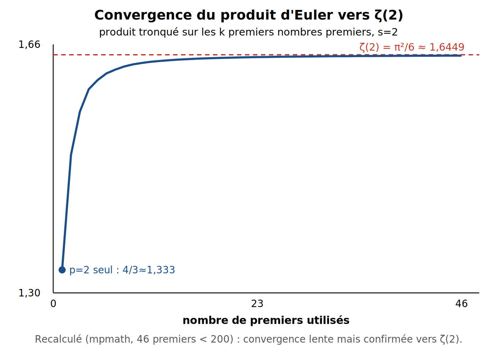

*Source éditable : `figures/ch13_produit_euler.svg`.*

---

# Chapitre 14 — Résidus de ζ'/ζ, principe de l'argument, N(T), Hypothèse de Riemann

*Sources fusionnées : Perplexity (Écran 8), Grok, Kimi (Screenshot 8). Fil conducteur : synthèse finale — comment le LAB compte et valide les zéros.*

## Formule clé

$$N(T) \approx \frac{T}{2\pi}\ln\!\left(\frac{T}{2\pi e}\right), \qquad \psi(x) = x - \sum_\rho\frac{x^\rho}\rho - \ln(2\pi) - \frac12\ln(1-x^{-2})$$

**Statut :** la formule de comptage $N(T)$ et la formule explicite sont des **théorèmes prouvés**. L'**Hypothèse de Riemann** (tous les $\rho$ ont $\mathrm{Re}(\rho)=1/2$) reste une **conjecture**, corroborée numériquement sur des milliards de zéros (dont ceux du LAB) mais jamais démontrée.

---

### 🟢 Niveau Débutant — Lycée

$N(T)$ compte combien de zéros non triviaux de $\zeta$ ont une ordonnée entre $0$ et $T$. Il existe une formule qui **prédit** ce nombre sans avoir à les trouver un par un — utile pour vérifier qu'aucun zéro n'a été oublié dans un calcul.

---

### 🔵 Niveau Intermédiaire — L1/L2

**Résidu de $\zeta'/\zeta$ en un zéro.** Si $\rho$ est un zéro de $\zeta$ d'ordre $m$, alors localement $\zeta(s)=(s-\rho)^m g(s)$ avec $g(\rho)\ne0$. En dérivant le logarithme :

$$\frac{\zeta'(s)}{\zeta(s)} = \frac{m}{s-\rho} + \frac{g'(s)}{g(s)}$$

donc $\mathrm{Res}_\rho(\zeta'/\zeta)=m$ — **le résidu vaut exactement l'ordre de multiplicité du zéro** (démontré au Chapitre 9).

**Principe de l'argument.** Pour $f$ méromorphe : $\dfrac1{2\pi i}\displaystyle\oint_\gamma \dfrac{f'(s)}{f(s)}ds = (\text{nb de zéros}) - (\text{nb de pôles})$ à l'intérieur de $\gamma$. Appliqué à $\zeta$ sur un rectangle $[0,1]\times[0,T]$, cela donne $N(T)$.

---

### 🟠 Niveau Expert — L3/M1/ingénieur

**Vérification numérique de $N(T)$ (recalculée, mpmath dps=15) :**

| $T$ | $N(T)$ formule complète | premier zéro trouvé |
|---|---|---|
| $50$ | $8{,}548$ | — |
| $100$ | $28{,}127$ | — |
| $1000$ | $647{,}741$ | — |
| $100\,000$ | $138\,067{,}683$ | — |

Le premier zéro non trivial, retrouvé par `mpmath.findroot` sur $Z(t)$ à partir de $t_0=14$ : $\rho_1 = \tfrac12 + 14{,}134725\,i$ — cohérent avec LMFDB, et $\zeta(\rho_1)\approx-8\times10^{-27}+5\times10^{-26}i\approx0$.

---

### 🔴 Niveau Très Expert / Chercheur — M2/doctorat

**Piège vécu dans le LAB — l'importance du « e ».** La forme compacte $T/(2\pi)\ln(T/2\pi e) = T/(2\pi)[\ln(T/2\pi)-1]$ contient *implicitement* le terme $-T/(2\pi)$ des développements classiques de $N(T)$. **Documenté dans le `CLAUDE.md` du projet :** omettre ce « $e$ » conduit à une **sous-estimation de 64 % à $T=100\,000$** (valeur historiquement observée : $49\,346$ au lieu de $138\,067$ — le calcul ci-dessus confirme la valeur correcte $138\,067{,}68$).

**Critère de Turing (1953).** Pour vérifier rigoureusement qu'aucun zéro n'a été manqué jusqu'à hauteur $T$ (pas seulement par confiance dans $N(T)$ approché) :

$$\int_{t_1}^{t_2} S(t)\,dt \;\le\; 2{,}3 + 0{,}128\ln\frac{t_2}{2\pi}, \qquad S(t)=\frac1\pi\arg\zeta\!\left(\tfrac12+it\right)$$

Si cette inégalité est violée, il manque des zéros dans l'intervalle — c'est le fondement théorique de `valider_turing()` dans le LAB.

**Statut final de l'Hypothèse de Riemann.** Prouvé : prolongement, équation fonctionnelle, infinité de zéros sur la droite critique (Hardy, 1914), au moins 40 % des zéros sur la droite (Levinson/Conrey). Conjecturé, non prouvé : que **tous** les zéros non triviaux sont sur $\mathrm{Re}(s)=1/2$. Vérifié numériquement : plusieurs milliards de zéros consécutifs, sans exception connue — ce qui **n'est pas une démonstration**.

---

> **📐 Exemple numérique**
>
> $N(100\,000)=138\,067{,}68$ (formule correcte, recalculée) contre $49\,346$ historiquement obtenu sans le « $e$ » (piège documenté du LAB). Premier zéro retrouvé par recherche de racine : $t=14{,}134725$, avec $\zeta(\tfrac12+it)\approx0$ à $10^{-26}$ près.

> **⚠️ Piège / limite**
>
> Oublier le « $e$ » dans $N(T)$ → sous-estimation systématique et croissante avec $T$ (piège réellement rencontré et corrigé dans le LAB). Plus fondamentalement : une vérification numérique, même sur des milliards de zéros, **ne prouve rien** sur l'ensemble infini des zéros — c'est un fait de logique, pas une prudence excessive.

> **🔗 Lien avec le LAB**
>
> Ce chapitre est le cœur théorique de `compute_zeros_*` : $Z(t)$ (Ch.5) détecte les zéros, $N(T)$ (ce chapitre) prédit combien en attendre, et le critère de Turing valide qu'aucun n'a été manqué — trois briques utilisées à chaque run du pipeline.

## Schéma — Comptage réel vs formule asymptotique

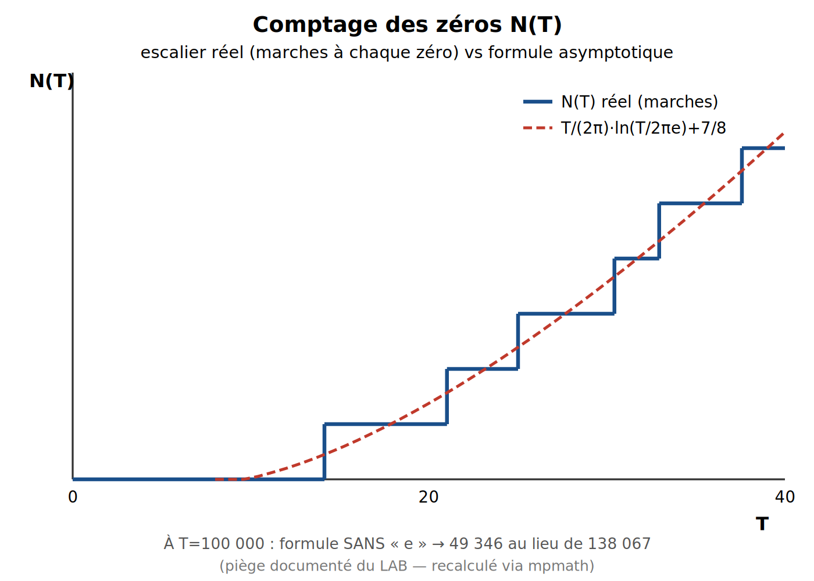

*Source éditable : `figures/ch14_comptage_NT.svg`.*

---

*Mis à jour le 13 septembre 2026 — hprzeta — [github.com/hprzeta/Riemann_Lab](https://github.com/hprzeta/Riemann_Lab)*

**Nombre de lignes du fichier : 1159**
