# Riemann Lab — Zêta Project
## Clonage système & mise à jour multi-disques bootables

**Rapport technique complet illustré — hôte `riemann@zeta-lab`**

| Disque | Modèle | Rôle |
|---|---|---|
| Interne | Seagate ST1000LM035, 1 To | Ubuntu — système principal — `/dev/sda` |
| Externe #1 | Toshiba MQ04ABD200, 2 To USB3 | Clone Ubuntu bootable — `/dev/sdb` |
| Externe #2 | Samsung M2 Portable, 500 Go USB3 | Clone Kali bootable — `/dev/sdc` → `sdb` |

> **Périmètre exclu (au 21 juin) :** SSD Micron 1100 (boîtier Verbatim), ancien Windows/BitLocker — non touché.
> *Mise à jour 22 juin 2026 — ce disque a depuis été reformaté pour un usage distinct (vault RAG), voir §11 Phase F.*

Document généré le 21 juin 2026 — édition enrichie (captures intégrées). Mis à jour le 22 juin 2026 (§11 Phase F).
Projet : sauvegarde disque résiliente — système d'exploration de l'Hypothèse de Riemann.

---

## Sommaire

1. [Contexte et objectifs du projet](#1-contexte-et-objectifs-du-projet)
2. [Inventaire des disques et corrections d'identification](#2-inventaire-des-disques-et-corrections-didentification)
3. [Phase A — Préparation et installation des outils](#3-phase-a--préparation-et-installation-des-outils)
4. [Phase B — Clonage Kali (Toshiba → Samsung)](#4-phase-b--clonage-kali-toshiba--samsung)
5. [Phase C — Clonage Ubuntu (sda → Toshiba)](#5-phase-c--clonage-ubuntu-sda--toshiba)
6. [Phase D — Dépannage boot Kali sur Samsung](#6-phase-d--dépannage-boot-kali-sur-samsung)
7. [Phase E — Première mise à jour système du clone Kali](#7-phase-e--première-mise-à-jour-système-du-clone-kali)
8. [Synthèse de tous les problèmes rencontrés et corrections](#8-synthèse-de-tous-les-problèmes-rencontrés-et-corrections)
9. [État final et tableau de bord](#9-état-final-et-tableau-de-bord)
10. [Leçons apprises et bonnes pratiques retenues](#10-leçons-apprises-et-bonnes-pratiques-retenues)
11. [Phase F — Configuration du vault RAG sur le SSD Micron 1100](#11-phase-f--configuration-du-vault-rag-sur-le-ssd-micron-1100)
12. [Annexe — Galerie complète des captures d'écran](#12-annexe--galerie-complète-des-captures-décran)

> **Note sur cette édition.** Cette version du rapport intègre directement, dans chaque section concernée, les captures d'écran correspondantes (BIOS, kernel panic, menus GRUB, terminaux) plutôt que de s'y référer uniquement par le texte. Une annexe galerie (§12) regroupe en outre l'intégralité des 45 captures disponibles, dans l'ordre chronologique. Toutes les images sont référencées en chemin relatif `img/...` — conserver le sous-dossier `img/` à côté de ce fichier Markdown.

---

## 1. Contexte et objectifs du projet

L'objectif initial était de produire trois disques indépendamment bootables à partir d'un poste de travail Linux (machine `zeta-lab`, utilisateur `riemann`) utilisé notamment pour le projet de recherche sur l'hypothèse de Riemann (calcul des zéros non triviaux de la fonction zêta) :

- **Disque interne (`/dev/sda`)** — Ubuntu, système principal de travail.
- **Disque externe Toshiba 2 To USB3** — clone complet et bootable de l'Ubuntu local, destiné à servir de sauvegarde de secours en cas de panne du disque interne.
- **Disque externe Samsung 500 Go USB3** — clone complet et bootable d'une installation Kali Linux préexistante, trouvée sur le Toshiba avant sa réaffectation.

### Disque explicitement exclu

Un SSD Micron (boîtier Verbatim) contenant une ancienne installation Windows protégée par BitLocker a été identifié dès l'inventaire initial et volontairement exclu de toute opération de clonage ou de formatage.

### Consignes de travail appliquées tout au long du projet

- Commandes fournies prêtes à copier-coller, exécutées par l'utilisateur lui-même.
- Confirmation explicite demandée avant toute action destructrice (formatage, partitionnement, `wipefs`).
- Captures d'écran demandées en cas de doute ou d'erreur visuelle (BIOS, menus GRUB, terminal).
- Tableau d'avancement et liste du reste à faire tenus à jour à chaque étape.
- Toute erreur rencontrée corrigée immédiatement, sans la reproduire à l'étape suivante.

---

## 2. Inventaire des disques et corrections d'identification

La toute première étape critique a été d'identifier précisément la nature réelle de chaque disque, car les hypothèses de départ de l'utilisateur (tailles, type SSD/HDD) se sont révélées partiellement inexactes après inspection avec `lsblk`, `smartctl` et `parted`.

| Nom au démarrage | Modèle réel identifié | Taille réelle | Contenu d'origine | Rôle final assigné |
|---|---|---|---|---|
| `/dev/sda` | Seagate ST1000LM035 (HDD) | 931 GiB (1 To) | Ubuntu — système actif | Disque principal (inchangé) |
| Toshiba (vu un temps comme `sdb`) | Toshiba MQ04ABD200 (HDD) | 2 000 GB (≈1,82 TiB) | Ancienne installation Kali Linux | Reformaté → clone Ubuntu bootable |
| Samsung (vu un temps comme `sdc`) | Samsung M2 Portable | 500 GB | Ancienne installation Ubuntu inutilisée | Reformaté → clone Kali bootable |
| Boîtier Verbatim | SSD Micron 1100 (MTFDDAK2) | 238 GiB (256 GB réel) | Windows + BitLocker + partition RE | Reformaté → vault RAG `/mnt/vault_rag` (22 juin, voir §11) |

> ⚠️ **Problème rencontré — Hypothèse de taille erronée**
> L'utilisateur pensait disposer d'un SSD externe de 2 To pour le clone Ubuntu ; l'inspection a révélé que le disque réellement câblé à ce moment-là (boîtier Verbatim) ne faisait que **256 Go**, et contenait en réalité une ancienne installation Windows/BitLocker.

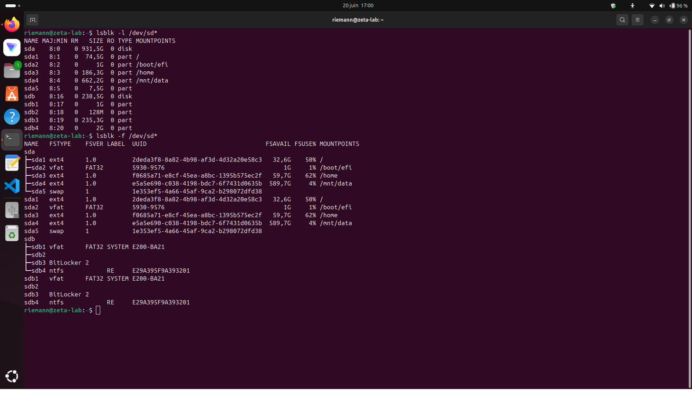
*Capture — premier `lsblk -l /dev/sd*` et `lsblk -f`. Le disque branché en `sdb` affiche 238,5G avec une partition `BitLocker` : c'est le SSD Micron, pas le disque de 2 To attendu.*

> ✅ **Correction appliquée**
> Réinventaire complet de tous les disques connectés avec `lsblk -f /dev/sd*` et `smartctl`. Le véritable disque 2 To (Toshiba) et le disque 500 Go (Samsung) ont été identifiés séparément, et les rôles ont été réattribués en conséquence : Toshiba pour le clone Ubuntu (volume suffisant), Samsung pour le clone Kali (après nettoyage du volumineux dossier de dumps forensiques, voir §4).

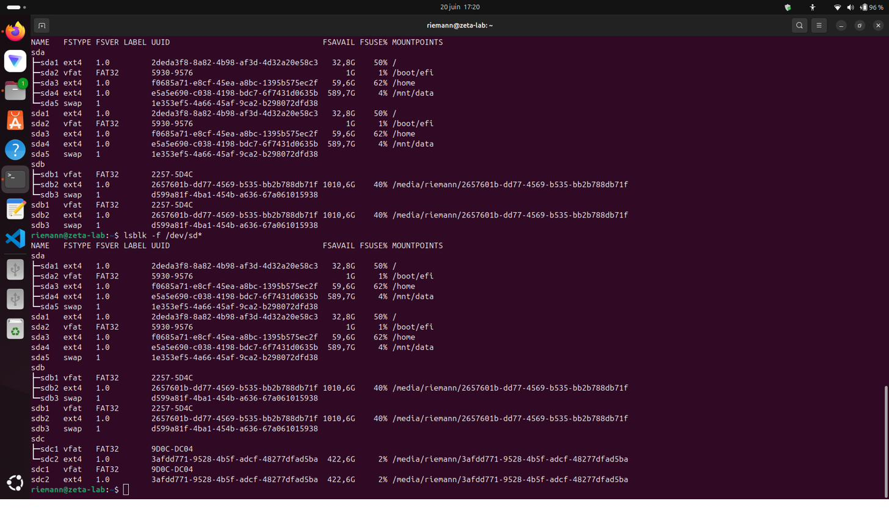
*Capture — réinventaire correct. `lsblk -f /dev/sd*` révèle `sdb` = Toshiba (1010,6G, monté avec le Kali d'origine, label UUID `2657601b…`) et `sdc` = Samsung (422,6G). Les bons disques sont désormais identifiés sans ambiguïté.*

> 📌 **Règle retenue pour la suite du projet**
> Les noms `/dev/sdX` sont instables d'une session à l'autre selon l'ordre de branchement USB. Toute identification a ensuite été faite par label (`kali-clone`, `root-clone`) ou par UUID, jamais par lettre seule.

---

## 3. Phase A — Préparation et installation des outils

Avant tout clonage, l'outil principal nécessaire a été vérifié sur le système source (Ubuntu, `sda`) :

```bash
sudo apt update
sudo apt install rsync
```

`rsync` était déjà installé en version récente (3.2.7-1ubuntu1.5) — aucune installation supplémentaire n'a donc été nécessaire à cette étape. Les autres outils utilisés (`parted`, `wipefs`, `mkfs.ext4`, `mkfs.vfat`, `mkswap`, `grub-install`, `update-grub`, `update-initramfs`, `smartctl`) étaient également déjà présents sur le système Ubuntu de base.

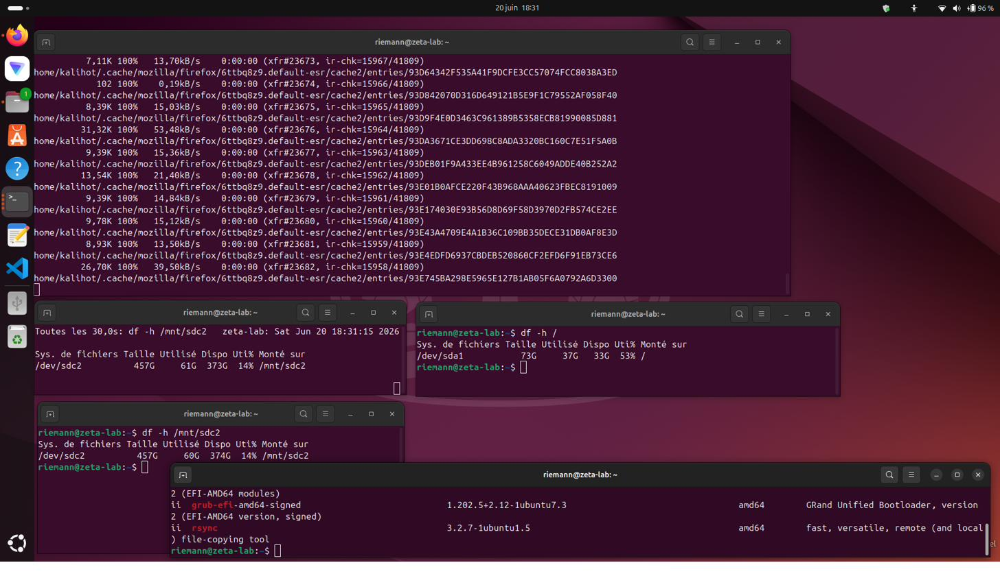
*Capture — vérification des paquets installés. En bas à droite : `grub-efi-amd64-signed` (1.202.5+2.12-1ubuntu7.3) et `rsync` (3.2.7-1ubuntu1.5) confirmés présents et à jour, pendant que le clonage Kali est déjà en cours dans les autres terminaux.*

### Contrôle disque rapide (SMART)

Un contrôle de santé rapide a été effectué sur les disques cibles avant toute opération destructrice :

```bash
sudo smartctl -H /dev/sdb
sudo smartctl -H /dev/sdc
```

Résultat : **PASSED** pour le disque Toshiba. Le contrôle du Samsung a été jugé non bloquant et traité comme optionnel à ce stade du projet.

---

## 4. Phase B — Clonage Kali (Toshiba → Samsung)

Avant de pouvoir réutiliser le Toshiba (2 To) pour le clone Ubuntu, l'installation Kali existante qu'il contenait a d'abord été sauvegardée sur le disque Samsung (500 Go).

### 4.1 — Analyse du volume de données à copier

Le volume total occupé par l'installation Kali sur le Toshiba était de 721 Go, ce qui dépassait la capacité du Samsung (500 Go / ≈423 GiB utilisables). Une analyse fine a permis d'isoler la cause :

| Élément | Taille | Décision |
|---|---|---|
| `home/img` | 509 Go | Dossier unique, identifié comme dump forensique recréable — exclu |
| Reste du système Kali | ≈212 Go | Conservé intégralement — rentre dans les 423 GiB du Samsung avec marge |
| /home Ubuntu (référence, étape ultérieure) | 118 Go | Utile pour dimensionner le clone Ubuntu (Phase C) |

> ✅ **Décision validée avec l'utilisateur**
> `home/img` a été confirmé par l'utilisateur comme une donnée recréable (dump forensique de mission terminée), permettant son exclusion sans perte de valeur réelle.

### 4.2 — Commande de copie (dry-run puis exécution réelle)

Une simulation a d'abord été lancée pour valider le volume avant tout transfert réel :

```bash
rsync -avh --dry-run \
  --exclude='home/img/' \
  "/media/riemann/<UUID-toshiba>/" \
  "/media/riemann/<UUID-samsung>/kali-backup/" \
  | tail -40
```

> ⚠️ **Problème rencontré — Erreurs de permissions**
> La première tentative de copie réelle a été lancée en utilisateur normal (`riemann`), provoquant des erreurs de permission sur de nombreux répertoires système sensibles de Kali (`/root`, `/etc/ssl/private`, `/var/lib/mysql/...`), ces fichiers appartenant à `root` et n'étant pas lisibles par un utilisateur standard.

> ✅ **Correction appliquée**
> Toutes les opérations `rsync` de clonage de systèmes ont ensuite été systématiquement lancées avec `sudo`, avec l'option `--one-file-system` pour respecter les limites de montage partition par partition (une commande `rsync` distincte par partition lors des clonages multi-partitions).

Commande type retenue pour la suite du projet :

```bash
sudo rsync -avh --progress --one-file-system \
  --exclude='home/img/' \
  --log-file=/home/riemann/clone_kali.log \
  /source/ /destination/
```

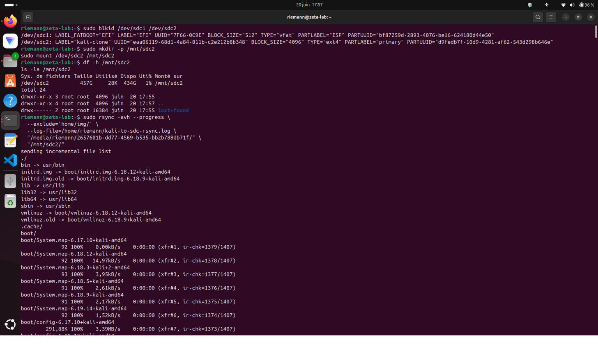
*Capture — rsync Kali en cours, correctement lancé avec `sudo`. La commande référence bien `--exclude='home/img/'`, un fichier de log dédié, et la source/destination par UUID de montage.*

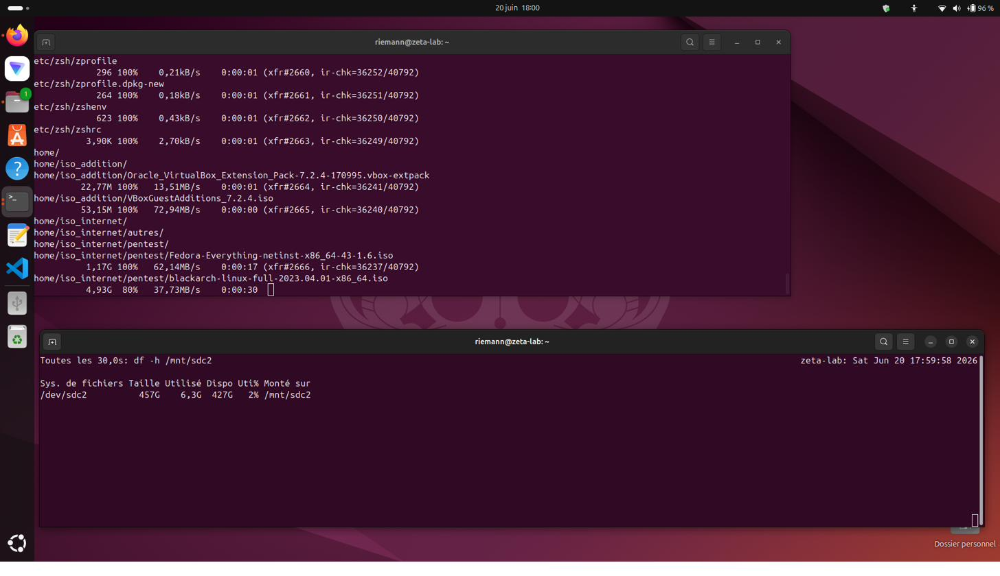
*Suivi en double-terminal. Transfert de gros fichiers ISO (`blackarch-linux-full` 4,93G, etc.) en haut ; `df -h /mnt/sdc2` rafraîchi toutes les 30s en bas (6,3G/427G à ce stade).*

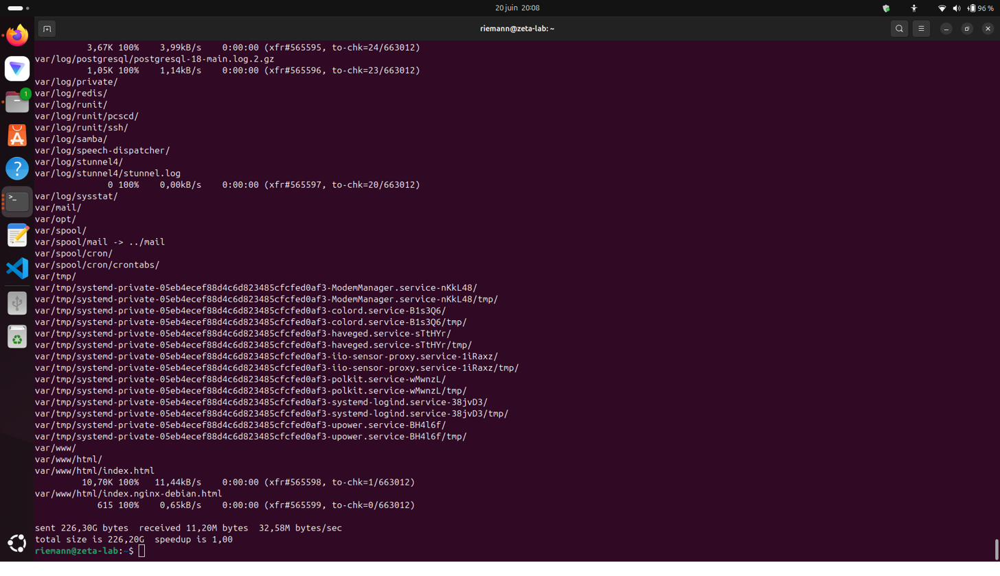
*Fin du rsync Kali. `sent 226,30G bytes received 11,20M bytes 32,58M bytes/sec` — `total size is 226,20G`. Volume cohérent avec les 212 Go estimés (hors `home/img`).*

### 4.3 — Vérification qualité post-transfert

Une fois le transfert terminé, une vérification du journal de copie a été effectuée par précaution, en cherchant les motifs `error`, `failed` et `denied`.

> ⚠️ **Alerte apparente — 2787 occurrences suspectes dans le log**
> ```
> grep -i "error\|failed\|denied" /home/riemann/kali-to-sdc-rsync.log | wc -l
> 2787
> ```
> Un premier comptage brut du journal de transfert a fait remonter **2787 lignes** contenant l'un de ces motifs, ce qui semblait à première vue préoccupant pour un clonage censé être propre.

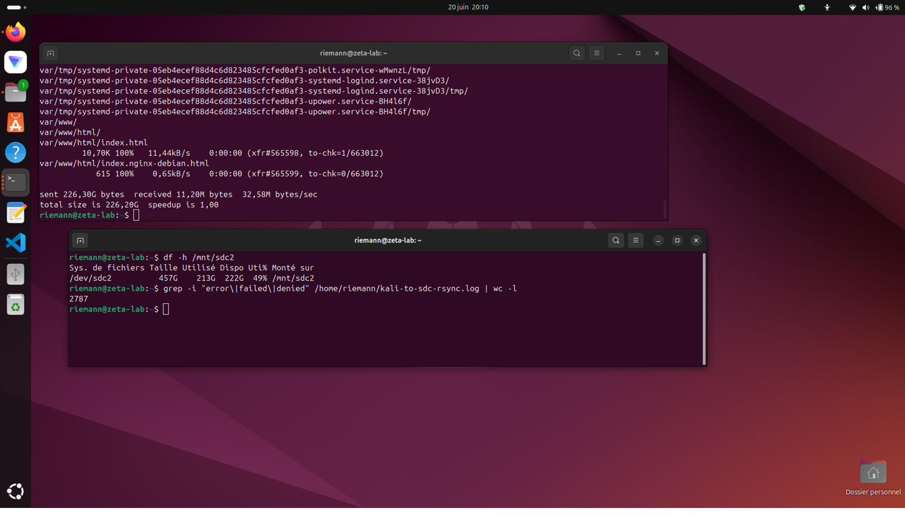
*Capture — comptage initial alarmant. 2787 lignes correspondent au filtre `error|failed|denied` dans le journal rsync.*

> ✅ **Analyse fine — faux positifs confirmés**
> Un examen détaillé des lignes correspondantes a montré qu'il s'agissait presque exclusivement de **noms de fichiers légitimes** contenant ces mots dans leur nom (ex. `libgpg-error0`, `scapy/error.py`, `mingw-w64/include/error.h`, `apache2/error.log`), et non de véritables échecs de transfert rsync. Une déduplication par motif (`sed` + `sort -u`) a permis de le confirmer rapidement.

```bash
grep -iE "error|failed|denied" /home/riemann/kali-to-sdc-rsync.log \
  | sed -E 's/.*\((.*)\).*/\1/' | sort | uniq -c | sort -rn | head -10
grep -c "^rsync:" /home/riemann/kali-to-sdc-rsync.log
# → 0
```

Le test décisif est le comptage des lignes commençant réellement par `rsync:` (préfixe utilisé par rsync pour ses propres messages d'erreur) : **0 résultat**. Aucune erreur de transfert rsync réelle n'a donc été constatée sur ce clonage.

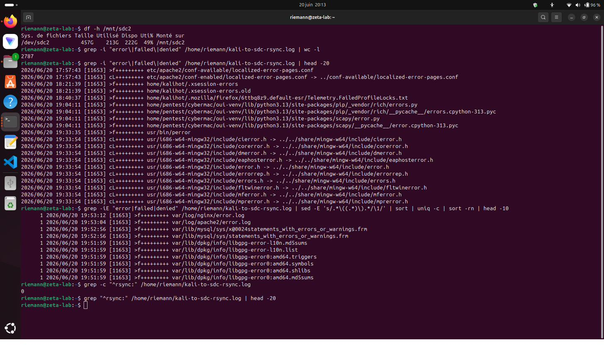
*Capture — vérification décisive. La liste dédupliquée en haut confirme qu'il s'agit de noms de fichiers (`nginx/error.log`, `mysql/.../statements_with_errors_or_warnings.frm`, `libgpg-error0`, etc.). En bas : `grep -c "^rsync:"` retourne **0** — confirmation qu'aucune vraie erreur rsync n'a eu lieu.*

> 📌 **Règle retenue pour la suite du projet**
> Pour vérifier la qualité d'un transfert rsync à partir d'un journal volumineux, ne jamais se fier à un simple comptage de mots-clés comme `error` ou `failed` : ces termes apparaissent très fréquemment dans des noms de fichiers légitimes. Le test fiable est de filtrer spécifiquement les lignes préfixées par `rsync:`, qui sont les seuls messages d'erreur réellement émis par l'outil lui-même.

---

## 5. Phase C — Clonage Ubuntu (sda → Toshiba)

Une fois le Toshiba libéré du contenu Kali (sauvegardé sur Samsung), il a été entièrement reformaté pour accueillir le clone bootable d'Ubuntu.

### 5.1 — Effacement et partitionnement (GPT)

Par sécurité, l'effacement de la table de partitions a d'abord été simulé en mode lecture seule avant toute écriture réelle :

```bash
sudo wipefs -n /dev/sdb   # simulation — aucune écriture
```

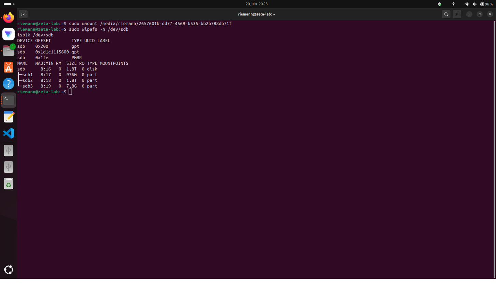
*Capture — `wipefs -n` (dry-run). Affiche les signatures GPT/PMBR qui seraient effacées, sans toucher au disque. Le `lsblk` confirme la structure encore présente du Toshiba (1,8T, 3 partitions héritées de Kali).*

Après confirmation explicite de l'utilisateur, l'effacement réel a été exécuté :

```bash
sudo wipefs -a /dev/sdb
sudo parted /dev/sdb --script mklabel gpt
```

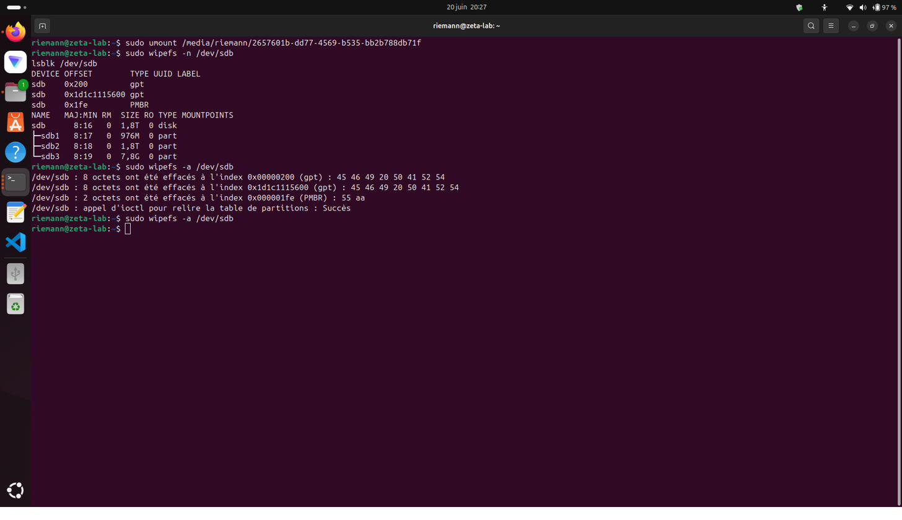
*Capture — `wipefs -a` réel. 8 octets effacés à l'index GPT primaire, 8 octets à l'index GPT secondaire, 2 octets au PMBR. Relecture de la table de partitions confirmée en succès.*

> ⚠️ **Problème rencontré — Dépassement de capacité dans le calcul des partitions**
> Lors de la création de la 4ᵉ partition (`/mnt/data`), la valeur de fin `1924409MiB` a été calculée à partir d'une estimation erronée de la capacité totale du disque. Erreur retournée :
> ```
> Erreur: La localisation 1924409MiB est en dehors du périphérique /dev/sdb.
> ```
> Cause : confusion entre la notation décimale (2000GB annoncés par `parted`) et la notation binaire (Tio) utilisée par `lsblk` (1,8T). La partition `/mnt/data` n'a pas pu être créée intégralement, et la partition swap n'a pas pu être créée du tout lors de cette première tentative.

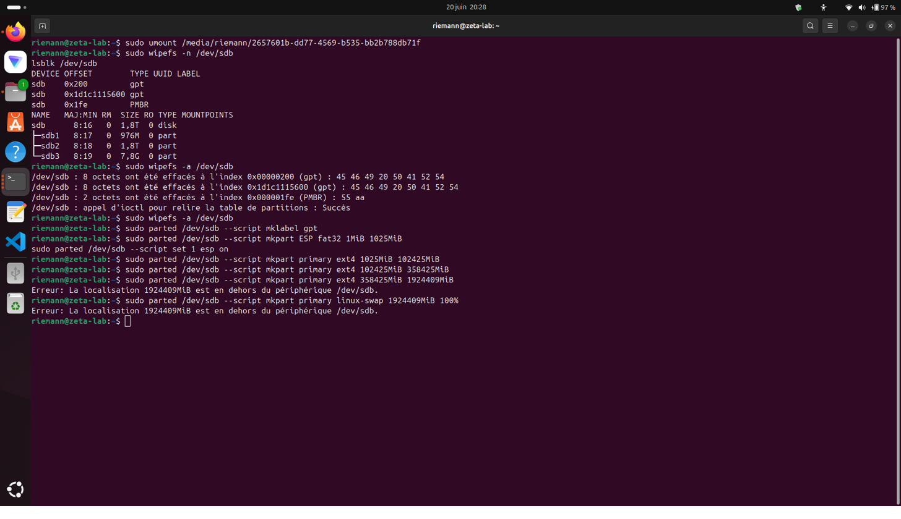
*Capture — erreur de dépassement capturée en direct. Les deux dernières commandes `mkpart` échouent identiquement : « La localisation 1924409MiB est en dehors du périphérique /dev/sdb ».*

> ✅ **Correction appliquée**
> Relecture de la taille exacte et déjà partitionnée du disque avec :
> ```bash
> sudo parted /dev/sdb --script print
> ```
> Le disque a été confirmé à exactement 2000GB (notation décimale), avec 376GB déjà utilisés par les 3 premières partitions. La 4ᵉ partition a ensuite été recréée en utilisant `100%` comme borne finale plutôt qu'une valeur MiB calculée à la main — éliminant tout risque de dépassement :

```bash
sudo parted /dev/sdb --script mkpart ESP fat32 1MiB 1025MiB
sudo parted /dev/sdb --script set 1 esp on
sudo parted /dev/sdb --script mkpart primary ext4 1025MiB 102425MiB
sudo parted /dev/sdb --script mkpart primary ext4 102425MiB 358425MiB
sudo parted /dev/sdb --script mkpart primary ext4 358425MiB 100%
```

> 📌 **Règle retenue**
> Pour toute partition qui doit occuper le reste de l'espace disponible sur un disque, utiliser systématiquement `100%` comme borne finale plutôt qu'une valeur MiB calculée manuellement, et toujours confirmer la taille réelle avec `parted ... print` avant de lancer des commandes de partitionnement en chaîne.

### 5.2 — Formatage des partitions

```bash
sudo mkfs.vfat -F32 /dev/sdb1
sudo mkfs.ext4 -L root-clone /dev/sdb2
sudo mkfs.ext4 -L home-clone /dev/sdb3
sudo mkfs.ext4 -L data-clone /dev/sdb4
sudo mkswap -L swap-clone /dev/sdb5
sudo swapon /dev/sdb5
```

> ℹ️ **Précision apportée par les captures — 5 partitions, pas 4**
> Le partitionnement final du Toshiba comporte en réalité **cinq** partitions et non quatre : en plus de l'EFI (`sdb1`), de la racine (`sdb2`, label `root-clone`), du home (`sdb3`, label `home-clone`) et de `/mnt/data` (`sdb4`, label `data-clone`), une cinquième partition **swap** (`sdb5`, label `swap-clone`) a été créée pour reproduire fidèlement la disposition du disque source `sda`, qui possède lui aussi 5 partitions dont un swap dédié.

### 5.3 — Clonage des données (rsync multi-partitions)

Conformément à la correction retenue en Phase B, chaque partition a été copiée individuellement avec `--one-file-system`, en root. Un essai à blanc a précédé chaque copie réelle :

```bash
sudo rsync -avh --progress --one-file-system --dry-run / /mnt/clone-root/
```

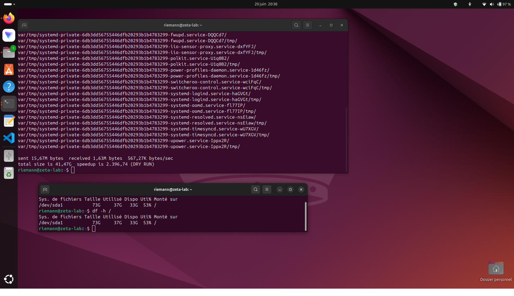
*Capture — `rsync --dry-run` sur la racine. En haut : simulation affichant `total size is 41,47G ... speedup is 2.396,74 (DRY RUN)`, confirmant le volume avant tout transfert réel. En bas : `df -h /` confirme 37G utilisés sur `sda1` (cohérent).*

```bash
sudo rsync -avh --progress --one-file-system / /mnt/clone-root/
sudo rsync -avh --progress --one-file-system /home/ /mnt/clone-root/home/
sudo rsync -avh --progress --one-file-system /mnt/data/ /mnt/clone-root/mnt/data/
```

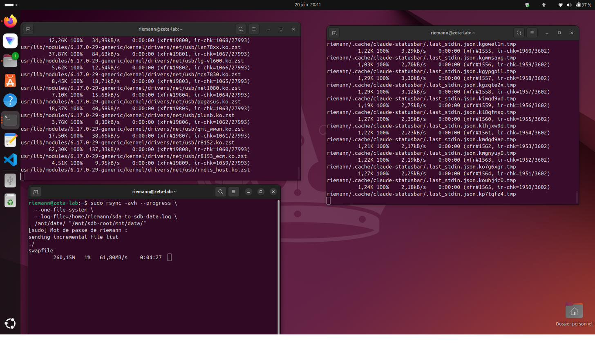
*Capture — trois rsync en parallèle. Transfert simultané de la racine (en bas à gauche, démarrage de la copie du `swapfile`), de `/home` (à droite) et de `/mnt/data` (modules noyau USB en haut à gauche).*

> ℹ️ **Avertissement bénin observé — fichiers « vanished »**
> ```
> rsync warning: some files vanished before they could be transferred (code 24) at main.c(1356) [sender=3.2.7]
> ```
> Ce message est apparu sur le transfert de `/home`. Une vérification ciblée a confirmé qu'il s'agissait d'un fichier de cache Firefox temporaire ayant disparu entre l'énumération et la copie effective (système actif en cours d'utilisation pendant le clonage) — comportement strictement normal pour un `rsync` exécuté sur un système live, sans incidence sur l'intégrité du clone.

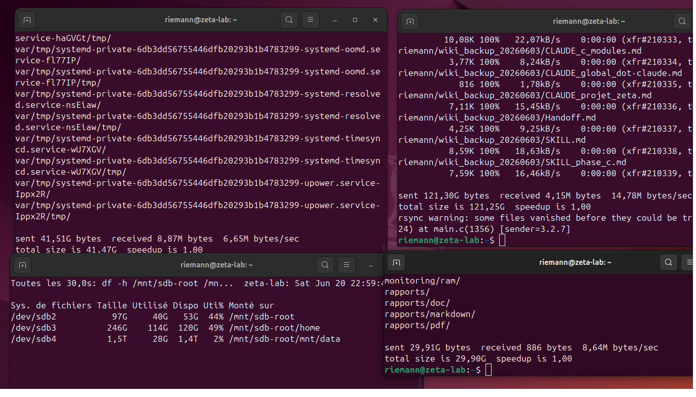
*Fin du rsync `/mnt/data`. `sent 41,51G bytes ... total size is 41,47G` ; le warning « vanished » apparaît dans le terminal voisin (transfert de `/home`, 121,30G envoyés).*

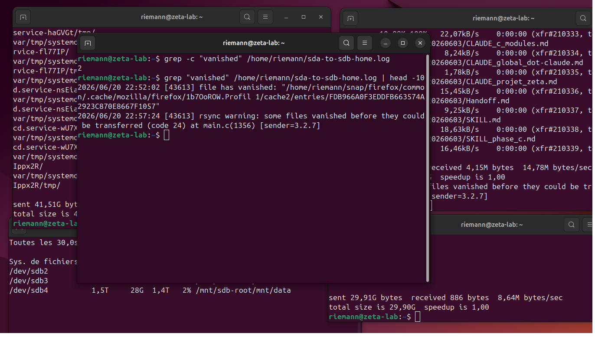
*Vérification du warning. `grep "vanished" /home/riemann/sda-to-sdb-home.log` identifie précisément le fichier disparu : un cache Firefox (`.../cache2/entries/...`) — confirmation du caractère bénin.*

### 5.4 — Installation de GRUB (chroot)

```bash
sudo mount --bind /dev /mnt/clone-root/dev
sudo mount --bind /dev/pts /mnt/clone-root/dev/pts
sudo mount --bind /proc /mnt/clone-root/proc
sudo mount --bind /sys /mnt/clone-root/sys
sudo mount --bind /run /mnt/clone-root/run

sudo chroot /mnt/clone-root /bin/bash
update-initramfs -u -k all
grub-install --target=x86_64-efi --efi-directory=/boot/efi \
  --bootloader-id=ubuntu --recheck /dev/sdb
update-grub
exit
```

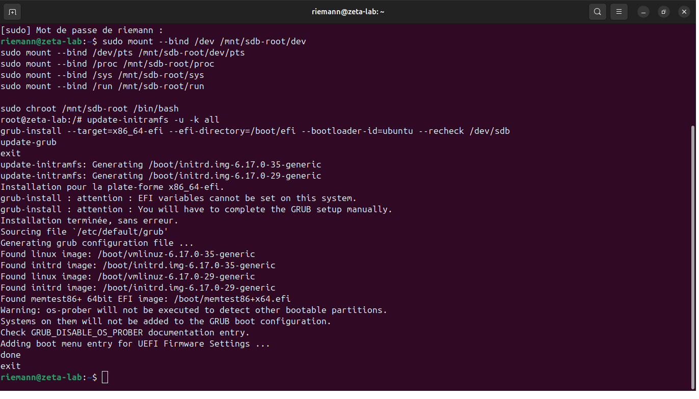
*Capture — installation GRUB complète en chroot. Régénération de l'initramfs pour les 2 noyaux Ubuntu, puis `grub-install` et `update-grub` avec détection correcte des images linux/initrd et de l'image memtest86+. Un avertissement `EFI variables cannot be set on this system` apparaît — normal en chroot (le firmware UEFI n'est accessible que depuis le système réellement démarré), sans incidence puisque la configuration GRUB est de toute façon écrite sur le disque.*

### 5.5 — Correction des UUID dans fstab

> ⚠️ **Problème rencontré — fstab pointant vers les anciens UUID**
> Après clonage, le fichier `/etc/fstab` du clone référençait encore les UUID des partitions d'origine (`sda`), inexistantes sur le nouveau disque, ce qui aurait empêché un démarrage correct.

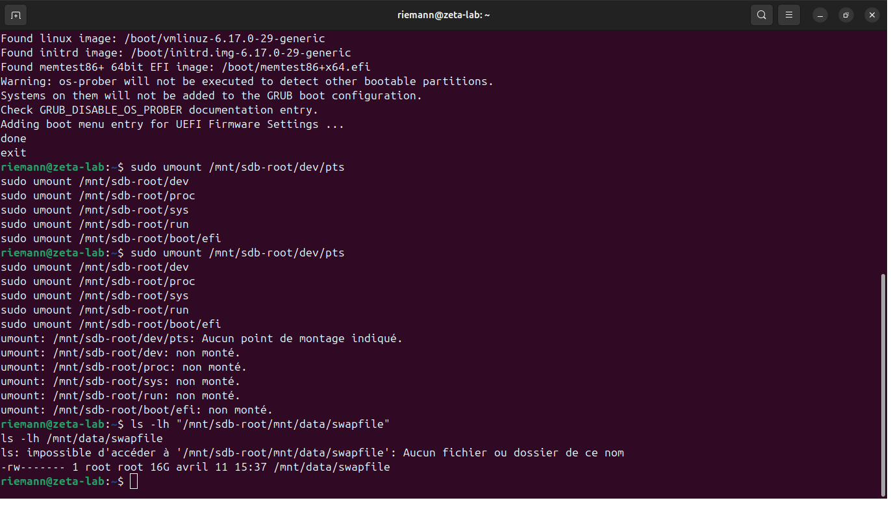
*Capture — fstab du clone avant correction. Les quatre lignes actives référencent encore les UUID de `sda1` à `sda4` (commentaires « was on /dev/sdaX during curtin installation »). Le `swapfile` n'est, à ce stade, pas encore accessible depuis le point de montage du clone.*

> ✅ **Correction appliquée**
> Remplacement des anciens UUID par les nouveaux (relevés via `blkid`) avec `sed -i` :

```bash
sudo blkid /dev/sdb1 /dev/sdb2 /dev/sdb3 /dev/sdb4 /dev/sdb5
```

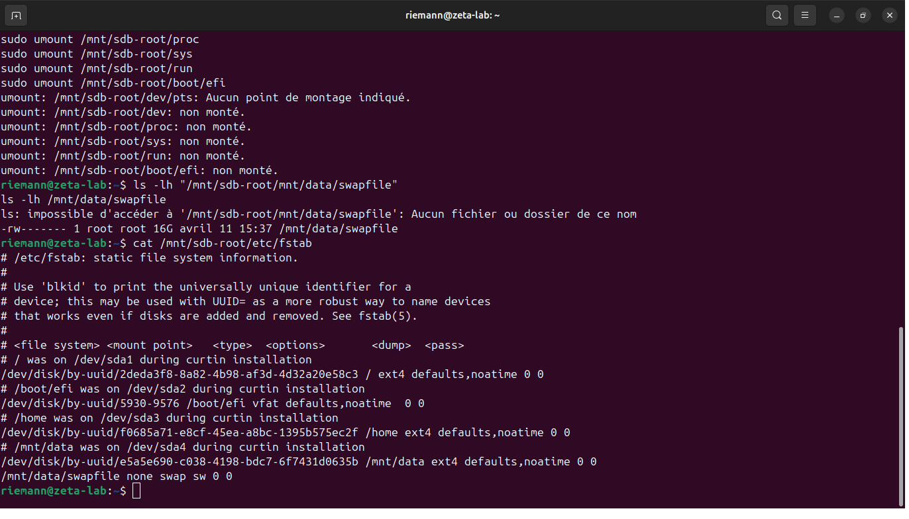
*Capture — relevé des nouveaux UUID via `blkid`. Les 5 partitions du Toshiba sont listées avec leurs labels (`root-clone`, `home-clone`, `data-clone`, `swap-clone`) et UUID propres, prêts à remplacer les anciennes références dans le `fstab` du clone.*

```bash
sudo sed -i 's/ANCIEN-UUID-ROOT/NOUVEAU-UUID-ROOT/' /mnt/clone-root/etc/fstab
sudo sed -i 's/ANCIEN-UUID-EFI/NOUVEAU-UUID-EFI/' /mnt/clone-root/etc/fstab
sudo sed -i 's/ANCIEN-UUID-HOME/NOUVEAU-UUID-HOME/' /mnt/clone-root/etc/fstab
sudo sed -i 's/ANCIEN-UUID-DATA/NOUVEAU-UUID-DATA/' /mnt/clone-root/etc/fstab
sudo sed -i 's#/mnt/data/swapfile none swap sw 0 0#UUID=NOUVEAU-UUID-SWAP none swap sw 0 0#' \
  /mnt/clone-root/etc/fstab
```

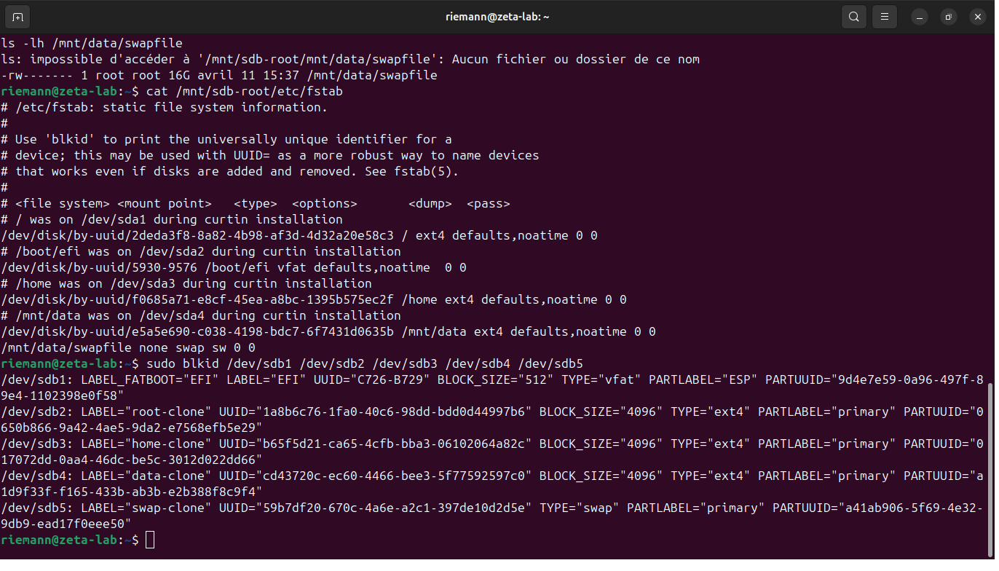
*Capture — les quatre commandes `sed -i` appliquées (root, EFI, home, data) ainsi que le remplacement de la ligne `swapfile` par l'UUID de la partition swap dédiée du clone. Le `cat` final confirme un `fstab` entièrement corrigé, pointant exclusivement vers les nouveaux UUID du Toshiba.*

```bash
sudo umount /mnt/clone-root/boot/efi /mnt/clone-root/mnt/data \
  /mnt/clone-root/home /mnt/clone-root
```

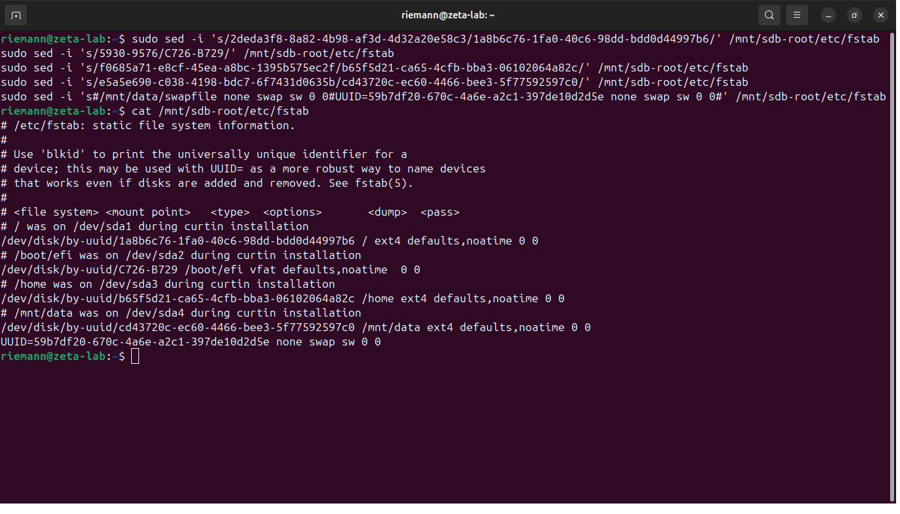
*Capture — démontage final propre des points de montage du clone, une fois le `fstab` corrigé et vérifié.*

### 5.6 — Résultat

> ✅ **SUCCÈS** — Le clone Ubuntu sur le Toshiba a démarré correctement dès le premier test de boot, sans erreur supplémentaire.

---

## 6. Phase D — Dépannage boot Kali sur Samsung

Une fois les données Kali copiées sur le Samsung (Phase B), le disque a été repartitionné et rendu bootable de façon autonome. Cette phase a rencontré le plus grand nombre de difficultés du projet.

### 6.1 — Correction du fstab (même type d'erreur qu'en Phase C)

| Élément | Ancien UUID (Toshiba/Kali d'origine) | Nouveau UUID (Samsung) |
|---|---|---|
| Partition racine (`/`) | `2657601b-dd77-4569-b535-bb2b788db71f` | `eaa06119-68d1-4a84-811b-c2e212b8b348` |
| Partition EFI | `2257-5D4C` | `7F66-0C9E` |
| Swap | — | Ligne supprimée (pas de swap sur le clone) |

Le fichier `/boot/grub/grub.cfg` a été vérifié et trouvé déjà correct, référençant directement le bon UUID de `sdb2` (label `kali-clone`).

### 6.2 — Problème de détection BIOS (carte mère Asus)

> ⚠️ **Problème — Le BIOS Asus ne démarre pas l'entrée EFI Samsung malgré Boot Priority #1**
> Malgré une Boot Priority correctement réglée sur le Samsung en position 1, le firmware redémarrait systématiquement sur le disque interne Ubuntu (`sda`). Diagnostic : comportement connu sur certaines cartes Asus où les entrées NVRAM EFI personnalisées (`EFI/ubuntu/grubx64.efi`) ne sont pas fiablement relancées, contrairement au chemin de secours standard.

| | |
|---|---|
| 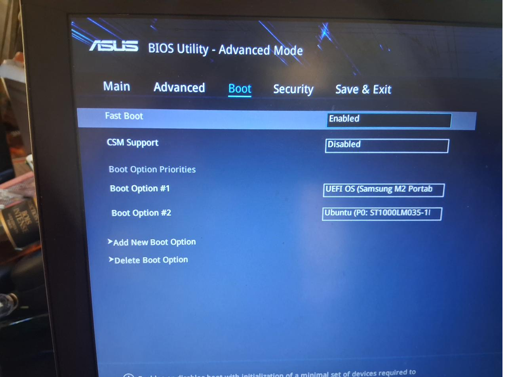 | 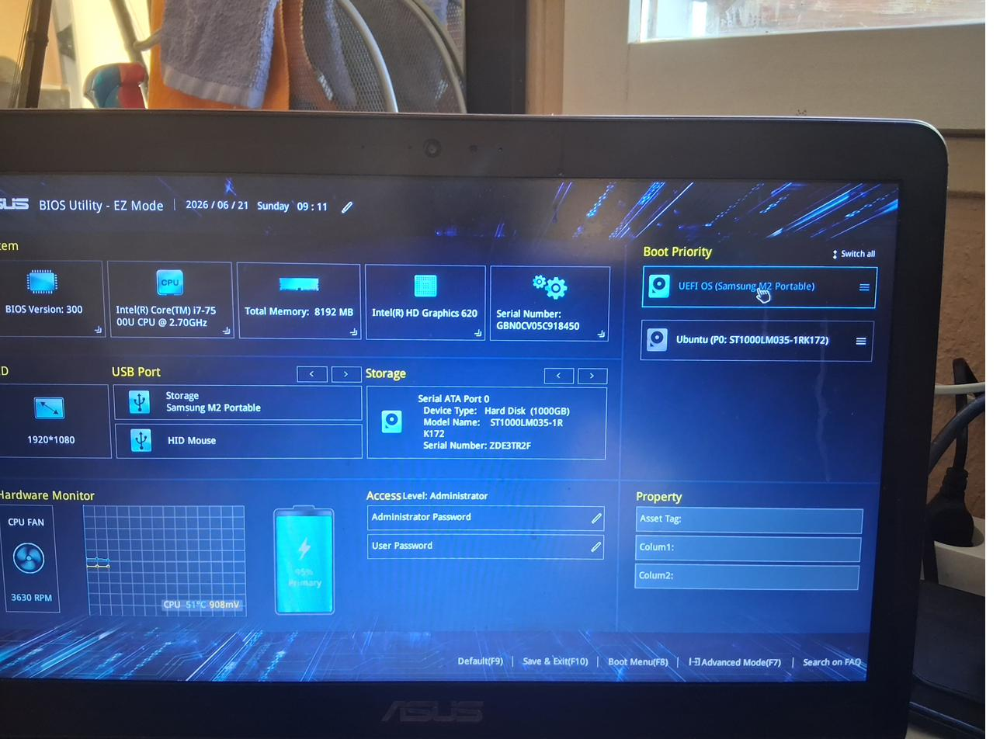 |
| *BIOS — onglet Boot, Advanced Mode. Boot Option #1 = `UEFI OS (Samsung M2 Portab…)`, Boot Option #2 = Ubuntu.* | *BIOS — EZ Mode, après correction. Le Samsung M2 Portable apparaît bien en première position de Boot Priority.* |

> ✅ **Correction appliquée — Création d'un binaire EFI de secours (fallback)**
> Création du chemin EFI standard reconnu par défaut par la plupart des firmwares, en copiant le binaire GRUB existant :

```bash
sudo mkdir -p /boot/efi/EFI/boot
sudo cp /boot/efi/EFI/ubuntu/grubx64.efi /boot/efi/EFI/boot/bootx64.efi
```

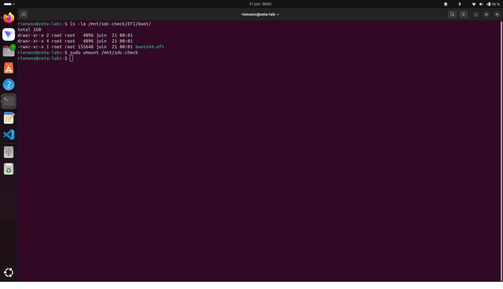
*Capture — vérification du fallback créé. `ls -la /mnt/sdc-check/EFI/boot/` confirme la présence de `bootx64.efi` (155 648 octets), copie du binaire GRUB d'origine.*

Confirmé via la capture `F2_fix_samsung_fisr_ok` ci-dessus : le démarrage via cette entrée de secours a permis de relancer correctement GRUB.

### 6.3 — Kernel panic au démarrage (montage de la racine impossible)

> ⚠️ **Problème — Kernel panic : « VFS: Unable to mount root fs on unknown-block(0,0) »**
> Une fois GRUB lancé correctement, le noyau Kali plantait avant même de monter le système de fichiers racine.

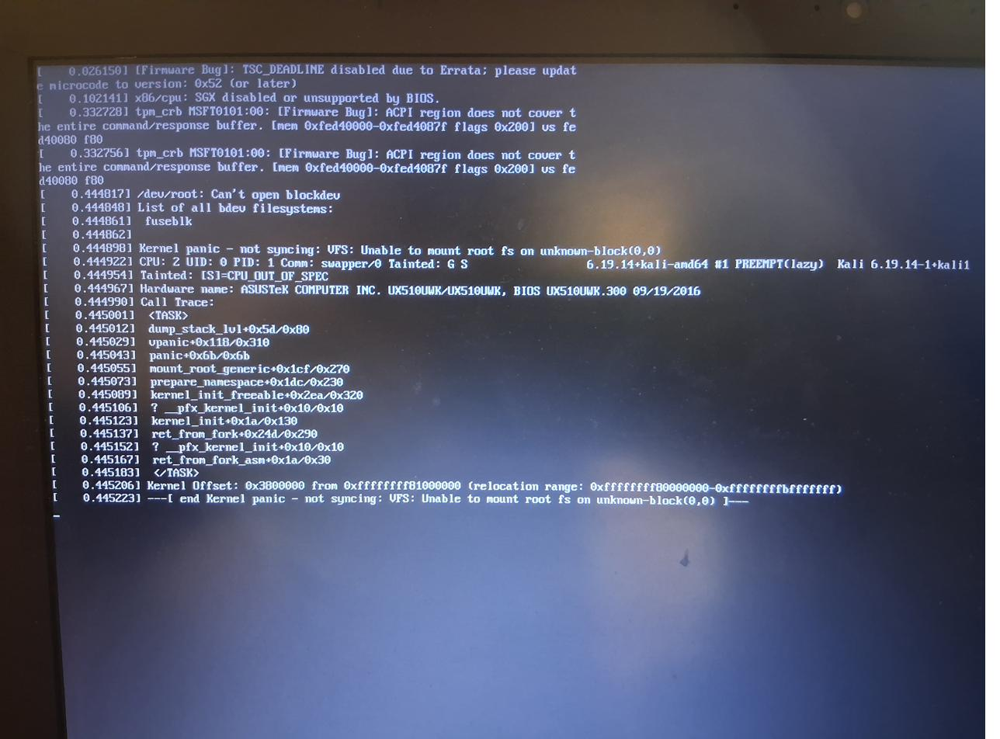
*Capture — trace complète du kernel panic. `[ 0.448898] Kernel panic - not syncing: VFS: Unable to mount root fs on unknown-block(0,0)`, noyau `6.19.14+kali-amd64`, carte mère identifiée dans la trace : `ASUSTeK COMPUTER INC. UX510UWK/UX510UWK, BIOS UX510UWK.300 09/19/2016`.*

Diagnostic effectué par chroot depuis l'Ubuntu de la machine (`sda`) : l'initramfs des 6 noyaux Kali installés (versions 6.17.10 à 6.19.14+kali-amd64) ne contenait aucun module de pilote de stockage USB (`usb_storage`, `uas`, `xhci_hcd`, `xhci_pci`). Le noyau ne pouvait donc physiquement pas accéder au disque racine, celui-ci étant connecté en USB et non en SATA/NVMe interne.

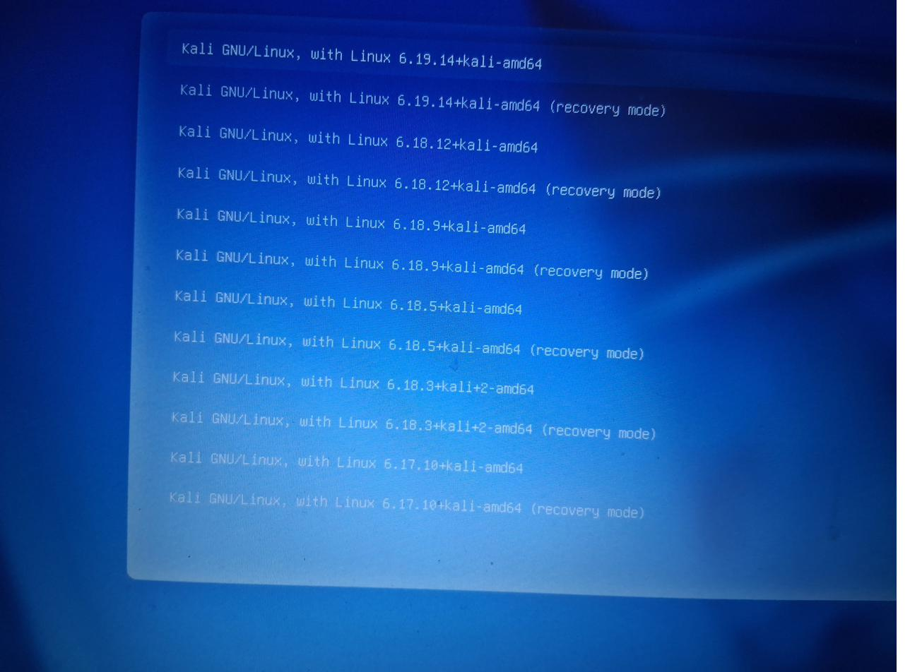
*Menu GRUB — Advanced options for Kali GNU/Linux. Les 6 noyaux installés sont visibles, chacun avec son mode normal et son mode recovery : 6.19.14, 6.18.12, 6.18.9, 6.18.5, 6.18.3+2, 6.17.10 (+kali-amd64).*

> ✅ **Correction appliquée — Ajout des modules USB à l'initramfs**

```bash
echo "usb_storage" | sudo tee -a /etc/initramfs-tools/modules
echo "uas" | sudo tee -a /etc/initramfs-tools/modules
echo "xhci_hcd" | sudo tee -a /etc/initramfs-tools/modules
echo "xhci_pci" | sudo tee -a /etc/initramfs-tools/modules

sudo update-initramfs -u -k all

for k in 6.17.10 6.18.3+2 6.18.5 6.18.9 6.18.12 6.19.14; do
  echo "=== ${k}+kali-amd64 ==="
  lsinitramfs /boot/initrd.img-${k}+kali-amd64 2>/dev/null | grep -E "usb_storage|uas|xhci"
done
```

> ⚠️ **Problème — Noyau 6.19.14 (le plus récent, par défaut) omis de la première régénération**
> La vérification a révélé que 5 des 6 noyaux contenaient bien les modules USB requis, mais que le noyau `6.19.14+kali-amd64` — le premier proposé par GRUB par défaut — était resté complètement vide de tout module USB après la commande `update-initramfs -u -k all`.

> ✅ **Correction appliquée — Régénération ciblée du noyau manquant**

```bash
sudo update-initramfs -u -k 6.19.14+kali-amd64
lsinitramfs /boot/initrd.img-6.19.14+kali-amd64 2>/dev/null | grep -E "usb_storage|uas|xhci"
```

Résultat confirmé : les modules `xhci-hcd.ko.xz`, `xhci-pci.ko.xz`, `uas.ko.xz` sont bien présents pour ce noyau après régénération ciblée — identique aux 5 autres noyaux.

> ℹ️ **Avertissement bénin observé pendant chaque régénération**
> ```
> cryptsetup: ERROR: Couldn't resolve device UUID=d599a81f-4ba1-454b-a636-67a061015938
> W: initramfs-tools configuration sets RESUME=UUID=... but no matching swap device is available.
> ```
> Diagnostiqué comme sans danger : il reflète simplement l'absence de partition swap sur le clone Kali (le fichier `/etc/initramfs-tools/conf.d/resume` référençait encore le swap du système d'origine). Ce point a été définitivement corrigé en Phase E (voir §7.6).

### 6.4 — Réinstallation de GRUB en mode amovible

```bash
sudo grub-install --target=x86_64-efi --efi-directory=/boot/efi \
  --bootloader-id=kali --removable /dev/sdb
sudo update-grub
```

L'option `--removable` garantit l'écriture également du chemin EFI de secours standard, renforçant la correction faite manuellement en §6.2.

### 6.5 — Problème de réapparition/disparition du Samsung en Boot Priority

> ⚠️ **Problème observé — Le Samsung disparaît de la liste Boot Priority après passage par UEFI Firmware Settings**
> Après être passé par le menu UEFI Firmware Settings depuis GRUB puis avoir sauvegardé, seule l'entrée Ubuntu (P0: ST1000LM035...) restait visible en Boot Priority — le Samsung avait disparu.

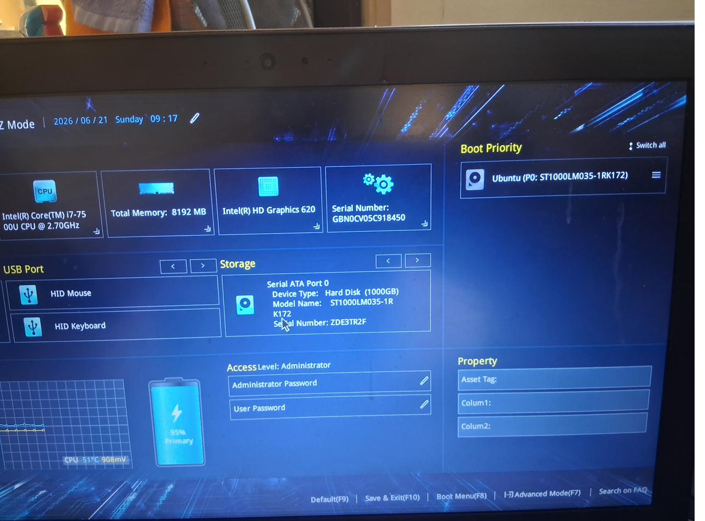
*Capture — preuve de la disparition. BIOS EZ Mode, encadré « Boot Priority » à droite : seule l'entrée `Ubuntu (P0: ST1000LM035-1RK172)` est listée, le Samsung n'apparaît plus du tout.*

**Diagnostic / correction.** Comportement transitoire lié à un rescan USB non terminé par le firmware au moment de l'affichage du menu Boot Priority (probablement après un retour rapide depuis les réglages UEFI, ou une sauvegarde par défaut F9 déclenchée par erreur). Un redémarrage supplémentaire et une revérification de la Boot Priority ont permis de voir le Samsung réapparaître correctement en position 1.

### 6.6 — Diagnostic complémentaire (instabilité des lettres de disque)

Au cours des vérifications successives par chroot depuis Ubuntu, plusieurs incidents mineurs liés à l'instabilité des noms `/dev/sdX` ont été rencontrés et corrigés en quelques secondes :

| | |
|---|---|
| 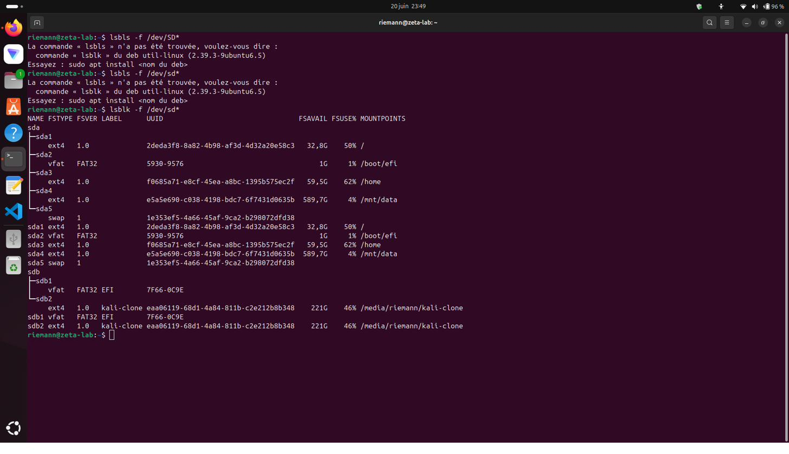 | 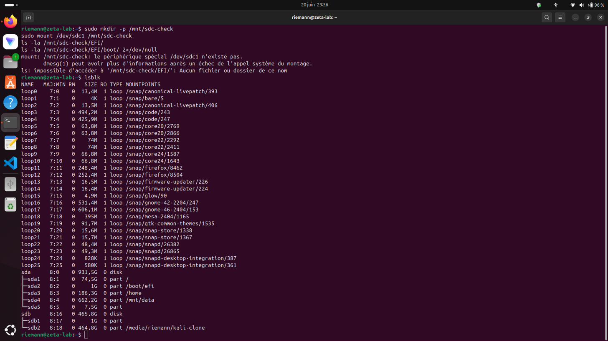 |
| *Petite faute de frappe (`lsbls` au lieu de `lsblk`), corrigée immédiatement. Le Samsung apparaît ici en `sdb` (label `kali-clone`, 46% utilisé).* | *Tentative de montage sur la mauvaise lettre. `sudo mount /dev/sdc1 /mnt/sdc-check` échoue — le disque s'appelle désormais `sdb`, pas `sdc`.* |

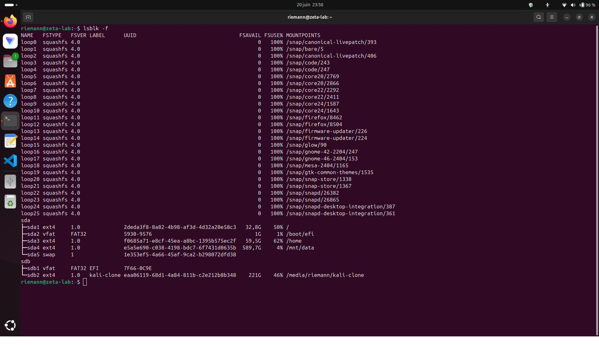
*Correction — identification par `lsblk -f`. Le label `kali-clone` est utilisé pour confirmer sans ambiguïté que `sdb` est bien le bon disque, conformément à la règle retenue au §2.*

### 6.7 — Résultat final de la Phase D

> ✅ **SUCCÈS** — Démarrage confirmé et validé du clone Kali en standalone sur le disque Samsung, après application cumulée de : fallback EFI (§6.2), correction fstab (§6.1), ajout des modules USB à l'initramfs pour tous les noyaux (§6.3), et réinstallation GRUB en mode `--removable` (§6.4).

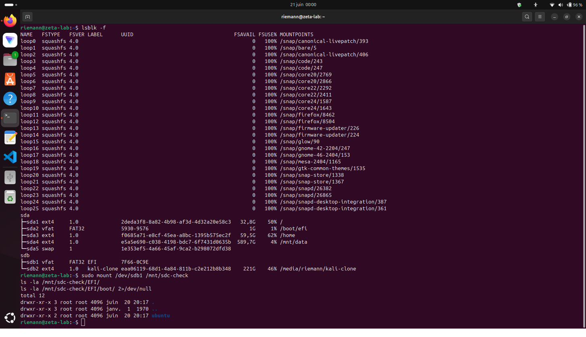
*Capture — confirmation finale (21 juin, 00h00). `lsblk -f` confirme `sdb` = label `kali-clone`, montée et exploitable de façon autonome.*

---

## 7. Phase E — Première mise à jour système du clone Kali

Une fois le boot du clone Kali confirmé de façon autonome (sans dépendre du disque Ubuntu pour le chroot), une mise à jour standard du système a été lancée pour vérifier la stabilité complète du clone.

### 7.1 — Erreur de syntaxe sur dpkg (tiret long copié-collé)

> ⚠️ **Problème — Option « -◆ inconnue »**
> ```
> $ sudo dpkg –configure -a
> dpkg: erreur: option -◆ inconnue
> ```
> Cause : un copier-coller depuis un éditeur de texte a substitué le double tiret court (`--`) par un tiret long unique (–, caractère Unicode U+2013), non reconnu par `dpkg`.

> ✅ **Correction appliquée**
> Re-saisie manuelle de la commande au clavier, garantissant l'usage de deux tirets courts ASCII :
> ```bash
> sudo dpkg --configure -a
> ```

### 7.2 — Erreur de permissions sur apt (sudo omis)

> ⚠️ **Problème — Verrou apt inaccessible**
> ```
> $ apt update && apt upgrade
> Erreur : Impossible d'ouvrir le fichier verrou /var/lib/apt/lists/lock
>  - open (13: Permission non accordée)
> ```
> Cause : commande lancée sans `sudo`, l'utilisateur standard n'ayant pas les droits d'écriture sur `/var/lib/apt/`.

> ✅ **Correction appliquée**
> ```bash
> sudo apt update && sudo apt upgrade -y
> ```

### 7.3 — Conflit de configuration sur /etc/sudoers

> ℹ️ **Décision prise pendant l'upgrade**
> `dpkg` a signalé que `/etc/sudoers` avait été modifié localement (probablement par un script d'installation pendant le clonage) alors qu'une nouvelle version officielle du paquet existait. Conformément au principe de prudence (ne jamais remplacer à l'aveugle un fichier de contrôle des droits sudo fonctionnel), l'option **« N »** (conserver la version actuelle) a été choisie — c'était également l'option par défaut suggérée par `dpkg`.

### 7.4 — Messages D-Bus en rouge pendant l'upgrade (faux positif)

> ℹ️ **Observation — Lignes en rouge pendant l'installation des paquets**
> ```
> Failed to get properties: Noeud final de transport n'est pas connecté
> Failed to connect to system scope bus via local transport: Connexion refusée
> ```
> **Diagnostic — sans gravité, aucune action requise.** Ces messages proviennent de tentatives de `systemctl` / `polkit` de notifier des changements de service via D-Bus, dans un contexte où certains sockets système n'étaient pas encore pleinement disponibles. `dpkg` a continué normalement l'installation des paquets suivants (`polkitd`, `fontconfig`, `kali-menu`, etc.) sans interruption ni corruption.

### 7.5 — Échec de redémarrage du service VirtualBox (faux positif)

> ℹ️ **Observation — Lignes en rouge liées à VirtualBox**
> ```
> Unit virtualbox.service could not be found.
> Failed to restart virtualbox.service: Unit virtualbox.service not found.
> invoke-rc.d: initscript virtualbox, action "restart" failed.
> ```
> **Diagnostic — sans gravité, modules kernel correctement construits.** Le paquet `virtualbox-dkms` a bien reconstruit et signé les modules noyau (`vboxdrv`, `vboxnetadp`, `vboxnetflt`) pour chaque version de noyau installée. Seule la tentative finale de redémarrage du service `virtualbox.service` a échoué, ce service n'étant pas configuré comme actif sur ce système. Sans incidence :
> ```bash
> sudo modprobe vboxdrv
> ```

### 7.6 — Warning UUID swap résiduel pendant la régénération d'initramfs post-upgrade

> ⚠️ **Problème — RESUME=UUID pointant vers un swap inexistant sur le clone**
> ```
> cryptsetup: ERROR: Couldn't resolve device UUID=d599a81f-4ba1-454b-a636-67a061015938
> W: initramfs-tools configuration sets RESUME=UUID=... but no matching swap device is available.
> ```
> Confirmé par inspection du disque (`lsblk -f`) : le clone Kali (label `kali-clone`, partition unique `sdb2`) ne possède aucune partition swap. Le fichier `/etc/initramfs-tools/conf.d/resume` référençait encore l'UUID du swap de la machine source d'origine du clone.

> ✅ **Correction appliquée — Désactivation explicite du resume**

```bash
cat /etc/initramfs-tools/conf.d/resume
# → RESUME=UUID=d599a81f-4ba1-454b-a636-67a061015938

sudo sed -i 's/^RESUME=.*/RESUME=none/' /etc/initramfs-tools/conf.d/resume
cat /etc/initramfs-tools/conf.d/resume
# → RESUME=none

sudo update-initramfs -u -k all
```

Régénération de l'initramfs pour tous les noyaux afin que le changement soit pris en compte au prochain démarrage. Un redémarrage à froid ultérieur a permis de confirmer la disparition définitive du warning swap, validant le clone Kali comme entièrement stable et autonome.

### 7.7 — Vérifications complémentaires (re-diagnostic du 21 juin matin)

Une nouvelle session de vérification a été menée le lendemain matin pour confirmer la stabilité du clone, cette fois en montant les partitions Kali par **label** plutôt que par lettre de périphérique, conformément à la règle retenue au §2.

```bash
sudo mkdir -p /mnt/kaliclone
sudo mount LABEL=kali-clone /mnt/kaliclone
sudo mount LABEL=EFI /mnt/kaliclone/boot/efi
```

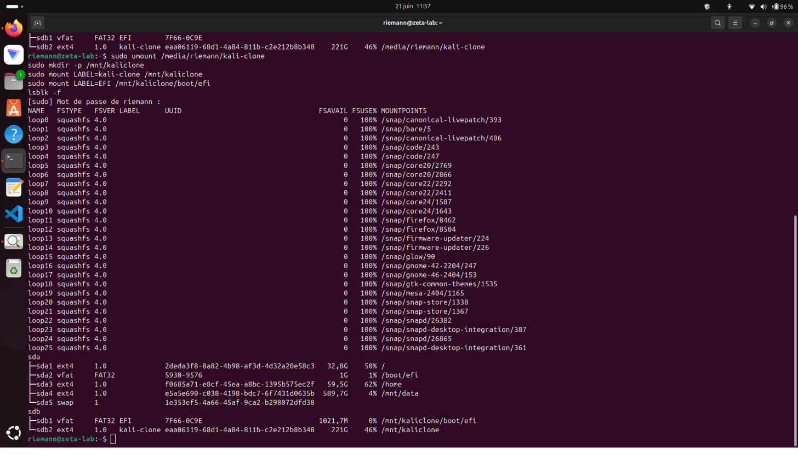
*Capture — montage par label. `mount LABEL=kali-clone` et `mount LABEL=EFI` exécutés avec succès ; le `lsblk -f` qui suit confirme les points de montage corrects sous `/mnt/kaliclone`, indépendamment de la lettre `/dev/sdX` attribuée ce jour-là.*

```bash
sudo mount --bind /dev /mnt/kaliclone/dev
sudo mount --bind /dev/pts /mnt/kaliclone/dev/pts
sudo mount --bind /proc /mnt/kaliclone/proc
sudo mount --bind /sys /mnt/kaliclone/sys
sudo mount --bind /run /mnt/kaliclone/run
sudo chroot /mnt/kaliclone /bin/bash
cat /etc/os-release
```

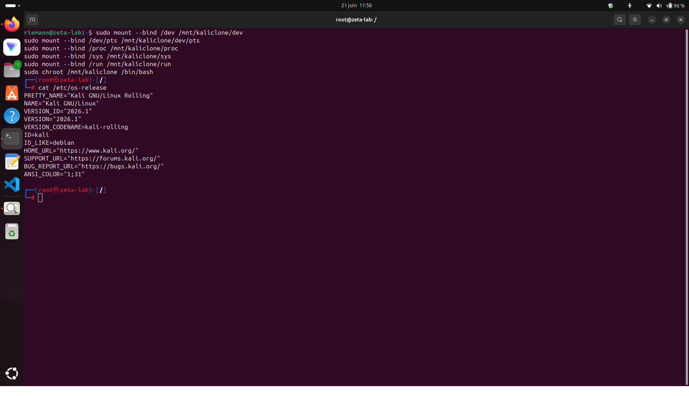
*Capture — confirmation finale en chroot. `cat /etc/os-release` retourne `PRETTY_NAME="Kali GNU/Linux Rolling"`, `VERSION_ID="2026.1"` — le clone est bien un système Kali Rolling 2026.1 complet et cohérent.*

> ℹ️ **Avertissement bénin observé en chroot**
> ```
> sudo: impossible de résoudre l'hôte zeta-lab : Nom ou service inconnu
> ```
> Ce message est apparu lors d'une commande `sudo` exécutée à l'intérieur du chroot du clone Kali. Cause : le fichier `/etc/hosts` du système cloné ne contient pas l'entrée locale `zeta-lab` propre à la machine hôte actuelle (résidu du système Kali d'origine). Sans incidence sur le fonctionnement réel du clone une fois démarré nativement (hors chroot).

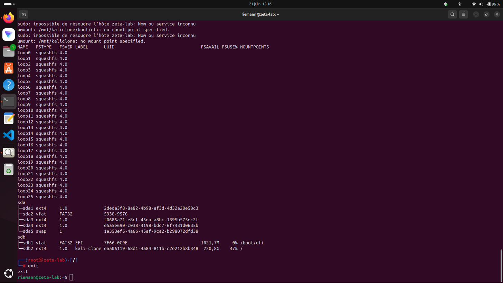
*Capture — avertissement de résolution de nom en chroot et démontage complet en sortie (`umount` de tous les points liés), suivi d'un `lsblk -f` final propre confirmant l'absence de montages résiduels.*

> 📌 **Contexte matériel — plateforme Asus de référence**
> L'ensemble des opérations BIOS/UEFI de ce projet a été réalisé sur la même plateforme Asus (BIOS Utility, version 300), dont les écrans de référence (informations système, Secure Boot) ont été capturés en début de projet pour documentation.

| | |
|---|---|
| 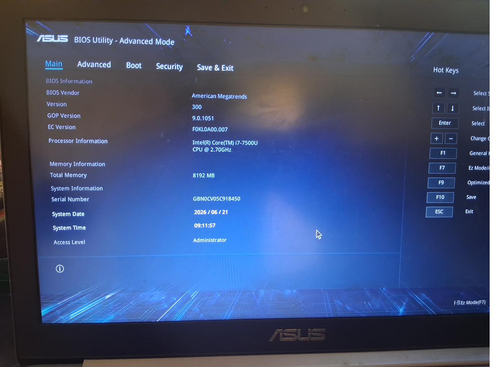 | 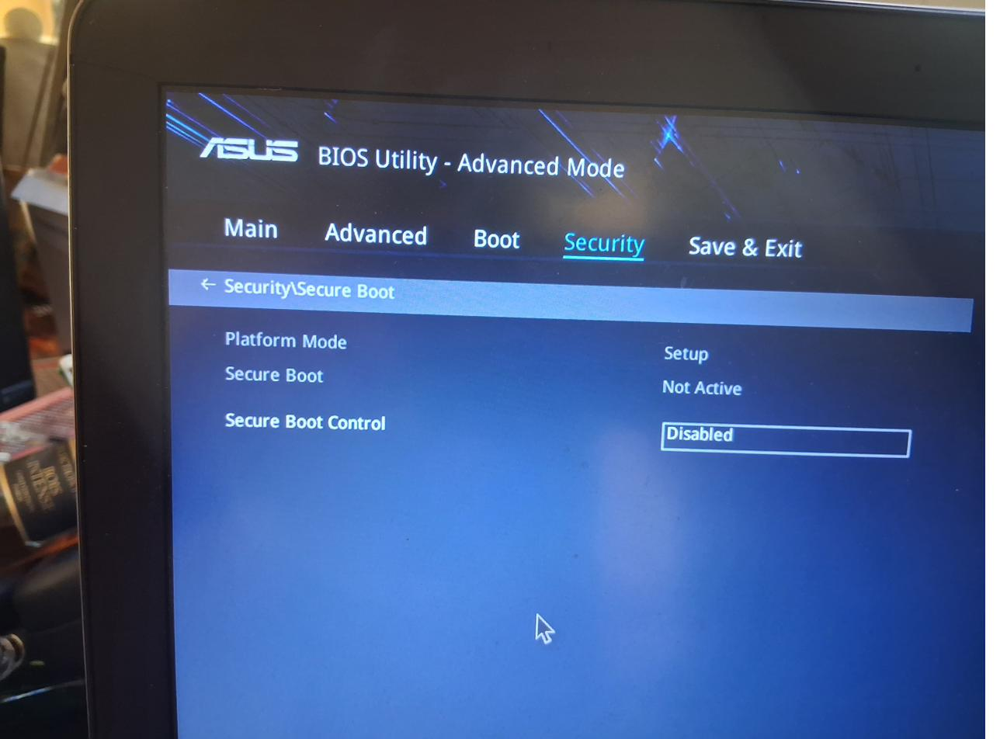 |
| *BIOS Utility — Main / Advanced Mode. Intel Core i7-7500U, 8192 MB RAM, BIOS version 300.* | *BIOS Utility — Security / Secure Boot. Secure Boot Control : `Disabled`.* |

---

## 8. Synthèse de tous les problèmes rencontrés et corrections

| # | Phase | Problème | Cause | Correction |
|---|---|---|---|---|
| 1 | Inventaire | Disque supposé 2 To en réalité 256 Go (Micron/BitLocker) | Hypothèse de départ non vérifiée | Réinventaire complet par `lsblk -f`, identification par modèle réel |
| 2 | Clonage Kali | Volume de données (721 Go) dépassant la capacité Samsung (500 Go) | Dossier `home/img` de 509 Go (dump forensique) | Exclusion validée avec l'utilisateur (`--exclude='home/img/'`) |
| 3 | Clonage Kali | Erreurs de permission lors du rsync | Commande lancée sans `sudo` | Toutes les copies système relancées avec `sudo` + `--one-file-system` |
| 4 | Clonage Kali | 2787 lignes « error/failed/denied » dans le journal rsync | Faux positifs : noms de fichiers légitimes contenant ces mots | Filtrage ciblé `grep -c "^rsync:"` = 0 vraie erreur confirmée |
| 5 | Partitionnement Toshiba | Dépassement de capacité disque lors du calcul MiB | Confusion Go décimaux / Tio binaires | Utilisation de `100%` comme borne finale + vérif via `parted print` |
| 6 | Clonage Ubuntu | Avertissement `rsync: some files vanished` (code 24) | Fichier de cache Firefox temporaire disparu en cours de copie (système live) | Vérification ciblée du fichier concerné — confirmé bénin |
| 7 | Clonage Ubuntu | fstab pointant vers les anciens UUID | UUID non régénérés après clonage | `sed -i` ciblé sur chaque UUID, vérifié via `blkid` |
| 8 | Boot Kali Samsung | BIOS Asus ne démarre pas l'entrée EFI personnalisée | Comportement connu de certaines cartes Asus (NVRAM) | Création du fallback `EFI/boot/bootx64.efi` |
| 9 | Boot Kali Samsung | Kernel panic — impossible de monter la racine | Modules USB (`usb_storage`, `uas`, `xhci_*`) absents de l'initramfs | Ajout des modules + `update-initramfs -u -k all` |
| 10 | Boot Kali Samsung | Noyau 6.19.14 (par défaut) oublié lors de la régénération groupée | Build initramfs incomplet pour ce noyau précis | Régénération ciblée `update-initramfs -u -k 6.19.14+kali-amd64` |
| 11 | Boot Kali Samsung | Samsung disparaît temporairement de Boot Priority | Rescan USB du firmware non terminé après passage UEFI Settings | Redémarrage supplémentaire — réapparition confirmée |
| 12 | Boot Kali Samsung | Tentative de montage sur `/dev/sdc1` inexistant | Lettre de périphérique changée entre deux branchements USB | Identification par `lsblk -f` et label `kali-clone` |
| 13 | Upgrade Kali | `dpkg --configure -a` rejeté (option inconnue) | Tiret long Unicode au lieu de deux tirets ASCII | Re-saisie manuelle de la commande |
| 14 | Upgrade Kali | Verrou apt inaccessible | `sudo` omis | `sudo apt update && sudo apt upgrade -y` |
| 15 | Upgrade Kali | Conflit de version sur `/etc/sudoers` | Fichier modifié localement vs nouvelle version officielle | Conservation de la version locale (`N`) |
| 16 | Upgrade Kali | Erreurs D-Bus en rouge pendant l'upgrade | Sockets système non disponibles temporairement | Aucune — faux positif confirmé, upgrade non interrompu |
| 17 | Upgrade Kali | Échec redémarrage `virtualbox.service` | Service non configuré sur ce système, modules bien construits | Aucune — faux positif, `modprobe vboxdrv` si besoin |
| 18 | Upgrade Kali | Warning `RESUME=UUID` swap introuvable | `conf.d/resume` référençant le swap de la machine d'origine | `RESUME=none` + régénération initramfs, confirmé par reboot à froid |
| 19 | Diagnostic chroot | `sudo: impossible de résoudre l'hôte zeta-lab` | `/etc/hosts` du clone sans l'entrée de l'hôte courant | Aucune — bénin, sans incidence hors chroot |

---

## 9. État final et tableau de bord

| Disque | Rôle | Partitionnement / fstab | GRUB | Test de boot | Mise à jour système |
|---|---|---|---|---|---|
| `sda` — Seagate 1 To (interne) | Système principal Ubuntu | Inchangé | Inchangé | N/A — jamais interrompu | Hors périmètre de ce rapport |
| Toshiba 2 To USB3 | Clone Ubuntu bootable (secours) | ✅ Corrigé | ✅ Installé | ✅ Confirmé au 1er essai | Non requise dans ce projet |
| Samsung 500 Go USB3 | Clone Kali bootable | ✅ Corrigé | ✅ Installé (`--removable`) | ✅ Confirmé après corrections | ✅ Terminée — `RESUME=none` confirmé par reboot à froid |
| SSD Micron 1100 (ex-Verbatim) | Vault RAG ChromaDB/LlamaIndex — Objectif 2 (22 juin, §11) | ✅ ext4 + fstab (`/mnt/vault_rag`, UUID `9476fad5-8512-4e0d-8cd4-50c9acae01c2`) | N/A — volume de données, pas de boot | N/A | N/A |

### Reste à faire / maintenance continue

- Maintenance continue : tenir à jour les deux clones (Ubuntu/Toshiba et Kali/Samsung) en parallèle du système principal.
- Optionnel : exécuter `sudo modprobe vboxdrv` sur le clone Kali si l'utilisateur souhaite utiliser VirtualBox immédiatement sans redémarrer au préalable.
- Recommandé : programmer une vérification SMART périodique (`smartctl -H`) sur les deux disques externes, utilisés en clones de secours.

---

## 10. Leçons apprises et bonnes pratiques retenues

- **Les noms `/dev/sdX` sont instables** d'une session à l'autre selon l'ordre de branchement USB — toujours identifier les disques par label ou UUID, jamais par lettre seule, pour éviter tout risque d'opération sur le mauvais disque.
- **`rsync --one-file-system` s'arrête aux limites de montage** — pour cloner un système multi-partitions, il faut lancer une commande rsync distincte par partition.
- **Les calculs de tailles en MiB avec `parted` peuvent dépasser la capacité réelle** du disque à cause de la confusion entre notation décimale (Go) et binaire (Gio/Tio) — préférer les valeurs en Go confirmées par `parted print`, et utiliser `100%` pour la dernière partition.
- **Un comptage brut de mots-clés (« error », « failed ») dans un journal rsync volumineux produit des faux positifs massifs** — ces termes apparaissent couramment dans des noms de fichiers légitimes. Le test fiable est de filtrer les lignes préfixées `rsync:`, seules véritables émissions d'erreur de l'outil.
- **Le message `rsync: some files vanished` (code 24) est normal sur un système live** — il signale simplement qu'un fichier temporaire a disparu entre l'énumération et la copie, sans affecter l'intégrité du clone.
- **Certains firmwares Asus ne détectent pas une entrée EFI personnalisée** sans qu'un chemin de secours existe — créer systématiquement `EFI/boot/bootx64.efi` (copie de `EFI/<distro>/grubx64.efi`) pour tout disque externe bootable.
- **La correction des UUID dans fstab est indispensable après tout clonage** — un remplacement `sed -i` systématique des anciens UUID par les nouveaux est une étape post-clonage obligatoire, y compris pour la ligne swap si une partition swap dédiée existe sur le clone.
- **Les données volumineuses et recréables** (ex. dumps forensiques) doivent être exclues des clones — utiliser les motifs d'exclusion rsync pour garder l'opération réaliste en taille.
- **Pour un disque externe bootable sans swap propre, désactiver explicitement `RESUME`** (`RESUME=none`) plutôt que de laisser un UUID de swap orphelin dans `initramfs-tools/conf.d/resume`.
- **Toujours vérifier individuellement chaque noyau après une régénération groupée d'initramfs** — une commande `update-initramfs -u -k all` peut, dans de rares cas, omettre le noyau le plus récent.
- **Distinguer les erreurs bloquantes des avertissements bénins** pendant une mise à jour apt (ex. erreurs D-Bus, échec de redémarrage d'un service non configuré, échec de résolution de nom d'hôte en chroot) — ne pas interrompre une opération en cours sur la seule base d'un texte en rouge sans en vérifier l'impact réel.
- **Toujours simuler avant d'exécuter** (`wipefs -n`, `rsync --dry-run`) pour toute opération destructrice ou de grand volume — cette discipline a permis de valider les volumes attendus avant chaque transfert réel du projet.

---

## 11. Phase F — Configuration du vault RAG sur le SSD Micron 1100

### 11.1 — Contexte

Le SSD Micron 1100 (boîtier Verbatim, identifié au §2) avait été volontairement exclu de ce projet de clonage : il contenait une ancienne installation Windows protégée par BitLocker, jugée hors périmètre. Le 22 juin 2026, ce même disque a été réaffecté à un nouvel usage : **vault de stockage RAG** (Retrieval-Augmented Generation) pour ChromaDB et LlamaIndex, dans le cadre de l'Objectif 2 du projet Zêta (agent IA autonome de recherche mathématique).

Le choix de réutiliser ce disque plutôt qu'un disque dédié neuf repose sur trois constats établis lors de l'inventaire initial (§2) :
- Capacité réelle confirmée saine : 256 GB / 238,47 GiB (pas de fraude, contrairement à un autre SSD externe testé et rejeté séparément le 21 juin pour capacité frauduleuse — incident hors périmètre de ce rapport).
- SMART `PASSED`, 89 % de durée de vie restante, usure normale pour un disque d'occasion.
- Disque déjà physiquement présent et disponible, sans nouvel achat nécessaire.

L'ancien contenu (Windows + BitLocker + partition de récupération) a été entièrement effacé : ce disque ne contient donc plus aucune donnée antérieure à cette opération.

### 11.2 — Paramètres choisis et justification

| Paramètre | Valeur | Justification |
|---|---|---|
| Table de partition | GPT, partition unique pleine disque | Volume de données simple, pas de boot requis |
| Filesystem | ext4 | Standard Linux, robuste, bien supporté par ChromaDB/LlamaIndex |
| `-i 8192` (bytes-per-inode) | ~31,3 M inodes (vs ~15,6 M par défaut à 16384) | Usage prévu = nombreux petits fichiers (chunks de corpus texte, cache LlamaIndex, segments ChromaDB) — plus d'inodes nécessaires que pour un usage de gros fichiers |
| `-m 1` (réserve root) | 1 % au lieu des 5 % par défaut | Ce n'est pas un disque système — pas besoin de réserver autant d'espace pour root, libère ~2,4 Go supplémentaires |
| `-L vault_rag` (label) | Label stable | Identification indépendante de la lettre `/dev/sdX`, conformément à la règle retenue au §2 |
| Montage | `/mnt/vault_rag`, `fstab` avec `defaults,noatime` | `noatime` évite l'écriture du timestamp d'accès à chaque lecture — pertinent pour une base vectorielle interrogée fréquemment |

### 11.3 — Commandes exactes

```bash
sudo wipefs -a /dev/sdb
sudo parted /dev/sdb mklabel gpt
sudo parted /dev/sdb mkpart primary ext4 0% 100%
sudo mkfs.ext4 -i 8192 -m 1 -L vault_rag /dev/sdb1
sudo mkdir -p /mnt/vault_rag
sudo mount /dev/sdb1 /mnt/vault_rag
echo "UUID=9476fad5-8512-4e0d-8cd4-50c9acae01c2  /mnt/vault_rag  ext4  defaults,noatime  0  2" | sudo tee -a /etc/fstab
sudo systemctl daemon-reload
sudo chown riemann:riemann /mnt/vault_rag
mkdir -p /mnt/vault_rag/{chromadb,corpus,llamaindex_cache,agent_logs}
```

> ⚠️ **Point notable — fausse alerte `vfat` après formatage (bénin)**
> Après le `mkfs.ext4` réussi, une commande `blkid /dev/sdb1` simple affichait à tort `TYPE="vfat"` avec l'ancien label `SYSTEM` (résidu d'une ancienne partition EFI Windows). `mkfs.ext4` ne touche jamais les 1024 premiers octets d'une partition (zone réservée pour compatibilité boot loader) ; combiné à un cache `blkid` non rafraîchi, l'ancienne signature pouvait sembler persister.

> ✅ **Correction / vérification appliquée**
> Sondage direct sans cache (`blkid -p /dev/sdb1`) et scan natif (`wipefs /dev/sdb1`, qui n'utilise jamais de cache) confirment tous deux une signature **unique : ext4**, label `vault_rag`, UUID `9476fad5-8512-4e0d-8cd4-50c9acae01c2`. Le montage effectif (`mount`, `findmnt`, `/proc/mounts`) confirmait déjà `type ext4` pendant toute l'opération — seul l'outil `blkid` sans option affichait une information périmée, sans impact réel sur les données.
>
> **Règle retenue :** ne jamais se fier à un `blkid` simple juste après un reformatage si le résultat semble incohérent avec le filesystem attendu — toujours revérifier avec `blkid -p` (sondage direct) ou `wipefs` (scan natif, sans cache) avant de s'inquiéter.

### 11.4 — Arborescence finale

```
/mnt/vault_rag/                  (UUID 9476fad5-8512-4e0d-8cd4-50c9acae01c2, riemann:riemann)
├── chromadb/                    ← segments HNSW + sqlite (ChromaDB)
├── corpus/                      ← chunks texte (nombreux petits fichiers)
├── llamaindex_cache/
├── agent_logs/
└── lost+found/                  (créé automatiquement par mkfs.ext4, root)
```

> ✅ **SUCCÈS** — Le SSD Micron 1100, précédemment hors périmètre de ce projet de clonage, est désormais opérationnel comme vault RAG pour ChromaDB/LlamaIndex sur `/mnt/vault_rag` (230 Go disponibles, 228 Go libres). Montage confirmé permanent via `fstab` (`rw,noatime`), permissions et arborescence en place. Prêt pour l'installation de ChromaDB et LlamaIndex (Objectif 2).

---

*Fin du corps du rapport — Projet Zêta / Riemann Lab — riemann@zeta-lab*

---
## 12. Annexe — Galerie complète des captures d'écran

Cette annexe regroupe l'intégralité des 45 captures d'écran disponibles pour ce projet, classées par ordre chronologique. Chaque capture déjà intégrée dans le corps du rapport (§2 à §7) est également listée ici à des fins d'indexation complète et de traçabilité.

**1. 20 juin, ~17:00** — lsblk initial — Micron/BitLocker détecté par erreur sur sdb


**2. 20 juin, 17:20** — lsblk -f réinventaire correct (sdb=Toshiba, sdc=Samsung)


**3. 20 juin, 17:57** — rsync Kali lancé avec sudo, exclude home/img


**4. 20 juin, 18:00** — Suivi double-terminal pendant rsync Kali


**5. 20 juin, 18:31** — Suivi multi-terminal + vérif paquets rsync/grub installés


**6. 20 juin, 20:08** — Fin du rsync Kali — 226,30G envoyés


**7. 20 juin, 20:10** — df -h final /mnt/sdc2 (213G/49%)

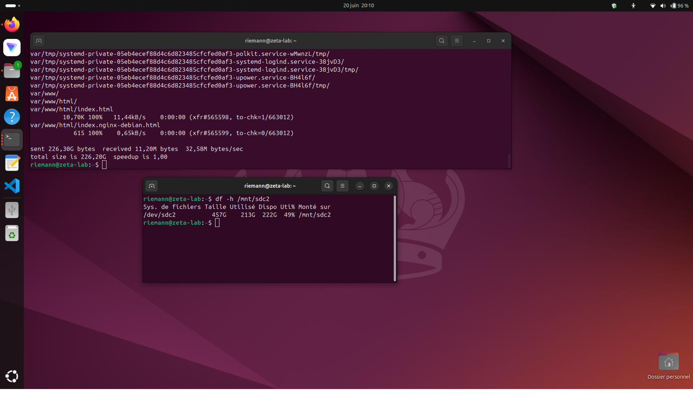

**8. 20 juin, 20:10** — grep error/failed/denied = 2787 lignes (alerte apparente)


**9. 20 juin, 20:13** — Analyse fine — faux positifs confirmés, 0 vraie erreur rsync


**10. 20 juin, 20:21** — Premier grub-install Kali en chroot (avant --removable)

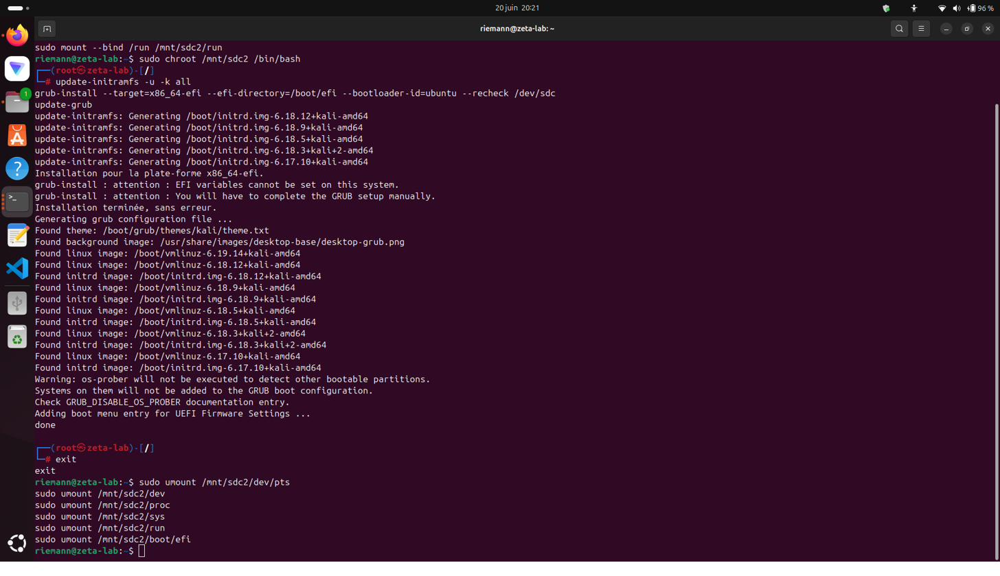

**11. 20 juin, 20:23** — wipefs -n (dry-run) sur le Toshiba avant formatage


**12. 20 juin, 20:27** — wipefs -a réel exécuté sur le Toshiba


**13. 20 juin, 20:28** — Erreur de dépassement de capacité parted (1924409MiB)


**14. 20 juin, 20:38** — rsync --dry-run sur la racine Ubuntu (DRY RUN, 41,47G)


**15. 20 juin, 20:41** — Trois rsync en parallèle (/, /home, /mnt/data)


**16. 20 juin, 22:59** — Fin rsync /mnt/data + warning vanished + df -h multi-partitions


**17. 20 juin, 23:01** — Suivi identique (quelques minutes plus tard)


**18. 20 juin, 23:07** — Vérification du warning vanished — fichier cache Firefox


**19. 20 juin, 23:11** — Installation GRUB complète en chroot (clone Ubuntu)


**20. 20 juin, 23:13** — fstab du clone Ubuntu AVANT correction (UUID sda)


**21. 20 juin, 23:13** — blkid des 5 partitions du Toshiba (incl. swap-clone)


**22. 20 juin, 23:14** — sed -i appliqué + fstab APRÈS correction


**23. 20 juin, 23:15** — Démontage final propre du clone Ubuntu


**24. 20 juin, 23:16** — Variante du démontage (re-vérification mount)

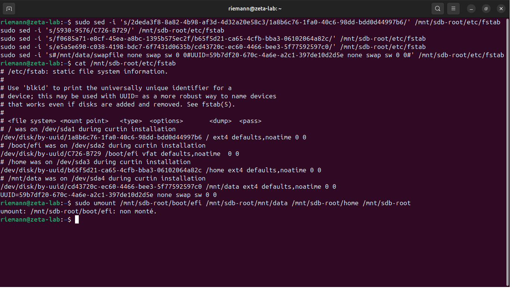

**25. 20 juin, 23:17** — Vérification finale mount | grep sdb (vide)

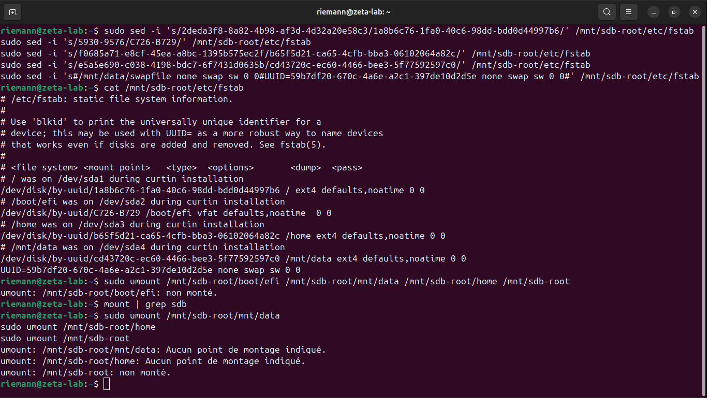

**26. 20 juin, 23:49** — Typo lsbls→lsblk corrigée ; Samsung en sdb (kali-clone)


**27. 20 juin, 23:56** — Tentative montage /dev/sdc1 inexistant (disque renommé)


**28. 20 juin, 23:58** — Identification correcte par lsblk -f (label kali-clone)


**29. 21 juin, 00:00** — Confirmation finale boot Kali — sdb=kali-clone


**30. 21 juin, 00:02** — Vérification du fallback EFI/boot/bootx64.efi présent


**31. (BIOS) Boot tab** — Boot Option #1 = Samsung M2 Portable


**32. (BIOS) EZ Mode** — Samsung confirmé en priorité 1, fallback opérationnel


**33. (boot) Kernel panic** — Trace complète VFS unable to mount root fs


**34. (GRUB) Menu avancé** — Liste des 6 noyaux Kali installés


**35. (BIOS) EZ Mode** — Samsung disparu de la Boot Priority (incident §6.5)


**36. 21 juin, 10:56** — Re-vérification lsblk -f du matin

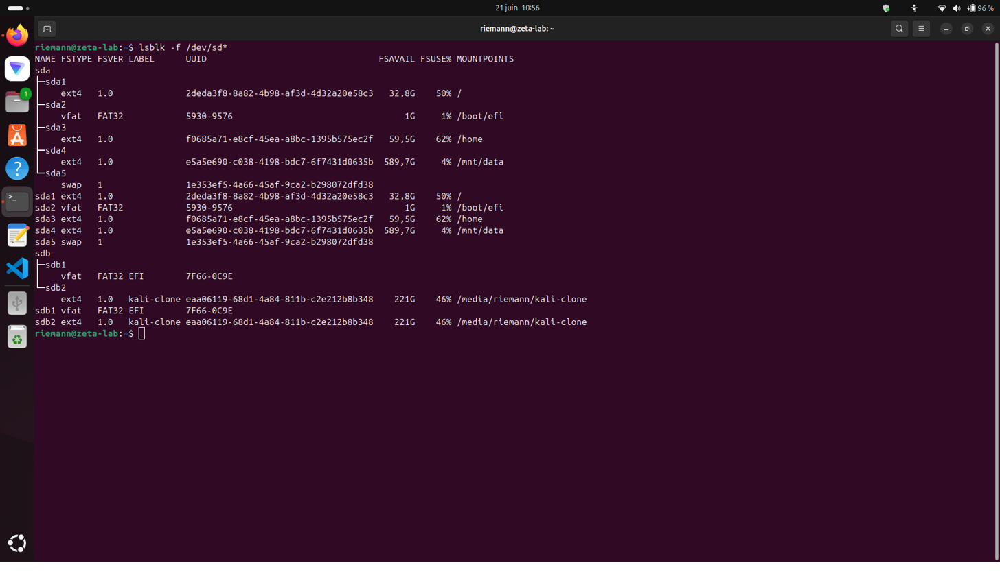

**37. 21 juin, 11:09** — Détail recadré du lsblk précédent

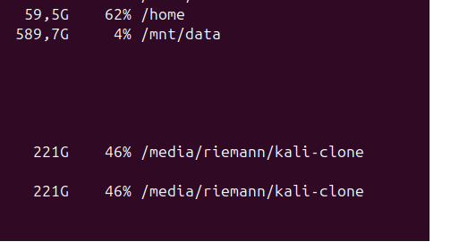

**38. 21 juin, 11:55** — Re-vérification lsblk -f (session Phase E)

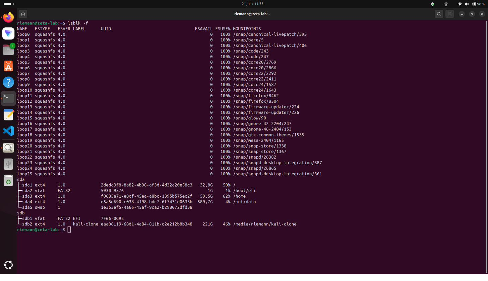

**39. 21 juin, 11:57** — Montage par LABEL (kali-clone, EFI)


**40. 21 juin, 11:58** — chroot + os-release : Kali 2026.1 Rolling confirmé


**41. 21 juin, 12:16** — Warning résolution hôte en chroot + démontage complet


**42. 21 juin, 12:38** — lsblk -f final, propre, après sortie de chroot

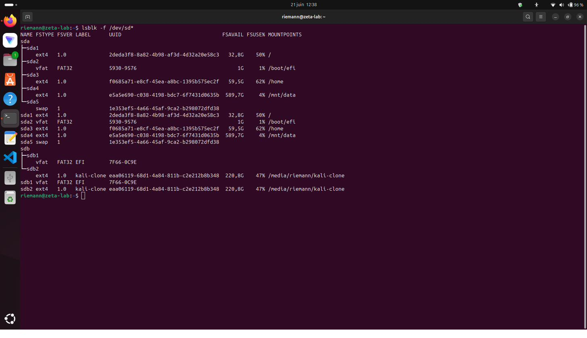

**43. (BIOS) Main** — Informations système — i7-7500U, 8192MB, BIOS v300


**44. (BIOS) Security** — Secure Boot Control: Disabled


**45. (GRUB) Menu Kali** — Kali GNU/Linux / Advanced options / UEFI Firmware Settings

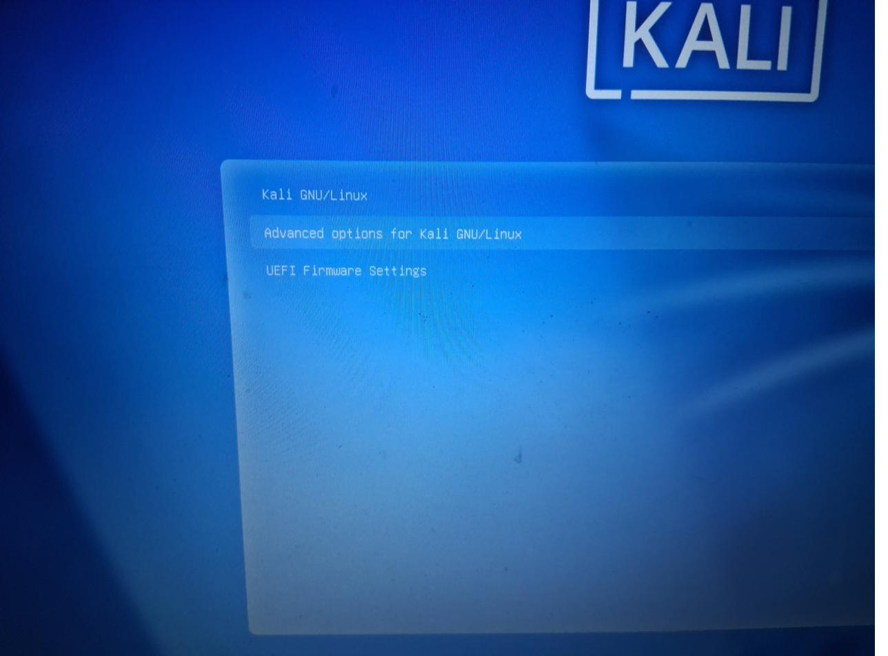

---

*Document généré par Claude — Riemann Lab / Projet Zêta — 21 juin 2026.*
*Sous-dossier `img/` requis à côté de ce fichier pour l'affichage des 45 captures.*